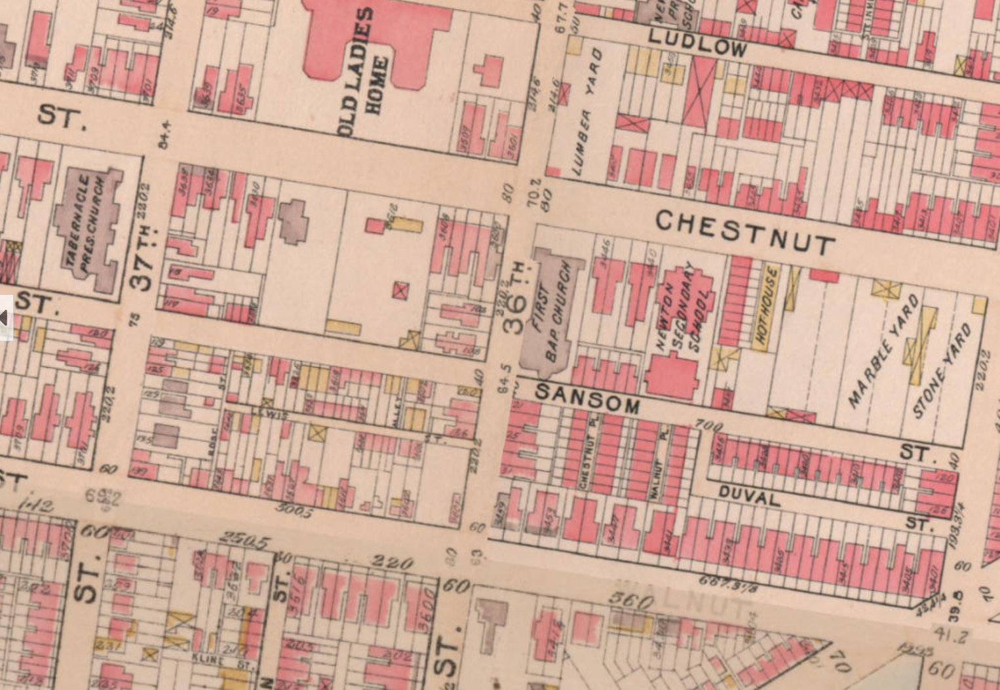
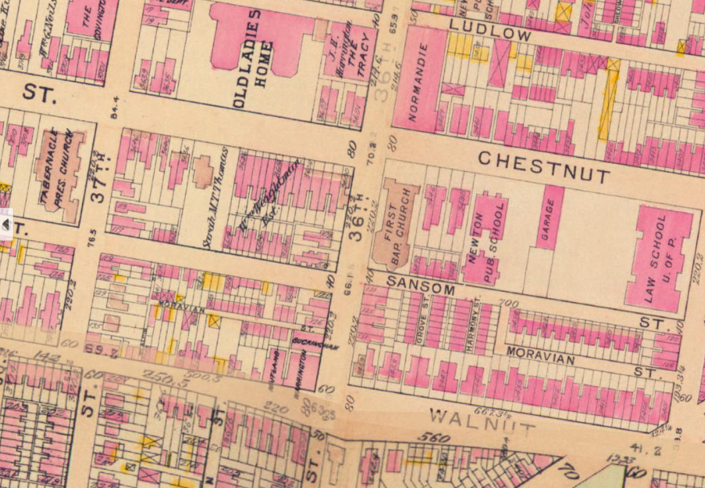
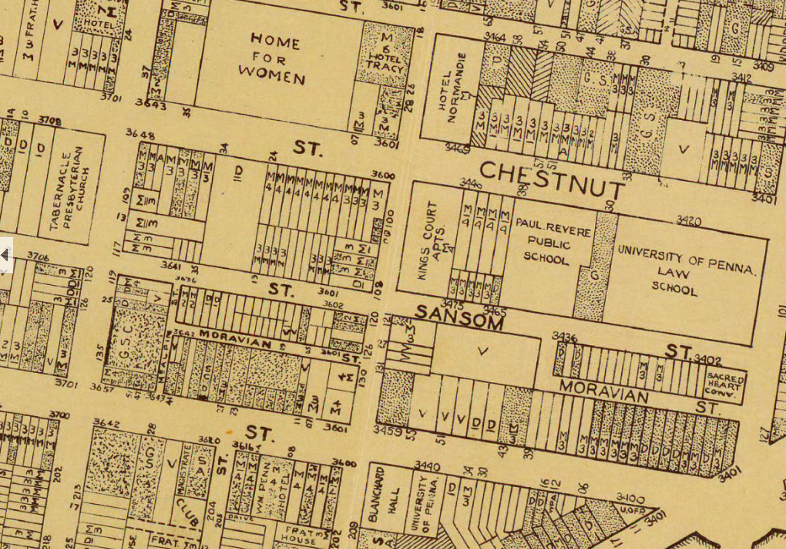
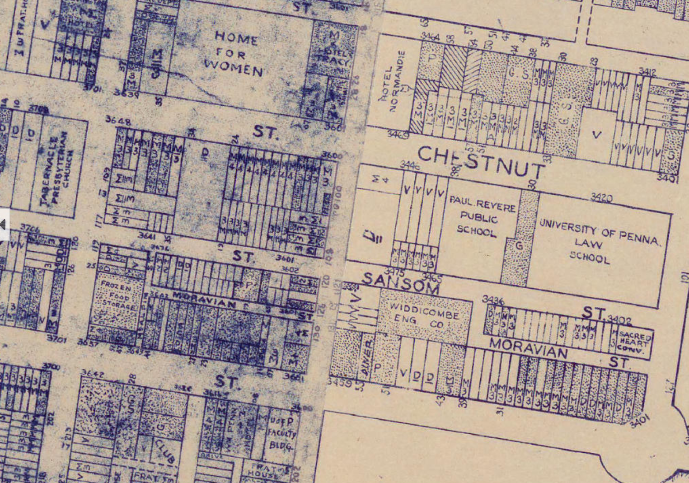
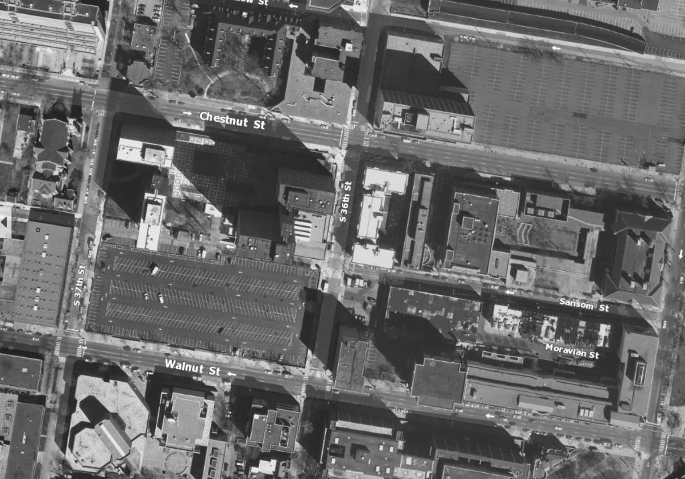
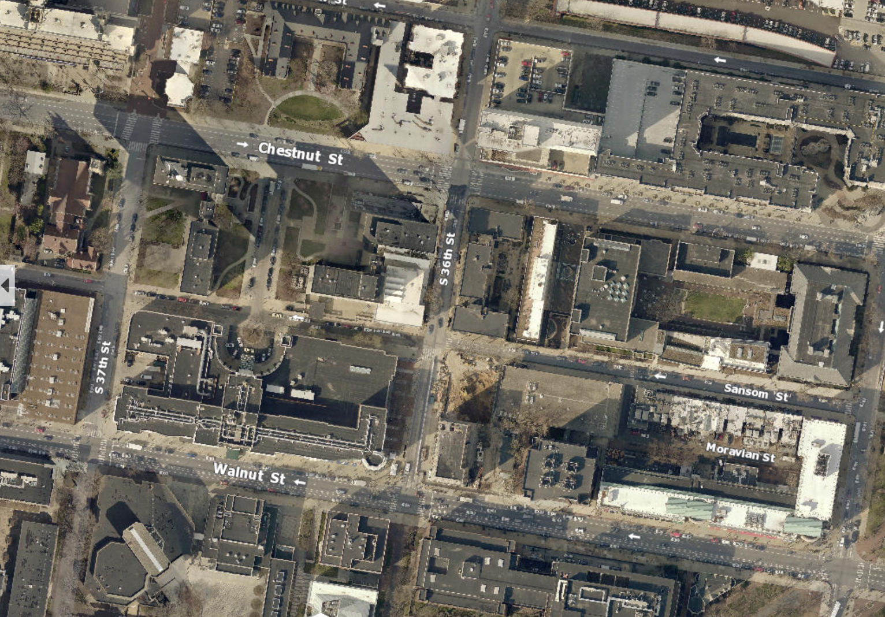

What would it feel like if my parents or grandparents' generations lived in the same building I live in 30 or 50 years ago? As a Korean student studying abroad, I am not used to that feeling because there are a lot of new cities and new buildings in Korea, but it is very common for the residents of Philadelphia.

"My father also graduated from the University of Pennsylvania, and he used the same dormitory building when he went to school."

"My grandmother also went to this cathedral."


``` r
knitr::opts_chunk$set(echo = TRUE)
if (!dir.exists("data")) {
  dir.create("data")
}

# Install and Load Libraries
# install.packages('mapview')
library(tidyverse)
library(tidycensus)
library(sf)
library(kableExtra)
library(mapview)
library(dplyr)
library(scales)
library(viridis)

# Disable Scientific Notation
options(scipen=999)
options(tigris_class = "sf")

# Set ACS API Key
census_api_key("b2835f54d89a4499ba29829c908967b86765b345", overwrite = TRUE)
```

The following photos of Chestnut Street and 36th Street show that Philadelphia has preserved its streetscape, buildings, and even type of businesses for over 100 years.

```{=html}
<div class="scroll-container">
  <div class="sticky-images">






</div>
</div>
```

```{=html}
<style>
  .scroll-container {
    position: relative;
    height: 600vh;
  }
  .sticky-images {
    position: sticky;
    top: 0;
    height: 100vh;
    display: flex;
    justify-content: center;
    align-items: center;
    background-color: #f8f9fa;
  }
  .sticky-images img {
    max-width: 100%;
    max-height: 100%;
    display: none;
  }
  .sticky-images img.active {
    display: block;
  }
</style>
```

```{=html}
<script>
  const images = document.querySelectorAll(".sticky-images img");
  const scrollContainer = document.querySelector(".scroll-container");
  const containerHeight = scrollContainer.offsetHeight;

  window.addEventListener("scroll", () => {
    const scrollPosition = window.scrollY;
    const sectionHeight = containerHeight / images.length;

    images.forEach((img, index) => {
      if (scrollPosition >= index * sectionHeight && scrollPosition < (index + 1) * sectionHeight) {
        img.classList.add("active");
      } else {
        img.classList.remove("active");
      }
    });
  });
</script>
```


``` r
# Get ACS Data of Philadelphia County 2010, 2015 and 2020
tracts10 <-  
  get_acs(geography = "tract",
          variables = c("B25034_001E","B25034_002E","B25034_003E","B25034_004E","B25034_005E","B25034_006E","B25034_007E","B25034_008E","B25034_009E","B25034_010E"), 
          year=2010, state="PA",
          county="Philadelphia", geometry=TRUE) %>% 
  st_as_sf(crs = 4326)%>%
  st_transform('ESRI:102728') # Use NAD 83 CRS

tracts15 <-  
  get_acs(geography = "tract",
          variables = c("B25034_001E","B25034_002E","B25034_003E","B25034_004E","B25034_005E","B25034_006E","B25034_007E","B25034_008E","B25034_009E","B25034_010E","B25034_011E"), 
          year=2015, state="PA",
          county="Philadelphia", geometry=TRUE) %>% 
  st_as_sf(crs = 4326)%>%
  st_transform('ESRI:102728') # Use NAD 83 CRS

tracts20 <-  
  get_acs(geography = "tract",
          variables = c("B25034_001E","B25034_002E","B25034_003E","B25034_004E","B25034_005E","B25034_006E","B25034_007E","B25034_008E","B25034_009E","B25034_010E","B25034_011E"), 
          year=2020, state="PA",
          county="Philadelphia", geometry=TRUE) %>% 
  st_as_sf(crs = 4326)%>%
  st_transform('ESRI:102728') # Use NAD 83 CRS

# Transforming Long Data to Wide Data Using Spread
tracts10 <- 
  tracts10 %>%
  dplyr::select( -NAME, -moe) %>%
  spread(key = variable, value = estimate) %>%
  rename(Total = B25034_001, 
         Y2005_to_Y2009 = B25034_002,
         Y2000_to_Y2004 = B25034_003, 
         Y1990_to_Y1999 = B25034_004,
         Y1980_to_Y1989 = B25034_005, 
         Y1970_to_Y1979 = B25034_006,
         Y1960_to_Y1969 = B25034_007,
         Y1950_to_Y1959 = B25034_008,
         Y1940_to_Y1949 = B25034_009,
         Y1939_or_earlier = B25034_010)

tracts20 <- 
  tracts20 %>%
  dplyr::select( -NAME, -moe) %>%
  spread(key = variable, value = estimate) %>%
  rename(Total = B25034_001, 
         Y2014_to_Y2019 = B25034_002,
         Y2010_to_Y2013 = B25034_003, 
         Y2000_to_Y2009 = B25034_004,
         Y1990_to_Y1999 = B25034_005, 
         Y1980_to_Y1989 = B25034_006,
         Y1970_to_Y1979 = B25034_007,
         Y1960_to_Y1969 = B25034_008,
         Y1950_to_Y1959 = B25034_009,
         Y1940_to_Y1949 = B25034_010,
         Y1939_or_earlier = B25034_011)

# Create Column that Calculates Proportion of 50 years above, 30 years above, and 10 years below
tracts10 <- 
  tracts10 %>%
  mutate(Y2010_to_Y2013=0,
         Y2014_to_Y2019=0,
         year="2010") %>%
  mutate(Y2000_to_Y2009=Y2000_to_Y2004+Y2005_to_Y2009) %>%
  mutate(pct50ab = ifelse(Total > 0, (Y1939_or_earlier+Y1940_to_Y1949+Y1950_to_Y1959) / Total, 0),
         pct30ab = ifelse(Total > 0, (Y1939_or_earlier+Y1940_to_Y1949+Y1950_to_Y1959+Y1960_to_Y1969+Y1970_to_Y1979) / Total, 0),
         pct10be = ifelse(Total > 0, (Y2005_to_Y2009+Y2000_to_Y2004) / Total, 0))

tracts20 <- 
  tracts20 %>%
  mutate(Y2000_to_Y2004=0,
         Y2005_to_Y2009=0,
         year="2020") %>%
  mutate(pct50ab = ifelse(Total > 0, (Y1939_or_earlier+Y1940_to_Y1949+Y1950_to_Y1959+Y1960_to_Y1969) / Total, 0),
         pct30ab = ifelse(Total > 0, (Y1939_or_earlier+Y1940_to_Y1949+Y1950_to_Y1959+Y1960_to_Y1969+Y1970_to_Y1979+Y1980_to_Y1989) / Total, 0),
         pct10be = ifelse(Total > 0, (Y2014_to_Y2019+Y2010_to_Y2013) / Total, 0))

# Row Bind of 2010 and 2020
allTracts <- rbind(tracts10,tracts20)
```

## Old Buildings in Philadelphia

This story is also confirmed by data. The following thematic map shows the proportion of buildings in Philadelphia that are more tha 30 years old by tract. The yellow area represents where 100% of buildings in the tract are more than 30 years old. You can see that the proportion in 2020 has decreased slightly in Center City and the Northeast compared to 2010.


``` r
ggplot() +
  geom_sf(data=allTracts, aes(fill=pct30ab))+
  facet_wrap(~year)+
  scale_fill_viridis()+
  labs(
    title = "Proportion of Buildings older than 30 years by Tract, 2010-2020",
    subtitle = "Year Structure Built, Age of buildings based on the respective census year",
    caption = "Data: U.S. Census Bureau") +
  theme_void()
```

<!-- -->

The following map shows the proportion of buildings in Philadelphia that are more than 50 years old by tract. The yellow area indicates that 100% of buildings in each tract are more than 50 years old. You can see that the proportion of buildings that are more than 50 years old in Center City and the North and Southwest increased slightly over the past decade.


``` r
ggplot() +
  geom_sf(data=allTracts, aes(fill=pct50ab))+
  facet_wrap(~year)+
  scale_fill_viridis()+
  labs(
    title = "Proportion of Buildings older than 50 years by Tract, 2010-2020",
    subtitle = "Year Structure Built, Age of buildings based on the respective census year",
    caption = "Data: U.S. Census Bureau") +
  theme_void()
```

<!-- -->

Meanwhile, the proportion of buildings built less than 10 years ago in each tract is as shown below. The Center City area was noticeably high in both 2010 and 2020, and the proportion increased particularly in 2020. It can be seen that construction has been active recently. In other tracts, there are hardly any buildings built in the past 10 years.


``` r
ggplot() +
  geom_sf(data=allTracts, aes(fill=pct10be))+
  facet_wrap(~year)+
  scale_fill_viridis()+
  labs(
    title = "Proportion of Buildings less than 10 years old by Tract, 2010-2020",
    subtitle = "Year Structure Built, Age of buildings based on the respective census year",
    caption = "Data: U.S. Census Bureau") +
  theme_void()
```

<!-- -->

## Historical Places in Philadelphia, and What Else?

Today, all properties of historical places in Philadelphia is managed by the City of Philadelphia, by undergoing a nomination process and being added to the register. The following map shows the locations of Philadelphia's historic sites. Yet many Philadelphians believe that many of Philadelphia's buildings, despite their preservation value, are not protected as much as they should be. Why is that?


``` r
historicPlaces <- st_read('./data/T_Table_1__XYTableToPoint.shp')
```

```
## Reading layer `T_Table_1__XYTableToPoint' from data source 
##   `/Users/yjmark/Documents/Communications/HW5/data/T_Table_1__XYTableToPoint.shp' 
##   using driver `ESRI Shapefile'
## Simple feature collection with 141 features and 8 fields
## Geometry type: POINT
## Dimension:     XY
## Bounding box:  xmin: 39.8756 ymin: -75.2465 xmax: 40.1159 ymax: -74.9695
## Projected CRS: NAD83 / Massachusetts Mainland
```

``` r
historicPlaces_trans <- historicPlaces %>%
  st_as_sf(coords=c("Y_Location","X_Location")) %>%
  st_transform(st_crs(tracts20)) # Use NAD 83 CRS
```


``` r
ggplot() + 
  geom_sf(data=st_union(tracts20)) +
  geom_point(
    data=historicPlaces_trans, aes(color="red", geometry=geometry), stat = "sf_coordinates")+
  labs(
    title = "Historical Places in Philadelphia",
    subtitle = "June, 2024",
    caption = "Data: City of Philadelphia") +
  theme_void()
```

<!-- -->

``` r
mapview(historicPlaces_trans)
```

```{=html}
<div class="leaflet html-widget html-fill-item" id="htmlwidget-45211b203481f3ebe852" style="width:672px;height:480px;"></div>
<script type="application/json" data-for="htmlwidget-45211b203481f3ebe852">{"x":{"options":{"minZoom":1,"maxZoom":52,"crs":{"crsClass":"L.CRS.EPSG3857","code":null,"proj4def":null,"projectedBounds":null,"options":{}},"preferCanvas":false,"bounceAtZoomLimits":false,"maxBounds":[[[-90,-370]],[[90,370]]]},"calls":[{"method":"addProviderTiles","args":["CartoDB.Positron","CartoDB.Positron","CartoDB.Positron",{"errorTileUrl":"","noWrap":false,"detectRetina":false,"pane":"tilePane"}]},{"method":"addProviderTiles","args":["CartoDB.DarkMatter","CartoDB.DarkMatter","CartoDB.DarkMatter",{"errorTileUrl":"","noWrap":false,"detectRetina":false,"pane":"tilePane"}]},{"method":"addProviderTiles","args":["OpenStreetMap","OpenStreetMap","OpenStreetMap",{"errorTileUrl":"","noWrap":false,"detectRetina":false,"pane":"tilePane"}]},{"method":"addProviderTiles","args":["Esri.WorldImagery","Esri.WorldImagery","Esri.WorldImagery",{"errorTileUrl":"","noWrap":false,"detectRetina":false,"pane":"tilePane"}]},{"method":"addProviderTiles","args":["OpenTopoMap","OpenTopoMap","OpenTopoMap",{"errorTileUrl":"","noWrap":false,"detectRetina":false,"pane":"tilePane"}]},{"method":"createMapPane","args":["point",440]},{"method":"addCircleMarkers","args":[[34.24372438136731,34.24372438661759,34.24372415141174,34.24372415840426,34.24372479925614,34.24372384269523,34.24372424829773,34.24372459800829,34.24372459349856,34.24372458910145,34.2437245874282,34.24372458832115,34.24372459791819,34.24372455674386,34.24372455513819,34.24372473607519,34.24372473245843,34.2437247619716,34.24372475837735,34.24372457372549,34.24372457015377,34.24372452736578,34.24372452830377,34.24372453180793,34.24372454478994,34.24372454277884,34.24372454124073,34.24372465171274,34.24372636084971,34.24372423256141,34.24372430953652,34.24372450663226,34.24372437326862,34.24372438927386,34.24372418015256,34.24372469970467,34.24372433224143,34.2437245131664,34.24372439550189,34.24372441538618,34.24372430166578,34.24372413332904,34.24372459146495,34.24372588914765,34.24372416890091,34.24372429804764,34.24372551425478,34.24372437560299,34.2437242784813,34.24372475063232,34.24372472835264,34.24372465257391,34.24372468858404,34.24372477498927,34.24372559272032,34.2437243201378,34.2437243851245,34.24372440168484,34.24372437684034,34.24372388771566,34.24372434252469,34.24372434518096,34.24372434424298,34.24372434069375,34.24372418889775,34.2437242745823,34.24372475213197,34.24372412850155,34.24372430702863,34.24372459074425,34.24372459076676,34.24372459878064,34.24372459965102,34.24372460235237,34.24372461483092,34.24372460232986,34.24372461389292,34.2437245685335,34.24372456585471,34.24372456848845,34.2437245507199,34.24372455603245,34.24372465483272,34.24372465574822,34.2437246441626,34.24372464418513,34.24372437148278,34.24372438927386,34.24372442817872,34.2437243661702,34.24372443670399,34.24372436990754,34.24372418378925,34.2437243761343,34.24372435363078,34.24372436805288,34.24372435892082,34.24372436443608,34.2437243751513,34.24372427512282,34.24372450011683,34.24372568861659,34.24372436083509,34.24372415715756,34.24372431080968,34.24372474423207,34.24372474423207,34.24372435920958,34.24372432905258,34.24372451876243,34.24372452144123,34.24372447246503,34.24372447692973,34.24372447599173,34.24372447154956,34.24372431350038,34.24372431528622,34.24372428784507,34.24372429411814,34.24372452959817,34.24372426421152,34.2437243245786,34.24372473153492,34.2437243075175,34.24372425341296,34.24372406413763,34.24372436882646,34.24372429133337,34.24372438215293,34.24372412622828,34.24372408888662,34.24372437679531,34.24372439290527,34.24372428738151,34.24372460311812,34.2437244542248,34.24372434758152,34.24372426257278,34.24372431852817,34.24372438483438,34.24372453973575],[-73.65094052603463,-73.65094074460445,-73.65094113877653,-73.65094050635177,-73.65094092282779,-73.65094128863534,-73.6509405230689,-73.65094093285421,-73.6509409348691,-73.65094093150776,-73.65094092607737,-73.65094092610448,-73.65094093715511,-73.65094111127847,-73.65094110262241,-73.65094022802066,-73.6509402300626,-73.65094010077348,-73.65094010174026,-73.65094102572115,-73.65094102561267,-73.65094123411625,-73.65094123199287,-73.6509412353271,-73.65094117009068,-73.65094118078868,-73.65094116890695,-73.65094084303266,-73.6509392283527,-73.65094063448599,-73.65094037214919,-73.65094132816691,-73.65094074204723,-73.65094074576106,-73.65094096104777,-73.65094098328312,-73.65094048258189,-73.65094076028308,-73.65094074702614,-73.65094077883153,-73.65094032134215,-73.65094174611835,-73.65094094664235,-73.65093999298753,-73.65093987726124,-73.65094045141784,-73.65093959104466,-73.65094067325963,-73.65094014849191,-73.65094094071743,-73.65094106592268,-73.65094101520499,-73.65094100231182,-73.65094092962219,-73.6509395988074,-73.65094050588438,-73.65094073057223,-73.65094075044165,-73.65094074215571,-73.65093999245113,-73.6509408874377,-73.65094088859429,-73.65094089071759,-73.65094088953394,-73.65094062885619,-73.65094059057384,-73.650941039747,-73.65094056892249,-73.65094053453589,-73.65094098104971,-73.65094097997446,-73.65094098129379,-73.65094098239615,-73.65094098140227,-73.65094098285721,-73.65094098247751,-73.65094098498049,-73.65094097499555,-73.65094097491418,-73.65094097714604,-73.65094097230265,-73.65094097461586,-73.65094099267944,-73.6509409916313,-73.65094099020351,-73.65094098912824,-73.65094074199298,-73.65094074576106,-73.65094089326689,-73.65094073967977,-73.65094078485858,-73.65094068922538,-73.65094048883225,-73.65094009335849,-73.6509401012823,-73.65094009526481,-73.65094010467067,-73.65094009730682,-73.65094009763227,-73.65094056476839,-73.65094082874516,-73.65093962754192,-73.65094073844189,-73.65094060852573,-73.65094060996466,-73.65094090501795,-73.65094090501795,-73.65094047479367,-73.65094046419452,-73.6509409196882,-73.65094091976955,-73.65094091182662,-73.65094091196222,-73.65094091408551,-73.65094091287466,-73.65094090807439,-73.65094090812865,-73.65094093849673,-73.65094093761132,-73.65094087160126,-73.65094065911737,-73.65094063512889,-73.65094099931268,-73.65094042588349,-73.65094002292453,-73.65093963199884,-73.65094074083638,-73.65094102790349,-73.65094074446884,-73.65093982432136,-73.6509401567204,-73.65094074430613,-73.65094006051451,-73.65094006484091,-73.65094094484449,-73.65094080152944,-73.65094094461469,-73.65094022547444,-73.65094015616363,-73.65094048848297,-73.65094085684636],6,null,"historicPlaces_trans",{"crs":{"crsClass":"L.CRS.EPSG3857","code":null,"proj4def":null,"projectedBounds":null,"options":{}},"pane":"point","stroke":true,"color":"#333333","weight":1,"opacity":0.9,"fill":true,"fillColor":"#6666FF","fillOpacity":0.6},null,null,["<div class='scrollableContainer'><table class=mapview-popup id='popup'><tr class='coord'><td><\/td><th><b>Feature ID&emsp;<\/b><\/th><td>1&emsp;<\/td><\/tr><tr><td>1<\/td><th>Resource_N&emsp;<\/th><td>Arnest Mansion (demolished)&emsp;<\/td><\/tr><tr><td>2<\/td><th>Approximat&emsp;<\/th><td>3300-99 W Susquehanna Ave&emsp;<\/td><\/tr><tr><td>3<\/td><th>X_Location&emsp;<\/th><td>39.98966&emsp;<\/td><\/tr><tr><td>4<\/td><th>Y_Location&emsp;<\/th><td>-75.18795&emsp;<\/td><\/tr><tr><td>5<\/td><th>Designatio&emsp;<\/th><td>3000-01-01&emsp;<\/td><\/tr><tr><td>6<\/td><th>District&emsp;<\/th><td>NA&emsp;<\/td><\/tr><tr><td>7<\/td><th>District_D&emsp;<\/th><td>NA&emsp;<\/td><\/tr><tr><td>8<\/td><th>Date&emsp;<\/th><td>   0&emsp;<\/td><\/tr><tr><td>9<\/td><th>geometry&emsp;<\/th><td>sfc_POINT&emsp;<\/td><\/tr><\/table><\/div>","<div class='scrollableContainer'><table class=mapview-popup id='popup'><tr class='coord'><td><\/td><th><b>Feature ID&emsp;<\/b><\/th><td>2&emsp;<\/td><\/tr><tr><td>1<\/td><th>Resource_N&emsp;<\/th><td>Bachelors Barge Club&emsp;<\/td><\/tr><tr><td>2<\/td><th>Approximat&emsp;<\/th><td>6 Boathouse Row&emsp;<\/td><\/tr><tr><td>3<\/td><th>X_Location&emsp;<\/th><td>39.96939&emsp;<\/td><\/tr><tr><td>4<\/td><th>Y_Location&emsp;<\/th><td>-75.18690&emsp;<\/td><\/tr><tr><td>5<\/td><th>Designatio&emsp;<\/th><td>1984-01-05&emsp;<\/td><\/tr><tr><td>6<\/td><th>District&emsp;<\/th><td>NA&emsp;<\/td><\/tr><tr><td>7<\/td><th>District_D&emsp;<\/th><td>NA&emsp;<\/td><\/tr><tr><td>8<\/td><th>Date&emsp;<\/th><td>1893&emsp;<\/td><\/tr><tr><td>9<\/td><th>geometry&emsp;<\/th><td>sfc_POINT&emsp;<\/td><\/tr><\/table><\/div>","<div class='scrollableContainer'><table class=mapview-popup id='popup'><tr class='coord'><td><\/td><th><b>Feature ID&emsp;<\/b><\/th><td>3&emsp;<\/td><\/tr><tr><td>1<\/td><th>Resource_N&emsp;<\/th><td>Bartram House with Garden and dependencies&emsp;<\/td><\/tr><tr><td>2<\/td><th>Approximat&emsp;<\/th><td>1650 S 53rd St&emsp;<\/td><\/tr><tr><td>3<\/td><th>X_Location&emsp;<\/th><td>39.93209&emsp;<\/td><\/tr><tr><td>4<\/td><th>Y_Location&emsp;<\/th><td>-75.21233&emsp;<\/td><\/tr><tr><td>5<\/td><th>Designatio&emsp;<\/th><td>1956-06-26&emsp;<\/td><\/tr><tr><td>6<\/td><th>District&emsp;<\/th><td>NA&emsp;<\/td><\/tr><tr><td>7<\/td><th>District_D&emsp;<\/th><td>NA&emsp;<\/td><\/tr><tr><td>8<\/td><th>Date&emsp;<\/th><td>   0&emsp;<\/td><\/tr><tr><td>9<\/td><th>geometry&emsp;<\/th><td>sfc_POINT&emsp;<\/td><\/tr><\/table><\/div>","<div class='scrollableContainer'><table class=mapview-popup id='popup'><tr class='coord'><td><\/td><th><b>Feature ID&emsp;<\/b><\/th><td>4&emsp;<\/td><\/tr><tr><td>1<\/td><th>Resource_N&emsp;<\/th><td>Belmont Mansion&emsp;<\/td><\/tr><tr><td>2<\/td><th>Approximat&emsp;<\/th><td>2000 Belmont Mansion Dr&emsp;<\/td><\/tr><tr><td>3<\/td><th>X_Location&emsp;<\/th><td>39.99094&emsp;<\/td><\/tr><tr><td>4<\/td><th>Y_Location&emsp;<\/th><td>-75.21304&emsp;<\/td><\/tr><tr><td>5<\/td><th>Designatio&emsp;<\/th><td>1956-06-26&emsp;<\/td><\/tr><tr><td>6<\/td><th>District&emsp;<\/th><td>NA&emsp;<\/td><\/tr><tr><td>7<\/td><th>District_D&emsp;<\/th><td>NA&emsp;<\/td><\/tr><tr><td>8<\/td><th>Date&emsp;<\/th><td>   0&emsp;<\/td><\/tr><tr><td>9<\/td><th>geometry&emsp;<\/th><td>sfc_POINT&emsp;<\/td><\/tr><\/table><\/div>","<div class='scrollableContainer'><table class=mapview-popup id='popup'><tr class='coord'><td><\/td><th><b>Feature ID&emsp;<\/b><\/th><td>5&emsp;<\/td><\/tr><tr><td>1<\/td><th>Resource_N&emsp;<\/th><td>Benjamin Franklin Bridge over the Delaware River&emsp;<\/td><\/tr><tr><td>2<\/td><th>Approximat&emsp;<\/th><td>200 N 5th St&emsp;<\/td><\/tr><tr><td>3<\/td><th>X_Location&emsp;<\/th><td>39.95396&emsp;<\/td><\/tr><tr><td>4<\/td><th>Y_Location&emsp;<\/th><td>-75.14026&emsp;<\/td><\/tr><tr><td>5<\/td><th>Designatio&emsp;<\/th><td>2003-12-12&emsp;<\/td><\/tr><tr><td>6<\/td><th>District&emsp;<\/th><td>NA&emsp;<\/td><\/tr><tr><td>7<\/td><th>District_D&emsp;<\/th><td>NA&emsp;<\/td><\/tr><tr><td>8<\/td><th>Date&emsp;<\/th><td>   0&emsp;<\/td><\/tr><tr><td>9<\/td><th>geometry&emsp;<\/th><td>sfc_POINT&emsp;<\/td><\/tr><\/table><\/div>","<div class='scrollableContainer'><table class=mapview-popup id='popup'><tr class='coord'><td><\/td><th><b>Feature ID&emsp;<\/b><\/th><td>6&emsp;<\/td><\/tr><tr><td>1<\/td><th>Resource_N&emsp;<\/th><td>Blue Bell Tavern&emsp;<\/td><\/tr><tr><td>2<\/td><th>Approximat&emsp;<\/th><td>7303 Woodland Ave&emsp;<\/td><\/tr><tr><td>3<\/td><th>X_Location&emsp;<\/th><td>39.91731&emsp;<\/td><\/tr><tr><td>4<\/td><th>Y_Location&emsp;<\/th><td>-75.24651&emsp;<\/td><\/tr><tr><td>5<\/td><th>Designatio&emsp;<\/th><td>1958-09-30&emsp;<\/td><\/tr><tr><td>6<\/td><th>District&emsp;<\/th><td>NA&emsp;<\/td><\/tr><tr><td>7<\/td><th>District_D&emsp;<\/th><td>NA&emsp;<\/td><\/tr><tr><td>8<\/td><th>Date&emsp;<\/th><td>   0&emsp;<\/td><\/tr><tr><td>9<\/td><th>geometry&emsp;<\/th><td>sfc_POINT&emsp;<\/td><\/tr><\/table><\/div>","<div class='scrollableContainer'><table class=mapview-popup id='popup'><tr class='coord'><td><\/td><th><b>Feature ID&emsp;<\/b><\/th><td>7&emsp;<\/td><\/tr><tr><td>1<\/td><th>Resource_N&emsp;<\/th><td>Boelson Cottage&emsp;<\/td><\/tr><tr><td>2<\/td><th>Approximat&emsp;<\/th><td>1 M L King Dr&emsp;<\/td><\/tr><tr><td>3<\/td><th>X_Location&emsp;<\/th><td>39.98965&emsp;<\/td><\/tr><tr><td>4<\/td><th>Y_Location&emsp;<\/th><td>-75.20294&emsp;<\/td><\/tr><tr><td>5<\/td><th>Designatio&emsp;<\/th><td>1963-05-28&emsp;<\/td><\/tr><tr><td>6<\/td><th>District&emsp;<\/th><td>NA&emsp;<\/td><\/tr><tr><td>7<\/td><th>District_D&emsp;<\/th><td>NA&emsp;<\/td><\/tr><tr><td>8<\/td><th>Date&emsp;<\/th><td>   0&emsp;<\/td><\/tr><tr><td>9<\/td><th>geometry&emsp;<\/th><td>sfc_POINT&emsp;<\/td><\/tr><\/table><\/div>","<div class='scrollableContainer'><table class=mapview-popup id='popup'><tr class='coord'><td><\/td><th><b>Feature ID&emsp;<\/b><\/th><td>8&emsp;<\/td><\/tr><tr><td>1<\/td><th>Resource_N&emsp;<\/th><td>Broad Street Subway Entrance, City Hall Station&emsp;<\/td><\/tr><tr><td>2<\/td><th>Approximat&emsp;<\/th><td>Market St and S. Juniper St, Northwest Corner&emsp;<\/td><\/tr><tr><td>3<\/td><th>X_Location&emsp;<\/th><td>39.95248&emsp;<\/td><\/tr><tr><td>4<\/td><th>Y_Location&emsp;<\/th><td>-75.16276&emsp;<\/td><\/tr><tr><td>5<\/td><th>Designatio&emsp;<\/th><td>NA&emsp;<\/td><\/tr><tr><td>6<\/td><th>District&emsp;<\/th><td>Cast-Iron Subway Entrances&emsp;<\/td><\/tr><tr><td>7<\/td><th>District_D&emsp;<\/th><td>2019-03-08&emsp;<\/td><\/tr><tr><td>8<\/td><th>Date&emsp;<\/th><td>1936&emsp;<\/td><\/tr><tr><td>9<\/td><th>geometry&emsp;<\/th><td>sfc_POINT&emsp;<\/td><\/tr><\/table><\/div>","<div class='scrollableContainer'><table class=mapview-popup id='popup'><tr class='coord'><td><\/td><th><b>Feature ID&emsp;<\/b><\/th><td>9&emsp;<\/td><\/tr><tr><td>1<\/td><th>Resource_N&emsp;<\/th><td>Broad Street Subway Entrance, City Hall Station&emsp;<\/td><\/tr><tr><td>2<\/td><th>Approximat&emsp;<\/th><td>City Hall Courtyard, Southeast Corner&emsp;<\/td><\/tr><tr><td>3<\/td><th>X_Location&emsp;<\/th><td>39.95226&emsp;<\/td><\/tr><tr><td>4<\/td><th>Y_Location&emsp;<\/th><td>-75.16334&emsp;<\/td><\/tr><tr><td>5<\/td><th>Designatio&emsp;<\/th><td>NA&emsp;<\/td><\/tr><tr><td>6<\/td><th>District&emsp;<\/th><td>Cast-Iron Subway Entrances&emsp;<\/td><\/tr><tr><td>7<\/td><th>District_D&emsp;<\/th><td>2019-03-08&emsp;<\/td><\/tr><tr><td>8<\/td><th>Date&emsp;<\/th><td>1931&emsp;<\/td><\/tr><tr><td>9<\/td><th>geometry&emsp;<\/th><td>sfc_POINT&emsp;<\/td><\/tr><\/table><\/div>","<div class='scrollableContainer'><table class=mapview-popup id='popup'><tr class='coord'><td><\/td><th><b>Feature ID&emsp;<\/b><\/th><td>10&emsp;<\/td><\/tr><tr><td>1<\/td><th>Resource_N&emsp;<\/th><td>Broad Street Subway Entrance, City Hall Station&emsp;<\/td><\/tr><tr><td>2<\/td><th>Approximat&emsp;<\/th><td>City Hall Courtyard, Northwest Corner&emsp;<\/td><\/tr><tr><td>3<\/td><th>X_Location&emsp;<\/th><td>39.95256&emsp;<\/td><\/tr><tr><td>4<\/td><th>Y_Location&emsp;<\/th><td>-75.16383&emsp;<\/td><\/tr><tr><td>5<\/td><th>Designatio&emsp;<\/th><td>NA&emsp;<\/td><\/tr><tr><td>6<\/td><th>District&emsp;<\/th><td>Cast-Iron Subway Entrances&emsp;<\/td><\/tr><tr><td>7<\/td><th>District_D&emsp;<\/th><td>2019-03-08&emsp;<\/td><\/tr><tr><td>8<\/td><th>Date&emsp;<\/th><td>1928&emsp;<\/td><\/tr><tr><td>9<\/td><th>geometry&emsp;<\/th><td>sfc_POINT&emsp;<\/td><\/tr><\/table><\/div>","<div class='scrollableContainer'><table class=mapview-popup id='popup'><tr class='coord'><td><\/td><th><b>Feature ID&emsp;<\/b><\/th><td>11&emsp;<\/td><\/tr><tr><td>1<\/td><th>Resource_N&emsp;<\/th><td>Broad Street Subway Entrance, City Hall Station&emsp;<\/td><\/tr><tr><td>2<\/td><th>Approximat&emsp;<\/th><td>N. Broad St and John F. Kennedy Blvd, Southwest\nCorner&emsp;<\/td><\/tr><tr><td>3<\/td><th>X_Location&emsp;<\/th><td>39.95308&emsp;<\/td><\/tr><tr><td>4<\/td><th>Y_Location&emsp;<\/th><td>-75.16397&emsp;<\/td><\/tr><tr><td>5<\/td><th>Designatio&emsp;<\/th><td>NA&emsp;<\/td><\/tr><tr><td>6<\/td><th>District&emsp;<\/th><td>Cast-Iron Subway Entrances&emsp;<\/td><\/tr><tr><td>7<\/td><th>District_D&emsp;<\/th><td>2019-03-08&emsp;<\/td><\/tr><tr><td>8<\/td><th>Date&emsp;<\/th><td>1928&emsp;<\/td><\/tr><tr><td>9<\/td><th>geometry&emsp;<\/th><td>sfc_POINT&emsp;<\/td><\/tr><\/table><\/div>","<div class='scrollableContainer'><table class=mapview-popup id='popup'><tr class='coord'><td><\/td><th><b>Feature ID&emsp;<\/b><\/th><td>12&emsp;<\/td><\/tr><tr><td>1<\/td><th>Resource_N&emsp;<\/th><td>Broad Street Subway Entrance, City Hall Station&emsp;<\/td><\/tr><tr><td>2<\/td><th>Approximat&emsp;<\/th><td>N. Broad St and John F. Kennedy Blvd, Southwest\nCorner&emsp;<\/td><\/tr><tr><td>3<\/td><th>X_Location&emsp;<\/th><td>39.95309&emsp;<\/td><\/tr><tr><td>4<\/td><th>Y_Location&emsp;<\/th><td>-75.16385&emsp;<\/td><\/tr><tr><td>5<\/td><th>Designatio&emsp;<\/th><td>NA&emsp;<\/td><\/tr><tr><td>6<\/td><th>District&emsp;<\/th><td>Cast-Iron Subway Entrances&emsp;<\/td><\/tr><tr><td>7<\/td><th>District_D&emsp;<\/th><td>2019-03-08&emsp;<\/td><\/tr><tr><td>8<\/td><th>Date&emsp;<\/th><td>1928&emsp;<\/td><\/tr><tr><td>9<\/td><th>geometry&emsp;<\/th><td>sfc_POINT&emsp;<\/td><\/tr><\/table><\/div>","<div class='scrollableContainer'><table class=mapview-popup id='popup'><tr class='coord'><td><\/td><th><b>Feature ID&emsp;<\/b><\/th><td>13&emsp;<\/td><\/tr><tr><td>1<\/td><th>Resource_N&emsp;<\/th><td>Broad Street Subway Entrance, City Hall Station&emsp;<\/td><\/tr><tr><td>2<\/td><th>Approximat&emsp;<\/th><td>Market St and S. Juniper St, Southwest Corner&emsp;<\/td><\/tr><tr><td>3<\/td><th>X_Location&emsp;<\/th><td>39.95210&emsp;<\/td><\/tr><tr><td>4<\/td><th>Y_Location&emsp;<\/th><td>-75.16285&emsp;<\/td><\/tr><tr><td>5<\/td><th>Designatio&emsp;<\/th><td>NA&emsp;<\/td><\/tr><tr><td>6<\/td><th>District&emsp;<\/th><td>Cast-Iron Subway Entrances&emsp;<\/td><\/tr><tr><td>7<\/td><th>District_D&emsp;<\/th><td>2019-03-08&emsp;<\/td><\/tr><tr><td>8<\/td><th>Date&emsp;<\/th><td>1936&emsp;<\/td><\/tr><tr><td>9<\/td><th>geometry&emsp;<\/th><td>sfc_POINT&emsp;<\/td><\/tr><\/table><\/div>","<div class='scrollableContainer'><table class=mapview-popup id='popup'><tr class='coord'><td><\/td><th><b>Feature ID&emsp;<\/b><\/th><td>14&emsp;<\/td><\/tr><tr><td>1<\/td><th>Resource_N&emsp;<\/th><td>Broad Street Subway Entrance, Ellsworth-Federal Station&emsp;<\/td><\/tr><tr><td>2<\/td><th>Approximat&emsp;<\/th><td>S. Broad St and Federal St, Northeast Corner&emsp;<\/td><\/tr><tr><td>3<\/td><th>X_Location&emsp;<\/th><td>39.93577&emsp;<\/td><\/tr><tr><td>4<\/td><th>Y_Location&emsp;<\/th><td>-75.16703&emsp;<\/td><\/tr><tr><td>5<\/td><th>Designatio&emsp;<\/th><td>NA&emsp;<\/td><\/tr><tr><td>6<\/td><th>District&emsp;<\/th><td>Cast-Iron Subway Entrances&emsp;<\/td><\/tr><tr><td>7<\/td><th>District_D&emsp;<\/th><td>2019-03-08&emsp;<\/td><\/tr><tr><td>8<\/td><th>Date&emsp;<\/th><td>1938&emsp;<\/td><\/tr><tr><td>9<\/td><th>geometry&emsp;<\/th><td>sfc_POINT&emsp;<\/td><\/tr><\/table><\/div>","<div class='scrollableContainer'><table class=mapview-popup id='popup'><tr class='coord'><td><\/td><th><b>Feature ID&emsp;<\/b><\/th><td>15&emsp;<\/td><\/tr><tr><td>1<\/td><th>Resource_N&emsp;<\/th><td>Broad Street Subway Entrance, Ellsworth-Federal Station&emsp;<\/td><\/tr><tr><td>2<\/td><th>Approximat&emsp;<\/th><td>S. Broad St and Ellsworth St, Southwest Corner&emsp;<\/td><\/tr><tr><td>3<\/td><th>X_Location&emsp;<\/th><td>39.93660&emsp;<\/td><\/tr><tr><td>4<\/td><th>Y_Location&emsp;<\/th><td>-75.16724&emsp;<\/td><\/tr><tr><td>5<\/td><th>Designatio&emsp;<\/th><td>NA&emsp;<\/td><\/tr><tr><td>6<\/td><th>District&emsp;<\/th><td>Cast-Iron Subway Entrances&emsp;<\/td><\/tr><tr><td>7<\/td><th>District_D&emsp;<\/th><td>2019-03-08&emsp;<\/td><\/tr><tr><td>8<\/td><th>Date&emsp;<\/th><td>1938&emsp;<\/td><\/tr><tr><td>9<\/td><th>geometry&emsp;<\/th><td>sfc_POINT&emsp;<\/td><\/tr><\/table><\/div>","<div class='scrollableContainer'><table class=mapview-popup id='popup'><tr class='coord'><td><\/td><th><b>Feature ID&emsp;<\/b><\/th><td>16&emsp;<\/td><\/tr><tr><td>1<\/td><th>Resource_N&emsp;<\/th><td>Broad Street Subway Entrance, Hunting Park Station&emsp;<\/td><\/tr><tr><td>2<\/td><th>Approximat&emsp;<\/th><td>N. Broad St and W. Bristol St, Southeast Corner&emsp;<\/td><\/tr><tr><td>3<\/td><th>X_Location&emsp;<\/th><td>40.01838&emsp;<\/td><\/tr><tr><td>4<\/td><th>Y_Location&emsp;<\/th><td>-75.14899&emsp;<\/td><\/tr><tr><td>5<\/td><th>Designatio&emsp;<\/th><td>NA&emsp;<\/td><\/tr><tr><td>6<\/td><th>District&emsp;<\/th><td>Cast-Iron Subway Entrances&emsp;<\/td><\/tr><tr><td>7<\/td><th>District_D&emsp;<\/th><td>2019-03-08&emsp;<\/td><\/tr><tr><td>8<\/td><th>Date&emsp;<\/th><td>1928&emsp;<\/td><\/tr><tr><td>9<\/td><th>geometry&emsp;<\/th><td>sfc_POINT&emsp;<\/td><\/tr><\/table><\/div>","<div class='scrollableContainer'><table class=mapview-popup id='popup'><tr class='coord'><td><\/td><th><b>Feature ID&emsp;<\/b><\/th><td>17&emsp;<\/td><\/tr><tr><td>1<\/td><th>Resource_N&emsp;<\/th><td>Broad Street Subway Entrance, Hunting Park Station&emsp;<\/td><\/tr><tr><td>2<\/td><th>Approximat&emsp;<\/th><td>N. Broad St and W. Roosevelt Blvd, Northwest Corner&emsp;<\/td><\/tr><tr><td>3<\/td><th>X_Location&emsp;<\/th><td>40.01816&emsp;<\/td><\/tr><tr><td>4<\/td><th>Y_Location&emsp;<\/th><td>-75.14945&emsp;<\/td><\/tr><tr><td>5<\/td><th>Designatio&emsp;<\/th><td>NA&emsp;<\/td><\/tr><tr><td>6<\/td><th>District&emsp;<\/th><td>Cast-Iron Subway Entrances&emsp;<\/td><\/tr><tr><td>7<\/td><th>District_D&emsp;<\/th><td>2019-03-08&emsp;<\/td><\/tr><tr><td>8<\/td><th>Date&emsp;<\/th><td>1928&emsp;<\/td><\/tr><tr><td>9<\/td><th>geometry&emsp;<\/th><td>sfc_POINT&emsp;<\/td><\/tr><\/table><\/div>","<div class='scrollableContainer'><table class=mapview-popup id='popup'><tr class='coord'><td><\/td><th><b>Feature ID&emsp;<\/b><\/th><td>18&emsp;<\/td><\/tr><tr><td>1<\/td><th>Resource_N&emsp;<\/th><td>Broad Street Subway Entrance, Logan Station&emsp;<\/td><\/tr><tr><td>2<\/td><th>Approximat&emsp;<\/th><td>N. Broad St and Lindley Ave, Southeast Corner&emsp;<\/td><\/tr><tr><td>3<\/td><th>X_Location&emsp;<\/th><td>40.03033&emsp;<\/td><\/tr><tr><td>4<\/td><th>Y_Location&emsp;<\/th><td>-75.14643&emsp;<\/td><\/tr><tr><td>5<\/td><th>Designatio&emsp;<\/th><td>NA&emsp;<\/td><\/tr><tr><td>6<\/td><th>District&emsp;<\/th><td>Cast-Iron Subway Entrances&emsp;<\/td><\/tr><tr><td>7<\/td><th>District_D&emsp;<\/th><td>2019-03-08&emsp;<\/td><\/tr><tr><td>8<\/td><th>Date&emsp;<\/th><td>1928&emsp;<\/td><\/tr><tr><td>9<\/td><th>geometry&emsp;<\/th><td>sfc_POINT&emsp;<\/td><\/tr><\/table><\/div>","<div class='scrollableContainer'><table class=mapview-popup id='popup'><tr class='coord'><td><\/td><th><b>Feature ID&emsp;<\/b><\/th><td>19&emsp;<\/td><\/tr><tr><td>1<\/td><th>Resource_N&emsp;<\/th><td>Broad Street Subway Entrance, Logan Station&emsp;<\/td><\/tr><tr><td>2<\/td><th>Approximat&emsp;<\/th><td>N. Broad St and W. Fishers Ln, Southwest Corner&emsp;<\/td><\/tr><tr><td>3<\/td><th>X_Location&emsp;<\/th><td>40.03017&emsp;<\/td><\/tr><tr><td>4<\/td><th>Y_Location&emsp;<\/th><td>-75.14681&emsp;<\/td><\/tr><tr><td>5<\/td><th>Designatio&emsp;<\/th><td>NA&emsp;<\/td><\/tr><tr><td>6<\/td><th>District&emsp;<\/th><td>Cast-Iron Subway Entrances&emsp;<\/td><\/tr><tr><td>7<\/td><th>District_D&emsp;<\/th><td>2019-03-08&emsp;<\/td><\/tr><tr><td>8<\/td><th>Date&emsp;<\/th><td>1928&emsp;<\/td><\/tr><tr><td>9<\/td><th>geometry&emsp;<\/th><td>sfc_POINT&emsp;<\/td><\/tr><\/table><\/div>","<div class='scrollableContainer'><table class=mapview-popup id='popup'><tr class='coord'><td><\/td><th><b>Feature ID&emsp;<\/b><\/th><td>20&emsp;<\/td><\/tr><tr><td>1<\/td><th>Resource_N&emsp;<\/th><td>Broad Street Subway Entrance, Lombard-South Station&emsp;<\/td><\/tr><tr><td>2<\/td><th>Approximat&emsp;<\/th><td>S. Broad St and South St, Northeast Corner&emsp;<\/td><\/tr><tr><td>3<\/td><th>X_Location&emsp;<\/th><td>39.94375&emsp;<\/td><\/tr><tr><td>4<\/td><th>Y_Location&emsp;<\/th><td>-75.16533&emsp;<\/td><\/tr><tr><td>5<\/td><th>Designatio&emsp;<\/th><td>NA&emsp;<\/td><\/tr><tr><td>6<\/td><th>District&emsp;<\/th><td>Cast-Iron Subway Entrances&emsp;<\/td><\/tr><tr><td>7<\/td><th>District_D&emsp;<\/th><td>2019-03-08&emsp;<\/td><\/tr><tr><td>8<\/td><th>Date&emsp;<\/th><td>1930&emsp;<\/td><\/tr><tr><td>9<\/td><th>geometry&emsp;<\/th><td>sfc_POINT&emsp;<\/td><\/tr><\/table><\/div>","<div class='scrollableContainer'><table class=mapview-popup id='popup'><tr class='coord'><td><\/td><th><b>Feature ID&emsp;<\/b><\/th><td>21&emsp;<\/td><\/tr><tr><td>1<\/td><th>Resource_N&emsp;<\/th><td>Broad Street Subway Entrance, Lombard-South Station&emsp;<\/td><\/tr><tr><td>2<\/td><th>Approximat&emsp;<\/th><td>S. Broad St and South St, Northwest Corner&emsp;<\/td><\/tr><tr><td>3<\/td><th>X_Location&emsp;<\/th><td>39.94380&emsp;<\/td><\/tr><tr><td>4<\/td><th>Y_Location&emsp;<\/th><td>-75.16567&emsp;<\/td><\/tr><tr><td>5<\/td><th>Designatio&emsp;<\/th><td>NA&emsp;<\/td><\/tr><tr><td>6<\/td><th>District&emsp;<\/th><td>Cast-Iron Subway Entrances&emsp;<\/td><\/tr><tr><td>7<\/td><th>District_D&emsp;<\/th><td>2019-03-08&emsp;<\/td><\/tr><tr><td>8<\/td><th>Date&emsp;<\/th><td>1930&emsp;<\/td><\/tr><tr><td>9<\/td><th>geometry&emsp;<\/th><td>sfc_POINT&emsp;<\/td><\/tr><\/table><\/div>","<div class='scrollableContainer'><table class=mapview-popup id='popup'><tr class='coord'><td><\/td><th><b>Feature ID&emsp;<\/b><\/th><td>22&emsp;<\/td><\/tr><tr><td>1<\/td><th>Resource_N&emsp;<\/th><td>Broad Street Subway Entrance, Snyder Station&emsp;<\/td><\/tr><tr><td>2<\/td><th>Approximat&emsp;<\/th><td>S. Broad St and Snyder Ave, Southwest Corner&emsp;<\/td><\/tr><tr><td>3<\/td><th>X_Location&emsp;<\/th><td>39.92433&emsp;<\/td><\/tr><tr><td>4<\/td><th>Y_Location&emsp;<\/th><td>-75.16999&emsp;<\/td><\/tr><tr><td>5<\/td><th>Designatio&emsp;<\/th><td>NA&emsp;<\/td><\/tr><tr><td>6<\/td><th>District&emsp;<\/th><td>Cast-Iron Subway Entrances&emsp;<\/td><\/tr><tr><td>7<\/td><th>District_D&emsp;<\/th><td>2019-03-08&emsp;<\/td><\/tr><tr><td>8<\/td><th>Date&emsp;<\/th><td>1938&emsp;<\/td><\/tr><tr><td>9<\/td><th>geometry&emsp;<\/th><td>sfc_POINT&emsp;<\/td><\/tr><\/table><\/div>","<div class='scrollableContainer'><table class=mapview-popup id='popup'><tr class='coord'><td><\/td><th><b>Feature ID&emsp;<\/b><\/th><td>23&emsp;<\/td><\/tr><tr><td>1<\/td><th>Resource_N&emsp;<\/th><td>Broad Street Subway Entrance, Snyder Station&emsp;<\/td><\/tr><tr><td>2<\/td><th>Approximat&emsp;<\/th><td>S. Broad St and Snyder Ave, Northwest Corner&emsp;<\/td><\/tr><tr><td>3<\/td><th>X_Location&emsp;<\/th><td>39.92454&emsp;<\/td><\/tr><tr><td>4<\/td><th>Y_Location&emsp;<\/th><td>-75.16985&emsp;<\/td><\/tr><tr><td>5<\/td><th>Designatio&emsp;<\/th><td>NA&emsp;<\/td><\/tr><tr><td>6<\/td><th>District&emsp;<\/th><td>Cast-Iron Subway Entrances&emsp;<\/td><\/tr><tr><td>7<\/td><th>District_D&emsp;<\/th><td>2019-03-08&emsp;<\/td><\/tr><tr><td>8<\/td><th>Date&emsp;<\/th><td>1938&emsp;<\/td><\/tr><tr><td>9<\/td><th>geometry&emsp;<\/th><td>sfc_POINT&emsp;<\/td><\/tr><\/table><\/div>","<div class='scrollableContainer'><table class=mapview-popup id='popup'><tr class='coord'><td><\/td><th><b>Feature ID&emsp;<\/b><\/th><td>24&emsp;<\/td><\/tr><tr><td>1<\/td><th>Resource_N&emsp;<\/th><td>Broad Street Subway Entrance, Snyder Station&emsp;<\/td><\/tr><tr><td>2<\/td><th>Approximat&emsp;<\/th><td>S. Broad St and Snyder Ave, Southeast Corner&emsp;<\/td><\/tr><tr><td>3<\/td><th>X_Location&emsp;<\/th><td>39.92421&emsp;<\/td><\/tr><tr><td>4<\/td><th>Y_Location&emsp;<\/th><td>-75.16949&emsp;<\/td><\/tr><tr><td>5<\/td><th>Designatio&emsp;<\/th><td>NA&emsp;<\/td><\/tr><tr><td>6<\/td><th>District&emsp;<\/th><td>Cast-Iron Subway Entrances&emsp;<\/td><\/tr><tr><td>7<\/td><th>District_D&emsp;<\/th><td>2019-03-08&emsp;<\/td><\/tr><tr><td>8<\/td><th>Date&emsp;<\/th><td>1938&emsp;<\/td><\/tr><tr><td>9<\/td><th>geometry&emsp;<\/th><td>sfc_POINT&emsp;<\/td><\/tr><\/table><\/div>","<div class='scrollableContainer'><table class=mapview-popup id='popup'><tr class='coord'><td><\/td><th><b>Feature ID&emsp;<\/b><\/th><td>25&emsp;<\/td><\/tr><tr><td>1<\/td><th>Resource_N&emsp;<\/th><td>Broad Street Subway Entrance, Tasker-Morris Station&emsp;<\/td><\/tr><tr><td>2<\/td><th>Approximat&emsp;<\/th><td>S. Broad St and Tasker St, Southeast Corner&emsp;<\/td><\/tr><tr><td>3<\/td><th>X_Location&emsp;<\/th><td>39.93030&emsp;<\/td><\/tr><tr><td>4<\/td><th>Y_Location&emsp;<\/th><td>-75.16823&emsp;<\/td><\/tr><tr><td>5<\/td><th>Designatio&emsp;<\/th><td>NA&emsp;<\/td><\/tr><tr><td>6<\/td><th>District&emsp;<\/th><td>Cast-Iron Subway Entrances&emsp;<\/td><\/tr><tr><td>7<\/td><th>District_D&emsp;<\/th><td>2019-03-08&emsp;<\/td><\/tr><tr><td>8<\/td><th>Date&emsp;<\/th><td>1938&emsp;<\/td><\/tr><tr><td>9<\/td><th>geometry&emsp;<\/th><td>sfc_POINT&emsp;<\/td><\/tr><\/table><\/div>","<div class='scrollableContainer'><table class=mapview-popup id='popup'><tr class='coord'><td><\/td><th><b>Feature ID&emsp;<\/b><\/th><td>26&emsp;<\/td><\/tr><tr><td>1<\/td><th>Resource_N&emsp;<\/th><td>Broad Street Subway Entrance, Tasker-Morris Station&emsp;<\/td><\/tr><tr><td>2<\/td><th>Approximat&emsp;<\/th><td>S. Broad St and Morris St, Northeast Corner&emsp;<\/td><\/tr><tr><td>3<\/td><th>X_Location&emsp;<\/th><td>39.92930&emsp;<\/td><\/tr><tr><td>4<\/td><th>Y_Location&emsp;<\/th><td>-75.16838&emsp;<\/td><\/tr><tr><td>5<\/td><th>Designatio&emsp;<\/th><td>NA&emsp;<\/td><\/tr><tr><td>6<\/td><th>District&emsp;<\/th><td>Cast-Iron Subway Entrances&emsp;<\/td><\/tr><tr><td>7<\/td><th>District_D&emsp;<\/th><td>2019-03-08&emsp;<\/td><\/tr><tr><td>8<\/td><th>Date&emsp;<\/th><td>1938&emsp;<\/td><\/tr><tr><td>9<\/td><th>geometry&emsp;<\/th><td>sfc_POINT&emsp;<\/td><\/tr><\/table><\/div>","<div class='scrollableContainer'><table class=mapview-popup id='popup'><tr class='coord'><td><\/td><th><b>Feature ID&emsp;<\/b><\/th><td>27&emsp;<\/td><\/tr><tr><td>1<\/td><th>Resource_N&emsp;<\/th><td>Broad Street Subway Entrance, Tasker-Morris Station&emsp;<\/td><\/tr><tr><td>2<\/td><th>Approximat&emsp;<\/th><td>S. Broad St and Tasker St, Southwest Corner&emsp;<\/td><\/tr><tr><td>3<\/td><th>X_Location&emsp;<\/th><td>39.93036&emsp;<\/td><\/tr><tr><td>4<\/td><th>Y_Location&emsp;<\/th><td>-75.16859&emsp;<\/td><\/tr><tr><td>5<\/td><th>Designatio&emsp;<\/th><td>NA&emsp;<\/td><\/tr><tr><td>6<\/td><th>District&emsp;<\/th><td>Cast-Iron Subway Entrances&emsp;<\/td><\/tr><tr><td>7<\/td><th>District_D&emsp;<\/th><td>2019-03-08&emsp;<\/td><\/tr><tr><td>8<\/td><th>Date&emsp;<\/th><td>1938&emsp;<\/td><\/tr><tr><td>9<\/td><th>geometry&emsp;<\/th><td>sfc_POINT&emsp;<\/td><\/tr><\/table><\/div>","<div class='scrollableContainer'><table class=mapview-popup id='popup'><tr class='coord'><td><\/td><th><b>Feature ID&emsp;<\/b><\/th><td>28&emsp;<\/td><\/tr><tr><td>1<\/td><th>Resource_N&emsp;<\/th><td>Broad-Ridge Spur Entrance, Spring Garden Station&emsp;<\/td><\/tr><tr><td>2<\/td><th>Approximat&emsp;<\/th><td>Ridge Ave and Buttonwood St, Northwest Corner&emsp;<\/td><\/tr><tr><td>3<\/td><th>X_Location&emsp;<\/th><td>39.96101&emsp;<\/td><\/tr><tr><td>4<\/td><th>Y_Location&emsp;<\/th><td>-75.15700&emsp;<\/td><\/tr><tr><td>5<\/td><th>Designatio&emsp;<\/th><td>NA&emsp;<\/td><\/tr><tr><td>6<\/td><th>District&emsp;<\/th><td>Cast-Iron Subway Entrances&emsp;<\/td><\/tr><tr><td>7<\/td><th>District_D&emsp;<\/th><td>2019-03-08&emsp;<\/td><\/tr><tr><td>8<\/td><th>Date&emsp;<\/th><td>1932&emsp;<\/td><\/tr><tr><td>9<\/td><th>geometry&emsp;<\/th><td>sfc_POINT&emsp;<\/td><\/tr><\/table><\/div>","<div class='scrollableContainer'><table class=mapview-popup id='popup'><tr class='coord'><td><\/td><th><b>Feature ID&emsp;<\/b><\/th><td>29&emsp;<\/td><\/tr><tr><td>1<\/td><th>Resource_N&emsp;<\/th><td>Byberry Burial Ground&emsp;<\/td><\/tr><tr><td>2<\/td><th>Approximat&emsp;<\/th><td>14700 Townsend Rd&emsp;<\/td><\/tr><tr><td>3<\/td><th>X_Location&emsp;<\/th><td>40.11593&emsp;<\/td><\/tr><tr><td>4<\/td><th>Y_Location&emsp;<\/th><td>-74.96951&emsp;<\/td><\/tr><tr><td>5<\/td><th>Designatio&emsp;<\/th><td>2015-10-09&emsp;<\/td><\/tr><tr><td>6<\/td><th>District&emsp;<\/th><td>NA&emsp;<\/td><\/tr><tr><td>7<\/td><th>District_D&emsp;<\/th><td>NA&emsp;<\/td><\/tr><tr><td>8<\/td><th>Date&emsp;<\/th><td>   0&emsp;<\/td><\/tr><tr><td>9<\/td><th>geometry&emsp;<\/th><td>sfc_POINT&emsp;<\/td><\/tr><\/table><\/div>","<div class='scrollableContainer'><table class=mapview-popup id='popup'><tr class='coord'><td><\/td><th><b>Feature ID&emsp;<\/b><\/th><td>30&emsp;<\/td><\/tr><tr><td>1<\/td><th>Resource_N&emsp;<\/th><td>Cedar Grove&emsp;<\/td><\/tr><tr><td>2<\/td><th>Approximat&emsp;<\/th><td>4001 Lansdowne Dr&emsp;<\/td><\/tr><tr><td>3<\/td><th>X_Location&emsp;<\/th><td>39.97916&emsp;<\/td><\/tr><tr><td>4<\/td><th>Y_Location&emsp;<\/th><td>-75.20439&emsp;<\/td><\/tr><tr><td>5<\/td><th>Designatio&emsp;<\/th><td>1956-06-26&emsp;<\/td><\/tr><tr><td>6<\/td><th>District&emsp;<\/th><td>NA&emsp;<\/td><\/tr><tr><td>7<\/td><th>District_D&emsp;<\/th><td>NA&emsp;<\/td><\/tr><tr><td>8<\/td><th>Date&emsp;<\/th><td>   0&emsp;<\/td><\/tr><tr><td>9<\/td><th>geometry&emsp;<\/th><td>sfc_POINT&emsp;<\/td><\/tr><\/table><\/div>","<div class='scrollableContainer'><table class=mapview-popup id='popup'><tr class='coord'><td><\/td><th><b>Feature ID&emsp;<\/b><\/th><td>31&emsp;<\/td><\/tr><tr><td>1<\/td><th>Resource_N&emsp;<\/th><td>Chamounix Mansion&emsp;<\/td><\/tr><tr><td>2<\/td><th>Approximat&emsp;<\/th><td>3250 Chamounix Dr&emsp;<\/td><\/tr><tr><td>3<\/td><th>X_Location&emsp;<\/th><td>40.00379&emsp;<\/td><\/tr><tr><td>4<\/td><th>Y_Location&emsp;<\/th><td>-75.19636&emsp;<\/td><\/tr><tr><td>5<\/td><th>Designatio&emsp;<\/th><td>1956-06-26&emsp;<\/td><\/tr><tr><td>6<\/td><th>District&emsp;<\/th><td>NA&emsp;<\/td><\/tr><tr><td>7<\/td><th>District_D&emsp;<\/th><td>NA&emsp;<\/td><\/tr><tr><td>8<\/td><th>Date&emsp;<\/th><td>   0&emsp;<\/td><\/tr><tr><td>9<\/td><th>geometry&emsp;<\/th><td>sfc_POINT&emsp;<\/td><\/tr><\/table><\/div>","<div class='scrollableContainer'><table class=mapview-popup id='popup'><tr class='coord'><td><\/td><th><b>Feature ID&emsp;<\/b><\/th><td>32&emsp;<\/td><\/tr><tr><td>1<\/td><th>Resource_N&emsp;<\/th><td>Christopher Columbus Statue&emsp;<\/td><\/tr><tr><td>2<\/td><th>Approximat&emsp;<\/th><td>2700 S Broad St&emsp;<\/td><\/tr><tr><td>3<\/td><th>X_Location&emsp;<\/th><td>39.91555&emsp;<\/td><\/tr><tr><td>4<\/td><th>Y_Location&emsp;<\/th><td>-75.17208&emsp;<\/td><\/tr><tr><td>5<\/td><th>Designatio&emsp;<\/th><td>2017-03-10&emsp;<\/td><\/tr><tr><td>6<\/td><th>District&emsp;<\/th><td>NA&emsp;<\/td><\/tr><tr><td>7<\/td><th>District_D&emsp;<\/th><td>NA&emsp;<\/td><\/tr><tr><td>8<\/td><th>Date&emsp;<\/th><td>   0&emsp;<\/td><\/tr><tr><td>9<\/td><th>geometry&emsp;<\/th><td>sfc_POINT&emsp;<\/td><\/tr><\/table><\/div>","<div class='scrollableContainer'><table class=mapview-popup id='popup'><tr class='coord'><td><\/td><th><b>Feature ID&emsp;<\/b><\/th><td>33&emsp;<\/td><\/tr><tr><td>1<\/td><th>Resource_N&emsp;<\/th><td>College Boat Club of University of Pennsylvania&emsp;<\/td><\/tr><tr><td>2<\/td><th>Approximat&emsp;<\/th><td>11 Boathouse Row&emsp;<\/td><\/tr><tr><td>3<\/td><th>X_Location&emsp;<\/th><td>39.96957&emsp;<\/td><\/tr><tr><td>4<\/td><th>Y_Location&emsp;<\/th><td>-75.18837&emsp;<\/td><\/tr><tr><td>5<\/td><th>Designatio&emsp;<\/th><td>1984-01-05&emsp;<\/td><\/tr><tr><td>6<\/td><th>District&emsp;<\/th><td>NA&emsp;<\/td><\/tr><tr><td>7<\/td><th>District_D&emsp;<\/th><td>NA&emsp;<\/td><\/tr><tr><td>8<\/td><th>Date&emsp;<\/th><td>   0&emsp;<\/td><\/tr><tr><td>9<\/td><th>geometry&emsp;<\/th><td>sfc_POINT&emsp;<\/td><\/tr><\/table><\/div>","<div class='scrollableContainer'><table class=mapview-popup id='popup'><tr class='coord'><td><\/td><th><b>Feature ID&emsp;<\/b><\/th><td>34&emsp;<\/td><\/tr><tr><td>1<\/td><th>Resource_N&emsp;<\/th><td>Crescent Boat Club&emsp;<\/td><\/tr><tr><td>2<\/td><th>Approximat&emsp;<\/th><td>5 Boathouse Row&emsp;<\/td><\/tr><tr><td>3<\/td><th>X_Location&emsp;<\/th><td>39.96933&emsp;<\/td><\/tr><tr><td>4<\/td><th>Y_Location&emsp;<\/th><td>-75.18659&emsp;<\/td><\/tr><tr><td>5<\/td><th>Designatio&emsp;<\/th><td>1984-01-05&emsp;<\/td><\/tr><tr><td>6<\/td><th>District&emsp;<\/th><td>NA&emsp;<\/td><\/tr><tr><td>7<\/td><th>District_D&emsp;<\/th><td>NA&emsp;<\/td><\/tr><tr><td>8<\/td><th>Date&emsp;<\/th><td>1869&emsp;<\/td><\/tr><tr><td>9<\/td><th>geometry&emsp;<\/th><td>sfc_POINT&emsp;<\/td><\/tr><\/table><\/div>","<div class='scrollableContainer'><table class=mapview-popup id='popup'><tr class='coord'><td><\/td><th><b>Feature ID&emsp;<\/b><\/th><td>35&emsp;<\/td><\/tr><tr><td>1<\/td><th>Resource_N&emsp;<\/th><td>Dickens and Little Nell Statue, Clark Park&emsp;<\/td><\/tr><tr><td>2<\/td><th>Approximat&emsp;<\/th><td>4400 Chester Ave&emsp;<\/td><\/tr><tr><td>3<\/td><th>X_Location&emsp;<\/th><td>39.94873&emsp;<\/td><\/tr><tr><td>4<\/td><th>Y_Location&emsp;<\/th><td>-75.20952&emsp;<\/td><\/tr><tr><td>5<\/td><th>Designatio&emsp;<\/th><td>2001-10-12&emsp;<\/td><\/tr><tr><td>6<\/td><th>District&emsp;<\/th><td>NA&emsp;<\/td><\/tr><tr><td>7<\/td><th>District_D&emsp;<\/th><td>NA&emsp;<\/td><\/tr><tr><td>8<\/td><th>Date&emsp;<\/th><td>1894&emsp;<\/td><\/tr><tr><td>9<\/td><th>geometry&emsp;<\/th><td>sfc_POINT&emsp;<\/td><\/tr><\/table><\/div>","<div class='scrollableContainer'><table class=mapview-popup id='popup'><tr class='coord'><td><\/td><th><b>Feature ID&emsp;<\/b><\/th><td>36&emsp;<\/td><\/tr><tr><td>1<\/td><th>Resource_N&emsp;<\/th><td>Dream Garden Glass Mosaic, Curtis Center&emsp;<\/td><\/tr><tr><td>2<\/td><th>Approximat&emsp;<\/th><td>170 S Independence W Mall&emsp;<\/td><\/tr><tr><td>3<\/td><th>X_Location&emsp;<\/th><td>39.94814&emsp;<\/td><\/tr><tr><td>4<\/td><th>Y_Location&emsp;<\/th><td>-75.15126&emsp;<\/td><\/tr><tr><td>5<\/td><th>Designatio&emsp;<\/th><td>1998-11-30&emsp;<\/td><\/tr><tr><td>6<\/td><th>District&emsp;<\/th><td>NA&emsp;<\/td><\/tr><tr><td>7<\/td><th>District_D&emsp;<\/th><td>NA&emsp;<\/td><\/tr><tr><td>8<\/td><th>Date&emsp;<\/th><td>1916&emsp;<\/td><\/tr><tr><td>9<\/td><th>geometry&emsp;<\/th><td>sfc_POINT&emsp;<\/td><\/tr><\/table><\/div>","<div class='scrollableContainer'><table class=mapview-popup id='popup'><tr class='coord'><td><\/td><th><b>Feature ID&emsp;<\/b><\/th><td>37&emsp;<\/td><\/tr><tr><td>1<\/td><th>Resource_N&emsp;<\/th><td>East Park Canoe House&emsp;<\/td><\/tr><tr><td>2<\/td><th>Approximat&emsp;<\/th><td>2400 Kelly Dr&emsp;<\/td><\/tr><tr><td>3<\/td><th>X_Location&emsp;<\/th><td>39.99355&emsp;<\/td><\/tr><tr><td>4<\/td><th>Y_Location&emsp;<\/th><td>-75.19361&emsp;<\/td><\/tr><tr><td>5<\/td><th>Designatio&emsp;<\/th><td>1995-05-10&emsp;<\/td><\/tr><tr><td>6<\/td><th>District&emsp;<\/th><td>NA&emsp;<\/td><\/tr><tr><td>7<\/td><th>District_D&emsp;<\/th><td>NA&emsp;<\/td><\/tr><tr><td>8<\/td><th>Date&emsp;<\/th><td>   0&emsp;<\/td><\/tr><tr><td>9<\/td><th>geometry&emsp;<\/th><td>sfc_POINT&emsp;<\/td><\/tr><\/table><\/div>","<div class='scrollableContainer'><table class=mapview-popup id='popup'><tr class='coord'><td><\/td><th><b>Feature ID&emsp;<\/b><\/th><td>38&emsp;<\/td><\/tr><tr><td>1<\/td><th>Resource_N&emsp;<\/th><td>Eastern State Penitentiary&emsp;<\/td><\/tr><tr><td>2<\/td><th>Approximat&emsp;<\/th><td>2101-99 Fairmount Ave&emsp;<\/td><\/tr><tr><td>3<\/td><th>X_Location&emsp;<\/th><td>39.96826&emsp;<\/td><\/tr><tr><td>4<\/td><th>Y_Location&emsp;<\/th><td>-75.17266&emsp;<\/td><\/tr><tr><td>5<\/td><th>Designatio&emsp;<\/th><td>1981-05-07&emsp;<\/td><\/tr><tr><td>6<\/td><th>District&emsp;<\/th><td>NA&emsp;<\/td><\/tr><tr><td>7<\/td><th>District_D&emsp;<\/th><td>NA&emsp;<\/td><\/tr><tr><td>8<\/td><th>Date&emsp;<\/th><td>   0&emsp;<\/td><\/tr><tr><td>9<\/td><th>geometry&emsp;<\/th><td>sfc_POINT&emsp;<\/td><\/tr><\/table><\/div>","<div class='scrollableContainer'><table class=mapview-popup id='popup'><tr class='coord'><td><\/td><th><b>Feature ID&emsp;<\/b><\/th><td>39&emsp;<\/td><\/tr><tr><td>1<\/td><th>Resource_N&emsp;<\/th><td>Fairmount Rowing Association&emsp;<\/td><\/tr><tr><td>2<\/td><th>Approximat&emsp;<\/th><td>2-3 Boathouse Row&emsp;<\/td><\/tr><tr><td>3<\/td><th>X_Location&emsp;<\/th><td>39.96920&emsp;<\/td><\/tr><tr><td>4<\/td><th>Y_Location&emsp;<\/th><td>-75.18589&emsp;<\/td><\/tr><tr><td>5<\/td><th>Designatio&emsp;<\/th><td>1984-01-05&emsp;<\/td><\/tr><tr><td>6<\/td><th>District&emsp;<\/th><td>NA&emsp;<\/td><\/tr><tr><td>7<\/td><th>District_D&emsp;<\/th><td>NA&emsp;<\/td><\/tr><tr><td>8<\/td><th>Date&emsp;<\/th><td>   0&emsp;<\/td><\/tr><tr><td>9<\/td><th>geometry&emsp;<\/th><td>sfc_POINT&emsp;<\/td><\/tr><\/table><\/div>","<div class='scrollableContainer'><table class=mapview-popup id='popup'><tr class='coord'><td><\/td><th><b>Feature ID&emsp;<\/b><\/th><td>40&emsp;<\/td><\/tr><tr><td>1<\/td><th>Resource_N&emsp;<\/th><td>Fairmount Water Works&emsp;<\/td><\/tr><tr><td>2<\/td><th>Approximat&emsp;<\/th><td>620-90 Aquarium Dr&emsp;<\/td><\/tr><tr><td>3<\/td><th>X_Location&emsp;<\/th><td>39.96635&emsp;<\/td><\/tr><tr><td>4<\/td><th>Y_Location&emsp;<\/th><td>-75.18360&emsp;<\/td><\/tr><tr><td>5<\/td><th>Designatio&emsp;<\/th><td>1956-06-26&emsp;<\/td><\/tr><tr><td>6<\/td><th>District&emsp;<\/th><td>NA&emsp;<\/td><\/tr><tr><td>7<\/td><th>District_D&emsp;<\/th><td>NA&emsp;<\/td><\/tr><tr><td>8<\/td><th>Date&emsp;<\/th><td>   0&emsp;<\/td><\/tr><tr><td>9<\/td><th>geometry&emsp;<\/th><td>sfc_POINT&emsp;<\/td><\/tr><\/table><\/div>","<div class='scrollableContainer'><table class=mapview-popup id='popup'><tr class='coord'><td><\/td><th><b>Feature ID&emsp;<\/b><\/th><td>41&emsp;<\/td><\/tr><tr><td>1<\/td><th>Resource_N&emsp;<\/th><td>Falls Bridge over the Schuylkill River&emsp;<\/td><\/tr><tr><td>2<\/td><th>Approximat&emsp;<\/th><td>Falls Rd&emsp;<\/td><\/tr><tr><td>3<\/td><th>X_Location&emsp;<\/th><td>40.00852&emsp;<\/td><\/tr><tr><td>4<\/td><th>Y_Location&emsp;<\/th><td>-75.19741&emsp;<\/td><\/tr><tr><td>5<\/td><th>Designatio&emsp;<\/th><td>2022-01-14&emsp;<\/td><\/tr><tr><td>6<\/td><th>District&emsp;<\/th><td>NA&emsp;<\/td><\/tr><tr><td>7<\/td><th>District_D&emsp;<\/th><td>NA&emsp;<\/td><\/tr><tr><td>8<\/td><th>Date&emsp;<\/th><td>1895&emsp;<\/td><\/tr><tr><td>9<\/td><th>geometry&emsp;<\/th><td>sfc_POINT&emsp;<\/td><\/tr><\/table><\/div>","<div class='scrollableContainer'><table class=mapview-popup id='popup'><tr class='coord'><td><\/td><th><b>Feature ID&emsp;<\/b><\/th><td>42&emsp;<\/td><\/tr><tr><td>1<\/td><th>Resource_N&emsp;<\/th><td>Fort Mifflin&emsp;<\/td><\/tr><tr><td>2<\/td><th>Approximat&emsp;<\/th><td>1 Fort Mifflin Rd&emsp;<\/td><\/tr><tr><td>3<\/td><th>X_Location&emsp;<\/th><td>39.87559&emsp;<\/td><\/tr><tr><td>4<\/td><th>Y_Location&emsp;<\/th><td>-75.21291&emsp;<\/td><\/tr><tr><td>5<\/td><th>Designatio&emsp;<\/th><td>1956-06-26&emsp;<\/td><\/tr><tr><td>6<\/td><th>District&emsp;<\/th><td>NA&emsp;<\/td><\/tr><tr><td>7<\/td><th>District_D&emsp;<\/th><td>NA&emsp;<\/td><\/tr><tr><td>8<\/td><th>Date&emsp;<\/th><td>   0&emsp;<\/td><\/tr><tr><td>9<\/td><th>geometry&emsp;<\/th><td>sfc_POINT&emsp;<\/td><\/tr><\/table><\/div>","<div class='scrollableContainer'><table class=mapview-popup id='popup'><tr class='coord'><td><\/td><th><b>Feature ID&emsp;<\/b><\/th><td>43&emsp;<\/td><\/tr><tr><td>1<\/td><th>Resource_N&emsp;<\/th><td>Founders Memorial Bell&emsp;<\/td><\/tr><tr><td>2<\/td><th>Approximat&emsp;<\/th><td>1 S Broad St&emsp;<\/td><\/tr><tr><td>3<\/td><th>X_Location&emsp;<\/th><td>39.95117&emsp;<\/td><\/tr><tr><td>4<\/td><th>Y_Location&emsp;<\/th><td>-75.16349&emsp;<\/td><\/tr><tr><td>5<\/td><th>Designatio&emsp;<\/th><td>2000-06-14&emsp;<\/td><\/tr><tr><td>6<\/td><th>District&emsp;<\/th><td>NA&emsp;<\/td><\/tr><tr><td>7<\/td><th>District_D&emsp;<\/th><td>NA&emsp;<\/td><\/tr><tr><td>8<\/td><th>Date&emsp;<\/th><td>   0&emsp;<\/td><\/tr><tr><td>9<\/td><th>geometry&emsp;<\/th><td>sfc_POINT&emsp;<\/td><\/tr><\/table><\/div>","<div class='scrollableContainer'><table class=mapview-popup id='popup'><tr class='coord'><td><\/td><th><b>Feature ID&emsp;<\/b><\/th><td>44&emsp;<\/td><\/tr><tr><td>1<\/td><th>Resource_N&emsp;<\/th><td>Frankford Avenue Bridge over the Pennypack Creek&emsp;<\/td><\/tr><tr><td>2<\/td><th>Approximat&emsp;<\/th><td>8350 Frankford Ave&emsp;<\/td><\/tr><tr><td>3<\/td><th>X_Location&emsp;<\/th><td>40.04354&emsp;<\/td><\/tr><tr><td>4<\/td><th>Y_Location&emsp;<\/th><td>-75.02054&emsp;<\/td><\/tr><tr><td>5<\/td><th>Designatio&emsp;<\/th><td>1970-06-30&emsp;<\/td><\/tr><tr><td>6<\/td><th>District&emsp;<\/th><td>NA&emsp;<\/td><\/tr><tr><td>7<\/td><th>District_D&emsp;<\/th><td>NA&emsp;<\/td><\/tr><tr><td>8<\/td><th>Date&emsp;<\/th><td>   0&emsp;<\/td><\/tr><tr><td>9<\/td><th>geometry&emsp;<\/th><td>sfc_POINT&emsp;<\/td><\/tr><\/table><\/div>","<div class='scrollableContainer'><table class=mapview-popup id='popup'><tr class='coord'><td><\/td><th><b>Feature ID&emsp;<\/b><\/th><td>45&emsp;<\/td><\/tr><tr><td>1<\/td><th>Resource_N&emsp;<\/th><td>Glen Fern/Livezey House&emsp;<\/td><\/tr><tr><td>2<\/td><th>Approximat&emsp;<\/th><td>1100 Livezey Ln&emsp;<\/td><\/tr><tr><td>3<\/td><th>X_Location&emsp;<\/th><td>40.04944&emsp;<\/td><\/tr><tr><td>4<\/td><th>Y_Location&emsp;<\/th><td>-75.21327&emsp;<\/td><\/tr><tr><td>5<\/td><th>Designatio&emsp;<\/th><td>1956-06-26&emsp;<\/td><\/tr><tr><td>6<\/td><th>District&emsp;<\/th><td>NA&emsp;<\/td><\/tr><tr><td>7<\/td><th>District_D&emsp;<\/th><td>NA&emsp;<\/td><\/tr><tr><td>8<\/td><th>Date&emsp;<\/th><td>   0&emsp;<\/td><\/tr><tr><td>9<\/td><th>geometry&emsp;<\/th><td>sfc_POINT&emsp;<\/td><\/tr><\/table><\/div>","<div class='scrollableContainer'><table class=mapview-popup id='popup'><tr class='coord'><td><\/td><th><b>Feature ID&emsp;<\/b><\/th><td>46&emsp;<\/td><\/tr><tr><td>1<\/td><th>Resource_N&emsp;<\/th><td>Greenland (demolished)&emsp;<\/td><\/tr><tr><td>2<\/td><th>Approximat&emsp;<\/th><td>1 Ford Rd&emsp;<\/td><\/tr><tr><td>3<\/td><th>X_Location&emsp;<\/th><td>39.99637&emsp;<\/td><\/tr><tr><td>4<\/td><th>Y_Location&emsp;<\/th><td>-75.19749&emsp;<\/td><\/tr><tr><td>5<\/td><th>Designatio&emsp;<\/th><td>1960-05-31&emsp;<\/td><\/tr><tr><td>6<\/td><th>District&emsp;<\/th><td>NA&emsp;<\/td><\/tr><tr><td>7<\/td><th>District_D&emsp;<\/th><td>NA&emsp;<\/td><\/tr><tr><td>8<\/td><th>Date&emsp;<\/th><td>   0&emsp;<\/td><\/tr><tr><td>9<\/td><th>geometry&emsp;<\/th><td>sfc_POINT&emsp;<\/td><\/tr><\/table><\/div>","<div class='scrollableContainer'><table class=mapview-popup id='popup'><tr class='coord'><td><\/td><th><b>Feature ID&emsp;<\/b><\/th><td>47&emsp;<\/td><\/tr><tr><td>1<\/td><th>Resource_N&emsp;<\/th><td>Hall-Wiley House (demolished)&emsp;<\/td><\/tr><tr><td>2<\/td><th>Approximat&emsp;<\/th><td>900-98 Susquehanna Rd&emsp;<\/td><\/tr><tr><td>3<\/td><th>X_Location&emsp;<\/th><td>40.07978&emsp;<\/td><\/tr><tr><td>4<\/td><th>Y_Location&emsp;<\/th><td>-75.06341&emsp;<\/td><\/tr><tr><td>5<\/td><th>Designatio&emsp;<\/th><td>1983-06-02&emsp;<\/td><\/tr><tr><td>6<\/td><th>District&emsp;<\/th><td>NA&emsp;<\/td><\/tr><tr><td>7<\/td><th>District_D&emsp;<\/th><td>NA&emsp;<\/td><\/tr><tr><td>8<\/td><th>Date&emsp;<\/th><td>   0&emsp;<\/td><\/tr><tr><td>9<\/td><th>geometry&emsp;<\/th><td>sfc_POINT&emsp;<\/td><\/tr><\/table><\/div>","<div class='scrollableContainer'><table class=mapview-popup id='popup'><tr class='coord'><td><\/td><th><b>Feature ID&emsp;<\/b><\/th><td>48&emsp;<\/td><\/tr><tr><td>1<\/td><th>Resource_N&emsp;<\/th><td>Hatfield House&emsp;<\/td><\/tr><tr><td>2<\/td><th>Approximat&emsp;<\/th><td>3201 W Girard Ave&emsp;<\/td><\/tr><tr><td>3<\/td><th>X_Location&emsp;<\/th><td>39.97595&emsp;<\/td><\/tr><tr><td>4<\/td><th>Y_Location&emsp;<\/th><td>-75.18833&emsp;<\/td><\/tr><tr><td>5<\/td><th>Designatio&emsp;<\/th><td>1956-06-26&emsp;<\/td><\/tr><tr><td>6<\/td><th>District&emsp;<\/th><td>NA&emsp;<\/td><\/tr><tr><td>7<\/td><th>District_D&emsp;<\/th><td>NA&emsp;<\/td><\/tr><tr><td>8<\/td><th>Date&emsp;<\/th><td>   0&emsp;<\/td><\/tr><tr><td>9<\/td><th>geometry&emsp;<\/th><td>sfc_POINT&emsp;<\/td><\/tr><\/table><\/div>","<div class='scrollableContainer'><table class=mapview-popup id='popup'><tr class='coord'><td><\/td><th><b>Feature ID&emsp;<\/b><\/th><td>49&emsp;<\/td><\/tr><tr><td>1<\/td><th>Resource_N&emsp;<\/th><td>Hermitage&emsp;<\/td><\/tr><tr><td>2<\/td><th>Approximat&emsp;<\/th><td>700 Hermit Ln&emsp;<\/td><\/tr><tr><td>3<\/td><th>X_Location&emsp;<\/th><td>40.02452&emsp;<\/td><\/tr><tr><td>4<\/td><th>Y_Location&emsp;<\/th><td>-75.20043&emsp;<\/td><\/tr><tr><td>5<\/td><th>Designatio&emsp;<\/th><td>1963-05-28&emsp;<\/td><\/tr><tr><td>6<\/td><th>District&emsp;<\/th><td>NA&emsp;<\/td><\/tr><tr><td>7<\/td><th>District_D&emsp;<\/th><td>NA&emsp;<\/td><\/tr><tr><td>8<\/td><th>Date&emsp;<\/th><td>   0&emsp;<\/td><\/tr><tr><td>9<\/td><th>geometry&emsp;<\/th><td>sfc_POINT&emsp;<\/td><\/tr><\/table><\/div>","<div class='scrollableContainer'><table class=mapview-popup id='popup'><tr class='coord'><td><\/td><th><b>Feature ID&emsp;<\/b><\/th><td>50&emsp;<\/td><\/tr><tr><td>1<\/td><th>Resource_N&emsp;<\/th><td>Horse Trough&emsp;<\/td><\/tr><tr><td>2<\/td><th>Approximat&emsp;<\/th><td>312 Arch St&emsp;<\/td><\/tr><tr><td>3<\/td><th>X_Location&emsp;<\/th><td>39.95219&emsp;<\/td><\/tr><tr><td>4<\/td><th>Y_Location&emsp;<\/th><td>-75.14574&emsp;<\/td><\/tr><tr><td>5<\/td><th>Designatio&emsp;<\/th><td>2003-12-12&emsp;<\/td><\/tr><tr><td>6<\/td><th>District&emsp;<\/th><td>NA&emsp;<\/td><\/tr><tr><td>7<\/td><th>District_D&emsp;<\/th><td>NA&emsp;<\/td><\/tr><tr><td>8<\/td><th>Date&emsp;<\/th><td>   0&emsp;<\/td><\/tr><tr><td>9<\/td><th>geometry&emsp;<\/th><td>sfc_POINT&emsp;<\/td><\/tr><\/table><\/div>","<div class='scrollableContainer'><table class=mapview-popup id='popup'><tr class='coord'><td><\/td><th><b>Feature ID&emsp;<\/b><\/th><td>51&emsp;<\/td><\/tr><tr><td>1<\/td><th>Resource_N&emsp;<\/th><td>Horse Trough&emsp;<\/td><\/tr><tr><td>2<\/td><th>Approximat&emsp;<\/th><td>300 Bainbridge St&emsp;<\/td><\/tr><tr><td>3<\/td><th>X_Location&emsp;<\/th><td>39.94046&emsp;<\/td><\/tr><tr><td>4<\/td><th>Y_Location&emsp;<\/th><td>-75.14790&emsp;<\/td><\/tr><tr><td>5<\/td><th>Designatio&emsp;<\/th><td>1971-02-23&emsp;<\/td><\/tr><tr><td>6<\/td><th>District&emsp;<\/th><td>NA&emsp;<\/td><\/tr><tr><td>7<\/td><th>District_D&emsp;<\/th><td>NA&emsp;<\/td><\/tr><tr><td>8<\/td><th>Date&emsp;<\/th><td>   0&emsp;<\/td><\/tr><tr><td>9<\/td><th>geometry&emsp;<\/th><td>sfc_POINT&emsp;<\/td><\/tr><\/table><\/div>","<div class='scrollableContainer'><table class=mapview-popup id='popup'><tr class='coord'><td><\/td><th><b>Feature ID&emsp;<\/b><\/th><td>52&emsp;<\/td><\/tr><tr><td>1<\/td><th>Resource_N&emsp;<\/th><td>Horse Trough&emsp;<\/td><\/tr><tr><td>2<\/td><th>Approximat&emsp;<\/th><td>315 S 09th St&emsp;<\/td><\/tr><tr><td>3<\/td><th>X_Location&emsp;<\/th><td>39.94498&emsp;<\/td><\/tr><tr><td>4<\/td><th>Y_Location&emsp;<\/th><td>-75.15648&emsp;<\/td><\/tr><tr><td>5<\/td><th>Designatio&emsp;<\/th><td>1971-02-23&emsp;<\/td><\/tr><tr><td>6<\/td><th>District&emsp;<\/th><td>NA&emsp;<\/td><\/tr><tr><td>7<\/td><th>District_D&emsp;<\/th><td>NA&emsp;<\/td><\/tr><tr><td>8<\/td><th>Date&emsp;<\/th><td>   0&emsp;<\/td><\/tr><tr><td>9<\/td><th>geometry&emsp;<\/th><td>sfc_POINT&emsp;<\/td><\/tr><\/table><\/div>","<div class='scrollableContainer'><table class=mapview-popup id='popup'><tr class='coord'><td><\/td><th><b>Feature ID&emsp;<\/b><\/th><td>53&emsp;<\/td><\/tr><tr><td>1<\/td><th>Resource_N&emsp;<\/th><td>Horse Trough&emsp;<\/td><\/tr><tr><td>2<\/td><th>Approximat&emsp;<\/th><td>615 S Washington Sq&emsp;<\/td><\/tr><tr><td>3<\/td><th>X_Location&emsp;<\/th><td>39.94627&emsp;<\/td><\/tr><tr><td>4<\/td><th>Y_Location&emsp;<\/th><td>-75.15245&emsp;<\/td><\/tr><tr><td>5<\/td><th>Designatio&emsp;<\/th><td>1971-02-23&emsp;<\/td><\/tr><tr><td>6<\/td><th>District&emsp;<\/th><td>NA&emsp;<\/td><\/tr><tr><td>7<\/td><th>District_D&emsp;<\/th><td>NA&emsp;<\/td><\/tr><tr><td>8<\/td><th>Date&emsp;<\/th><td>   0&emsp;<\/td><\/tr><tr><td>9<\/td><th>geometry&emsp;<\/th><td>sfc_POINT&emsp;<\/td><\/tr><\/table><\/div>","<div class='scrollableContainer'><table class=mapview-popup id='popup'><tr class='coord'><td><\/td><th><b>Feature ID&emsp;<\/b><\/th><td>54&emsp;<\/td><\/tr><tr><td>1<\/td><th>Resource_N&emsp;<\/th><td>Horse Trough&emsp;<\/td><\/tr><tr><td>2<\/td><th>Approximat&emsp;<\/th><td>147 N 02nd St&emsp;<\/td><\/tr><tr><td>3<\/td><th>X_Location&emsp;<\/th><td>39.95331&emsp;<\/td><\/tr><tr><td>4<\/td><th>Y_Location&emsp;<\/th><td>-75.14296&emsp;<\/td><\/tr><tr><td>5<\/td><th>Designatio&emsp;<\/th><td>2003-12-12&emsp;<\/td><\/tr><tr><td>6<\/td><th>District&emsp;<\/th><td>NA&emsp;<\/td><\/tr><tr><td>7<\/td><th>District_D&emsp;<\/th><td>NA&emsp;<\/td><\/tr><tr><td>8<\/td><th>Date&emsp;<\/th><td>   0&emsp;<\/td><\/tr><tr><td>9<\/td><th>geometry&emsp;<\/th><td>sfc_POINT&emsp;<\/td><\/tr><\/table><\/div>","<div class='scrollableContainer'><table class=mapview-popup id='popup'><tr class='coord'><td><\/td><th><b>Feature ID&emsp;<\/b><\/th><td>55&emsp;<\/td><\/tr><tr><td>1<\/td><th>Resource_N&emsp;<\/th><td>Krewstown Road House, Eaton-Henderson House&emsp;<\/td><\/tr><tr><td>2<\/td><th>Approximat&emsp;<\/th><td>8600 Krewstown Rd&emsp;<\/td><\/tr><tr><td>3<\/td><th>X_Location&emsp;<\/th><td>40.07928&emsp;<\/td><\/tr><tr><td>4<\/td><th>Y_Location&emsp;<\/th><td>-75.05458&emsp;<\/td><\/tr><tr><td>5<\/td><th>Designatio&emsp;<\/th><td>1983-06-02&emsp;<\/td><\/tr><tr><td>6<\/td><th>District&emsp;<\/th><td>NA&emsp;<\/td><\/tr><tr><td>7<\/td><th>District_D&emsp;<\/th><td>NA&emsp;<\/td><\/tr><tr><td>8<\/td><th>Date&emsp;<\/th><td>   0&emsp;<\/td><\/tr><tr><td>9<\/td><th>geometry&emsp;<\/th><td>sfc_POINT&emsp;<\/td><\/tr><\/table><\/div>","<div class='scrollableContainer'><table class=mapview-popup id='popup'><tr class='coord'><td><\/td><th><b>Feature ID&emsp;<\/b><\/th><td>56&emsp;<\/td><\/tr><tr><td>1<\/td><th>Resource_N&emsp;<\/th><td>Laurel Hill&emsp;<\/td><\/tr><tr><td>2<\/td><th>Approximat&emsp;<\/th><td>7201 Edgeley Dr&emsp;<\/td><\/tr><tr><td>3<\/td><th>X_Location&emsp;<\/th><td>39.99141&emsp;<\/td><\/tr><tr><td>4<\/td><th>Y_Location&emsp;<\/th><td>-75.19490&emsp;<\/td><\/tr><tr><td>5<\/td><th>Designatio&emsp;<\/th><td>1956-06-26&emsp;<\/td><\/tr><tr><td>6<\/td><th>District&emsp;<\/th><td>NA&emsp;<\/td><\/tr><tr><td>7<\/td><th>District_D&emsp;<\/th><td>NA&emsp;<\/td><\/tr><tr><td>8<\/td><th>Date&emsp;<\/th><td>   0&emsp;<\/td><\/tr><tr><td>9<\/td><th>geometry&emsp;<\/th><td>sfc_POINT&emsp;<\/td><\/tr><\/table><\/div>","<div class='scrollableContainer'><table class=mapview-popup id='popup'><tr class='coord'><td><\/td><th><b>Feature ID&emsp;<\/b><\/th><td>57&emsp;<\/td><\/tr><tr><td>1<\/td><th>Resource_N&emsp;<\/th><td>Lemon Hill&emsp;<\/td><\/tr><tr><td>2<\/td><th>Approximat&emsp;<\/th><td>1 LemonHill Dr&emsp;<\/td><\/tr><tr><td>3<\/td><th>X_Location&emsp;<\/th><td>39.97075&emsp;<\/td><\/tr><tr><td>4<\/td><th>Y_Location&emsp;<\/th><td>-75.18715&emsp;<\/td><\/tr><tr><td>5<\/td><th>Designatio&emsp;<\/th><td>1956-06-26&emsp;<\/td><\/tr><tr><td>6<\/td><th>District&emsp;<\/th><td>NA&emsp;<\/td><\/tr><tr><td>7<\/td><th>District_D&emsp;<\/th><td>NA&emsp;<\/td><\/tr><tr><td>8<\/td><th>Date&emsp;<\/th><td>   0&emsp;<\/td><\/tr><tr><td>9<\/td><th>geometry&emsp;<\/th><td>sfc_POINT&emsp;<\/td><\/tr><\/table><\/div>","<div class='scrollableContainer'><table class=mapview-popup id='popup'><tr class='coord'><td><\/td><th><b>Feature ID&emsp;<\/b><\/th><td>58&emsp;<\/td><\/tr><tr><td>1<\/td><th>Resource_N&emsp;<\/th><td>Lloyd Hall; Plaisted Hall (demolished)&emsp;<\/td><\/tr><tr><td>2<\/td><th>Approximat&emsp;<\/th><td>1 Boathouse Row&emsp;<\/td><\/tr><tr><td>3<\/td><th>X_Location&emsp;<\/th><td>39.96888&emsp;<\/td><\/tr><tr><td>4<\/td><th>Y_Location&emsp;<\/th><td>-75.18523&emsp;<\/td><\/tr><tr><td>5<\/td><th>Designatio&emsp;<\/th><td>1984-01-05&emsp;<\/td><\/tr><tr><td>6<\/td><th>District&emsp;<\/th><td>NA&emsp;<\/td><\/tr><tr><td>7<\/td><th>District_D&emsp;<\/th><td>NA&emsp;<\/td><\/tr><tr><td>8<\/td><th>Date&emsp;<\/th><td>1998&emsp;<\/td><\/tr><tr><td>9<\/td><th>geometry&emsp;<\/th><td>sfc_POINT&emsp;<\/td><\/tr><\/table><\/div>","<div class='scrollableContainer'><table class=mapview-popup id='popup'><tr class='coord'><td><\/td><th><b>Feature ID&emsp;<\/b><\/th><td>59&emsp;<\/td><\/tr><tr><td>1<\/td><th>Resource_N&emsp;<\/th><td>Malta Boat Club&emsp;<\/td><\/tr><tr><td>2<\/td><th>Approximat&emsp;<\/th><td>9 Boathouse Row&emsp;<\/td><\/tr><tr><td>3<\/td><th>X_Location&emsp;<\/th><td>39.96957&emsp;<\/td><\/tr><tr><td>4<\/td><th>Y_Location&emsp;<\/th><td>-75.18797&emsp;<\/td><\/tr><tr><td>5<\/td><th>Designatio&emsp;<\/th><td>1984-01-05&emsp;<\/td><\/tr><tr><td>6<\/td><th>District&emsp;<\/th><td>NA&emsp;<\/td><\/tr><tr><td>7<\/td><th>District_D&emsp;<\/th><td>NA&emsp;<\/td><\/tr><tr><td>8<\/td><th>Date&emsp;<\/th><td>1873&emsp;<\/td><\/tr><tr><td>9<\/td><th>geometry&emsp;<\/th><td>sfc_POINT&emsp;<\/td><\/tr><\/table><\/div>","<div class='scrollableContainer'><table class=mapview-popup id='popup'><tr class='coord'><td><\/td><th><b>Feature ID&emsp;<\/b><\/th><td>60&emsp;<\/td><\/tr><tr><td>1<\/td><th>Resource_N&emsp;<\/th><td>Manayunk Canal structures&emsp;<\/td><\/tr><tr><td>2<\/td><th>Approximat&emsp;<\/th><td>1 Manayunk Canal&emsp;<\/td><\/tr><tr><td>3<\/td><th>X_Location&emsp;<\/th><td>40.03792&emsp;<\/td><\/tr><tr><td>4<\/td><th>Y_Location&emsp;<\/th><td>-75.24453&emsp;<\/td><\/tr><tr><td>5<\/td><th>Designatio&emsp;<\/th><td>1977-07-07&emsp;<\/td><\/tr><tr><td>6<\/td><th>District&emsp;<\/th><td>NA&emsp;<\/td><\/tr><tr><td>7<\/td><th>District_D&emsp;<\/th><td>NA&emsp;<\/td><\/tr><tr><td>8<\/td><th>Date&emsp;<\/th><td>   0&emsp;<\/td><\/tr><tr><td>9<\/td><th>geometry&emsp;<\/th><td>sfc_POINT&emsp;<\/td><\/tr><\/table><\/div>","<div class='scrollableContainer'><table class=mapview-popup id='popup'><tr class='coord'><td><\/td><th><b>Feature ID&emsp;<\/b><\/th><td>61&emsp;<\/td><\/tr><tr><td>1<\/td><th>Resource_N&emsp;<\/th><td>Market-Frankford Subway/Elevated Entrance, 34th Street Station&emsp;<\/td><\/tr><tr><td>2<\/td><th>Approximat&emsp;<\/th><td>Market St and S. 34th St, Northwest Corner&emsp;<\/td><\/tr><tr><td>3<\/td><th>X_Location&emsp;<\/th><td>39.95605&emsp;<\/td><\/tr><tr><td>4<\/td><th>Y_Location&emsp;<\/th><td>-75.19154&emsp;<\/td><\/tr><tr><td>5<\/td><th>Designatio&emsp;<\/th><td>NA&emsp;<\/td><\/tr><tr><td>6<\/td><th>District&emsp;<\/th><td>Cast-Iron Subway Entrances&emsp;<\/td><\/tr><tr><td>7<\/td><th>District_D&emsp;<\/th><td>2019-03-08&emsp;<\/td><\/tr><tr><td>8<\/td><th>Date&emsp;<\/th><td>1955&emsp;<\/td><\/tr><tr><td>9<\/td><th>geometry&emsp;<\/th><td>sfc_POINT&emsp;<\/td><\/tr><\/table><\/div>","<div class='scrollableContainer'><table class=mapview-popup id='popup'><tr class='coord'><td><\/td><th><b>Feature ID&emsp;<\/b><\/th><td>62&emsp;<\/td><\/tr><tr><td>1<\/td><th>Resource_N&emsp;<\/th><td>Market-Frankford Subway/Elevated Entrance, 34th Street Station&emsp;<\/td><\/tr><tr><td>2<\/td><th>Approximat&emsp;<\/th><td>Market St and S. 34th St, Northeast Corner&emsp;<\/td><\/tr><tr><td>3<\/td><th>X_Location&emsp;<\/th><td>39.95592&emsp;<\/td><\/tr><tr><td>4<\/td><th>Y_Location&emsp;<\/th><td>-75.19119&emsp;<\/td><\/tr><tr><td>5<\/td><th>Designatio&emsp;<\/th><td>NA&emsp;<\/td><\/tr><tr><td>6<\/td><th>District&emsp;<\/th><td>Cast-Iron Subway Entrances&emsp;<\/td><\/tr><tr><td>7<\/td><th>District_D&emsp;<\/th><td>2019-03-08&emsp;<\/td><\/tr><tr><td>8<\/td><th>Date&emsp;<\/th><td>1955&emsp;<\/td><\/tr><tr><td>9<\/td><th>geometry&emsp;<\/th><td>sfc_POINT&emsp;<\/td><\/tr><\/table><\/div>","<div class='scrollableContainer'><table class=mapview-popup id='popup'><tr class='coord'><td><\/td><th><b>Feature ID&emsp;<\/b><\/th><td>63&emsp;<\/td><\/tr><tr><td>1<\/td><th>Resource_N&emsp;<\/th><td>Market-Frankford Subway/Elevated Entrance, 34th Street Station&emsp;<\/td><\/tr><tr><td>2<\/td><th>Approximat&emsp;<\/th><td>Market St and S. 34th St, Southeast Corner&emsp;<\/td><\/tr><tr><td>3<\/td><th>X_Location&emsp;<\/th><td>39.95574&emsp;<\/td><\/tr><tr><td>4<\/td><th>Y_Location&emsp;<\/th><td>-75.19129&emsp;<\/td><\/tr><tr><td>5<\/td><th>Designatio&emsp;<\/th><td>NA&emsp;<\/td><\/tr><tr><td>6<\/td><th>District&emsp;<\/th><td>Cast-Iron Subway Entrances&emsp;<\/td><\/tr><tr><td>7<\/td><th>District_D&emsp;<\/th><td>2019-03-08&emsp;<\/td><\/tr><tr><td>8<\/td><th>Date&emsp;<\/th><td>1955&emsp;<\/td><\/tr><tr><td>9<\/td><th>geometry&emsp;<\/th><td>sfc_POINT&emsp;<\/td><\/tr><\/table><\/div>","<div class='scrollableContainer'><table class=mapview-popup id='popup'><tr class='coord'><td><\/td><th><b>Feature ID&emsp;<\/b><\/th><td>64&emsp;<\/td><\/tr><tr><td>1<\/td><th>Resource_N&emsp;<\/th><td>Market-Frankford Subway/Elevated Entrance, 34th Street Station&emsp;<\/td><\/tr><tr><td>2<\/td><th>Approximat&emsp;<\/th><td>Market St and S. 34th St, Southwest Corner&emsp;<\/td><\/tr><tr><td>3<\/td><th>X_Location&emsp;<\/th><td>39.95579&emsp;<\/td><\/tr><tr><td>4<\/td><th>Y_Location&emsp;<\/th><td>-75.19172&emsp;<\/td><\/tr><tr><td>5<\/td><th>Designatio&emsp;<\/th><td>NA&emsp;<\/td><\/tr><tr><td>6<\/td><th>District&emsp;<\/th><td>Cast-Iron Subway Entrances&emsp;<\/td><\/tr><tr><td>7<\/td><th>District_D&emsp;<\/th><td>2019-03-08&emsp;<\/td><\/tr><tr><td>8<\/td><th>Date&emsp;<\/th><td>1955&emsp;<\/td><\/tr><tr><td>9<\/td><th>geometry&emsp;<\/th><td>sfc_POINT&emsp;<\/td><\/tr><\/table><\/div>","<div class='scrollableContainer'><table class=mapview-popup id='popup'><tr class='coord'><td><\/td><th><b>Feature ID&emsp;<\/b><\/th><td>65&emsp;<\/td><\/tr><tr><td>1<\/td><th>Resource_N&emsp;<\/th><td>Memorial Hall&emsp;<\/td><\/tr><tr><td>2<\/td><th>Approximat&emsp;<\/th><td>4231 N Concourse Dr&emsp;<\/td><\/tr><tr><td>3<\/td><th>X_Location&emsp;<\/th><td>39.97960&emsp;<\/td><\/tr><tr><td>4<\/td><th>Y_Location&emsp;<\/th><td>-75.20925&emsp;<\/td><\/tr><tr><td>5<\/td><th>Designatio&emsp;<\/th><td>1978-07-06&emsp;<\/td><\/tr><tr><td>6<\/td><th>District&emsp;<\/th><td>NA&emsp;<\/td><\/tr><tr><td>7<\/td><th>District_D&emsp;<\/th><td>NA&emsp;<\/td><\/tr><tr><td>8<\/td><th>Date&emsp;<\/th><td>   0&emsp;<\/td><\/tr><tr><td>9<\/td><th>geometry&emsp;<\/th><td>sfc_POINT&emsp;<\/td><\/tr><\/table><\/div>","<div class='scrollableContainer'><table class=mapview-popup id='popup'><tr class='coord'><td><\/td><th><b>Feature ID&emsp;<\/b><\/th><td>66&emsp;<\/td><\/tr><tr><td>1<\/td><th>Resource_N&emsp;<\/th><td>Mount Pleasant&emsp;<\/td><\/tr><tr><td>2<\/td><th>Approximat&emsp;<\/th><td>3800 Mount Pleasant Dr&emsp;<\/td><\/tr><tr><td>3<\/td><th>X_Location&emsp;<\/th><td>39.98339&emsp;<\/td><\/tr><tr><td>4<\/td><th>Y_Location&emsp;<\/th><td>-75.19977&emsp;<\/td><\/tr><tr><td>5<\/td><th>Designatio&emsp;<\/th><td>1956-06-26&emsp;<\/td><\/tr><tr><td>6<\/td><th>District&emsp;<\/th><td>NA&emsp;<\/td><\/tr><tr><td>7<\/td><th>District_D&emsp;<\/th><td>NA&emsp;<\/td><\/tr><tr><td>8<\/td><th>Date&emsp;<\/th><td>   0&emsp;<\/td><\/tr><tr><td>9<\/td><th>geometry&emsp;<\/th><td>sfc_POINT&emsp;<\/td><\/tr><\/table><\/div>","<div class='scrollableContainer'><table class=mapview-popup id='popup'><tr class='coord'><td><\/td><th><b>Feature ID&emsp;<\/b><\/th><td>67&emsp;<\/td><\/tr><tr><td>1<\/td><th>Resource_N&emsp;<\/th><td>New Market Headhouse&emsp;<\/td><\/tr><tr><td>2<\/td><th>Approximat&emsp;<\/th><td>400 S 02nd St&emsp;<\/td><\/tr><tr><td>3<\/td><th>X_Location&emsp;<\/th><td>39.94297&emsp;<\/td><\/tr><tr><td>4<\/td><th>Y_Location&emsp;<\/th><td>-75.14527&emsp;<\/td><\/tr><tr><td>5<\/td><th>Designatio&emsp;<\/th><td>1956-06-26&emsp;<\/td><\/tr><tr><td>6<\/td><th>District&emsp;<\/th><td>Society Hill&emsp;<\/td><\/tr><tr><td>7<\/td><th>District_D&emsp;<\/th><td>1999-03-10&emsp;<\/td><\/tr><tr><td>8<\/td><th>Date&emsp;<\/th><td>   0&emsp;<\/td><\/tr><tr><td>9<\/td><th>geometry&emsp;<\/th><td>sfc_POINT&emsp;<\/td><\/tr><\/table><\/div>","<div class='scrollableContainer'><table class=mapview-popup id='popup'><tr class='coord'><td><\/td><th><b>Feature ID&emsp;<\/b><\/th><td>68&emsp;<\/td><\/tr><tr><td>1<\/td><th>Resource_N&emsp;<\/th><td>Ohio State Building&emsp;<\/td><\/tr><tr><td>2<\/td><th>Approximat&emsp;<\/th><td>1700 Belmont Ave&emsp;<\/td><\/tr><tr><td>3<\/td><th>X_Location&emsp;<\/th><td>39.98504&emsp;<\/td><\/tr><tr><td>4<\/td><th>Y_Location&emsp;<\/th><td>-75.21618&emsp;<\/td><\/tr><tr><td>5<\/td><th>Designatio&emsp;<\/th><td>1963-05-28&emsp;<\/td><\/tr><tr><td>6<\/td><th>District&emsp;<\/th><td>NA&emsp;<\/td><\/tr><tr><td>7<\/td><th>District_D&emsp;<\/th><td>NA&emsp;<\/td><\/tr><tr><td>8<\/td><th>Date&emsp;<\/th><td>1876&emsp;<\/td><\/tr><tr><td>9<\/td><th>geometry&emsp;<\/th><td>sfc_POINT&emsp;<\/td><\/tr><\/table><\/div>","<div class='scrollableContainer'><table class=mapview-popup id='popup'><tr class='coord'><td><\/td><th><b>Feature ID&emsp;<\/b><\/th><td>69&emsp;<\/td><\/tr><tr><td>1<\/td><th>Resource_N&emsp;<\/th><td>Ormiston&emsp;<\/td><\/tr><tr><td>2<\/td><th>Approximat&emsp;<\/th><td>2000 Reservoir Dr&emsp;<\/td><\/tr><tr><td>3<\/td><th>X_Location&emsp;<\/th><td>39.98871&emsp;<\/td><\/tr><tr><td>4<\/td><th>Y_Location&emsp;<\/th><td>-75.19633&emsp;<\/td><\/tr><tr><td>5<\/td><th>Designatio&emsp;<\/th><td>1956-06-26&emsp;<\/td><\/tr><tr><td>6<\/td><th>District&emsp;<\/th><td>NA&emsp;<\/td><\/tr><tr><td>7<\/td><th>District_D&emsp;<\/th><td>NA&emsp;<\/td><\/tr><tr><td>8<\/td><th>Date&emsp;<\/th><td>   0&emsp;<\/td><\/tr><tr><td>9<\/td><th>geometry&emsp;<\/th><td>sfc_POINT&emsp;<\/td><\/tr><\/table><\/div>","<div class='scrollableContainer'><table class=mapview-popup id='popup'><tr class='coord'><td><\/td><th><b>Feature ID&emsp;<\/b><\/th><td>70&emsp;<\/td><\/tr><tr><td>1<\/td><th>Resource_N&emsp;<\/th><td>PATCO Speedline Entrance, 12th-13th and Locust Station&emsp;<\/td><\/tr><tr><td>2<\/td><th>Approximat&emsp;<\/th><td>Locust St and S. Juniper St, Southwest Corner&emsp;<\/td><\/tr><tr><td>3<\/td><th>X_Location&emsp;<\/th><td>39.94802&emsp;<\/td><\/tr><tr><td>4<\/td><th>Y_Location&emsp;<\/th><td>-75.16352&emsp;<\/td><\/tr><tr><td>5<\/td><th>Designatio&emsp;<\/th><td>NA&emsp;<\/td><\/tr><tr><td>6<\/td><th>District&emsp;<\/th><td>Cast-Iron Subway Entrances&emsp;<\/td><\/tr><tr><td>7<\/td><th>District_D&emsp;<\/th><td>2019-03-08&emsp;<\/td><\/tr><tr><td>8<\/td><th>Date&emsp;<\/th><td>1952&emsp;<\/td><\/tr><tr><td>9<\/td><th>geometry&emsp;<\/th><td>sfc_POINT&emsp;<\/td><\/tr><\/table><\/div>","<div class='scrollableContainer'><table class=mapview-popup id='popup'><tr class='coord'><td><\/td><th><b>Feature ID&emsp;<\/b><\/th><td>71&emsp;<\/td><\/tr><tr><td>1<\/td><th>Resource_N&emsp;<\/th><td>PATCO Speedline Entrance, 12th-13th and Locust Station&emsp;<\/td><\/tr><tr><td>2<\/td><th>Approximat&emsp;<\/th><td>Locust St and S. Juniper St, Northwest Corner&emsp;<\/td><\/tr><tr><td>3<\/td><th>X_Location&emsp;<\/th><td>39.94815&emsp;<\/td><\/tr><tr><td>4<\/td><th>Y_Location&emsp;<\/th><td>-75.16350&emsp;<\/td><\/tr><tr><td>5<\/td><th>Designatio&emsp;<\/th><td>NA&emsp;<\/td><\/tr><tr><td>6<\/td><th>District&emsp;<\/th><td>Cast-Iron Subway Entrances&emsp;<\/td><\/tr><tr><td>7<\/td><th>District_D&emsp;<\/th><td>2019-03-08&emsp;<\/td><\/tr><tr><td>8<\/td><th>Date&emsp;<\/th><td>1952&emsp;<\/td><\/tr><tr><td>9<\/td><th>geometry&emsp;<\/th><td>sfc_POINT&emsp;<\/td><\/tr><\/table><\/div>","<div class='scrollableContainer'><table class=mapview-popup id='popup'><tr class='coord'><td><\/td><th><b>Feature ID&emsp;<\/b><\/th><td>72&emsp;<\/td><\/tr><tr><td>1<\/td><th>Resource_N&emsp;<\/th><td>PATCO Speedline Entrance, 12th-13th and Locust Station&emsp;<\/td><\/tr><tr><td>2<\/td><th>Approximat&emsp;<\/th><td>Locust St and S. 13th St, Northwest Corner&emsp;<\/td><\/tr><tr><td>3<\/td><th>X_Location&emsp;<\/th><td>39.94805&emsp;<\/td><\/tr><tr><td>4<\/td><th>Y_Location&emsp;<\/th><td>-75.16256&emsp;<\/td><\/tr><tr><td>5<\/td><th>Designatio&emsp;<\/th><td>NA&emsp;<\/td><\/tr><tr><td>6<\/td><th>District&emsp;<\/th><td>Cast-Iron Subway Entrances&emsp;<\/td><\/tr><tr><td>7<\/td><th>District_D&emsp;<\/th><td>2019-03-08&emsp;<\/td><\/tr><tr><td>8<\/td><th>Date&emsp;<\/th><td>1952&emsp;<\/td><\/tr><tr><td>9<\/td><th>geometry&emsp;<\/th><td>sfc_POINT&emsp;<\/td><\/tr><\/table><\/div>","<div class='scrollableContainer'><table class=mapview-popup id='popup'><tr class='coord'><td><\/td><th><b>Feature ID&emsp;<\/b><\/th><td>73&emsp;<\/td><\/tr><tr><td>1<\/td><th>Resource_N&emsp;<\/th><td>PATCO Speedline Entrance, 12th-13th and Locust Station&emsp;<\/td><\/tr><tr><td>2<\/td><th>Approximat&emsp;<\/th><td>Locust St andn S. 13th St, Southwest Corner&emsp;<\/td><\/tr><tr><td>3<\/td><th>X_Location&emsp;<\/th><td>39.94790&emsp;<\/td><\/tr><tr><td>4<\/td><th>Y_Location&emsp;<\/th><td>-75.16253&emsp;<\/td><\/tr><tr><td>5<\/td><th>Designatio&emsp;<\/th><td>NA&emsp;<\/td><\/tr><tr><td>6<\/td><th>District&emsp;<\/th><td>Cast-Iron Subway Entrances&emsp;<\/td><\/tr><tr><td>7<\/td><th>District_D&emsp;<\/th><td>2019-03-08&emsp;<\/td><\/tr><tr><td>8<\/td><th>Date&emsp;<\/th><td>1952&emsp;<\/td><\/tr><tr><td>9<\/td><th>geometry&emsp;<\/th><td>sfc_POINT&emsp;<\/td><\/tr><\/table><\/div>","<div class='scrollableContainer'><table class=mapview-popup id='popup'><tr class='coord'><td><\/td><th><b>Feature ID&emsp;<\/b><\/th><td>74&emsp;<\/td><\/tr><tr><td>1<\/td><th>Resource_N&emsp;<\/th><td>PATCO Speedline Entrance, 12th-13th and Locust Station&emsp;<\/td><\/tr><tr><td>2<\/td><th>Approximat&emsp;<\/th><td>Locust St and S. 13th St, Northeast Corner&emsp;<\/td><\/tr><tr><td>3<\/td><th>X_Location&emsp;<\/th><td>39.94799&emsp;<\/td><\/tr><tr><td>4<\/td><th>Y_Location&emsp;<\/th><td>-75.16222&emsp;<\/td><\/tr><tr><td>5<\/td><th>Designatio&emsp;<\/th><td>NA&emsp;<\/td><\/tr><tr><td>6<\/td><th>District&emsp;<\/th><td>Cast-Iron Subway Entrances&emsp;<\/td><\/tr><tr><td>7<\/td><th>District_D&emsp;<\/th><td>2019-03-08&emsp;<\/td><\/tr><tr><td>8<\/td><th>Date&emsp;<\/th><td>1952&emsp;<\/td><\/tr><tr><td>9<\/td><th>geometry&emsp;<\/th><td>sfc_POINT&emsp;<\/td><\/tr><\/table><\/div>","<div class='scrollableContainer'><table class=mapview-popup id='popup'><tr class='coord'><td><\/td><th><b>Feature ID&emsp;<\/b><\/th><td>75&emsp;<\/td><\/tr><tr><td>1<\/td><th>Resource_N&emsp;<\/th><td>PATCO Speedline Entrance, 12th-13th and Locust Station&emsp;<\/td><\/tr><tr><td>2<\/td><th>Approximat&emsp;<\/th><td>Locust St and S. 12th St, Northwest Corner&emsp;<\/td><\/tr><tr><td>3<\/td><th>X_Location&emsp;<\/th><td>39.94787&emsp;<\/td><\/tr><tr><td>4<\/td><th>Y_Location&emsp;<\/th><td>-75.16085&emsp;<\/td><\/tr><tr><td>5<\/td><th>Designatio&emsp;<\/th><td>NA&emsp;<\/td><\/tr><tr><td>6<\/td><th>District&emsp;<\/th><td>Cast-Iron Subway Entrances&emsp;<\/td><\/tr><tr><td>7<\/td><th>District_D&emsp;<\/th><td>2019-03-08&emsp;<\/td><\/tr><tr><td>8<\/td><th>Date&emsp;<\/th><td>1952&emsp;<\/td><\/tr><tr><td>9<\/td><th>geometry&emsp;<\/th><td>sfc_POINT&emsp;<\/td><\/tr><\/table><\/div>","<div class='scrollableContainer'><table class=mapview-popup id='popup'><tr class='coord'><td><\/td><th><b>Feature ID&emsp;<\/b><\/th><td>76&emsp;<\/td><\/tr><tr><td>1<\/td><th>Resource_N&emsp;<\/th><td>PATCO Speedline Entrance, 12th-13th and Locust Station&emsp;<\/td><\/tr><tr><td>2<\/td><th>Approximat&emsp;<\/th><td>Locust St and S. 13th St, Southeast Corner&emsp;<\/td><\/tr><tr><td>3<\/td><th>X_Location&emsp;<\/th><td>39.94788&emsp;<\/td><\/tr><tr><td>4<\/td><th>Y_Location&emsp;<\/th><td>-75.16225&emsp;<\/td><\/tr><tr><td>5<\/td><th>Designatio&emsp;<\/th><td>NA&emsp;<\/td><\/tr><tr><td>6<\/td><th>District&emsp;<\/th><td>Cast-Iron Subway Entrances&emsp;<\/td><\/tr><tr><td>7<\/td><th>District_D&emsp;<\/th><td>2019-03-08&emsp;<\/td><\/tr><tr><td>8<\/td><th>Date&emsp;<\/th><td>1952&emsp;<\/td><\/tr><tr><td>9<\/td><th>geometry&emsp;<\/th><td>sfc_POINT&emsp;<\/td><\/tr><\/table><\/div>","<div class='scrollableContainer'><table class=mapview-popup id='popup'><tr class='coord'><td><\/td><th><b>Feature ID&emsp;<\/b><\/th><td>77&emsp;<\/td><\/tr><tr><td>1<\/td><th>Resource_N&emsp;<\/th><td>PATCO Speedline Entrance, 12th-13th and Locust Station&emsp;<\/td><\/tr><tr><td>2<\/td><th>Approximat&emsp;<\/th><td>Locust St and S. 12th St, Southwest Corner&emsp;<\/td><\/tr><tr><td>3<\/td><th>X_Location&emsp;<\/th><td>39.94765&emsp;<\/td><\/tr><tr><td>4<\/td><th>Y_Location&emsp;<\/th><td>-75.16089&emsp;<\/td><\/tr><tr><td>5<\/td><th>Designatio&emsp;<\/th><td>NA&emsp;<\/td><\/tr><tr><td>6<\/td><th>District&emsp;<\/th><td>Cast-Iron Subway Entrances&emsp;<\/td><\/tr><tr><td>7<\/td><th>District_D&emsp;<\/th><td>2019-03-08&emsp;<\/td><\/tr><tr><td>8<\/td><th>Date&emsp;<\/th><td>1952&emsp;<\/td><\/tr><tr><td>9<\/td><th>geometry&emsp;<\/th><td>sfc_POINT&emsp;<\/td><\/tr><\/table><\/div>","<div class='scrollableContainer'><table class=mapview-popup id='popup'><tr class='coord'><td><\/td><th><b>Feature ID&emsp;<\/b><\/th><td>78&emsp;<\/td><\/tr><tr><td>1<\/td><th>Resource_N&emsp;<\/th><td>PATCO Speedline Entrance, 15th-16th and Locust Station&emsp;<\/td><\/tr><tr><td>2<\/td><th>Approximat&emsp;<\/th><td>Locust St and S. 15th St, Northeast Corner&emsp;<\/td><\/tr><tr><td>3<\/td><th>X_Location&emsp;<\/th><td>39.94846&emsp;<\/td><\/tr><tr><td>4<\/td><th>Y_Location&emsp;<\/th><td>-75.16601&emsp;<\/td><\/tr><tr><td>5<\/td><th>Designatio&emsp;<\/th><td>NA&emsp;<\/td><\/tr><tr><td>6<\/td><th>District&emsp;<\/th><td>Cast-Iron Subway Entrances&emsp;<\/td><\/tr><tr><td>7<\/td><th>District_D&emsp;<\/th><td>2019-03-08&emsp;<\/td><\/tr><tr><td>8<\/td><th>Date&emsp;<\/th><td>1952&emsp;<\/td><\/tr><tr><td>9<\/td><th>geometry&emsp;<\/th><td>sfc_POINT&emsp;<\/td><\/tr><\/table><\/div>","<div class='scrollableContainer'><table class=mapview-popup id='popup'><tr class='coord'><td><\/td><th><b>Feature ID&emsp;<\/b><\/th><td>79&emsp;<\/td><\/tr><tr><td>1<\/td><th>Resource_N&emsp;<\/th><td>PATCO Speedline Entrance, 15th-16th and Locust Station&emsp;<\/td><\/tr><tr><td>2<\/td><th>Approximat&emsp;<\/th><td>Locust St and S. 15th St, Northwest Corner&emsp;<\/td><\/tr><tr><td>3<\/td><th>X_Location&emsp;<\/th><td>39.94850&emsp;<\/td><\/tr><tr><td>4<\/td><th>Y_Location&emsp;<\/th><td>-75.16633&emsp;<\/td><\/tr><tr><td>5<\/td><th>Designatio&emsp;<\/th><td>NA&emsp;<\/td><\/tr><tr><td>6<\/td><th>District&emsp;<\/th><td>Cast-Iron Subway Entrances&emsp;<\/td><\/tr><tr><td>7<\/td><th>District_D&emsp;<\/th><td>2019-03-08&emsp;<\/td><\/tr><tr><td>8<\/td><th>Date&emsp;<\/th><td>1952&emsp;<\/td><\/tr><tr><td>9<\/td><th>geometry&emsp;<\/th><td>sfc_POINT&emsp;<\/td><\/tr><\/table><\/div>","<div class='scrollableContainer'><table class=mapview-popup id='popup'><tr class='coord'><td><\/td><th><b>Feature ID&emsp;<\/b><\/th><td>80&emsp;<\/td><\/tr><tr><td>1<\/td><th>Resource_N&emsp;<\/th><td>PATCO Speedline Entrance, 15th-16th and Locust Station&emsp;<\/td><\/tr><tr><td>2<\/td><th>Approximat&emsp;<\/th><td>Locust St and S. 15th St, Southeast Corner&emsp;<\/td><\/tr><tr><td>3<\/td><th>X_Location&emsp;<\/th><td>39.94835&emsp;<\/td><\/tr><tr><td>4<\/td><th>Y_Location&emsp;<\/th><td>-75.16602&emsp;<\/td><\/tr><tr><td>5<\/td><th>Designatio&emsp;<\/th><td>NA&emsp;<\/td><\/tr><tr><td>6<\/td><th>District&emsp;<\/th><td>Cast-Iron Subway Entrances&emsp;<\/td><\/tr><tr><td>7<\/td><th>District_D&emsp;<\/th><td>2019-03-08&emsp;<\/td><\/tr><tr><td>8<\/td><th>Date&emsp;<\/th><td>1952&emsp;<\/td><\/tr><tr><td>9<\/td><th>geometry&emsp;<\/th><td>sfc_POINT&emsp;<\/td><\/tr><\/table><\/div>","<div class='scrollableContainer'><table class=mapview-popup id='popup'><tr class='coord'><td><\/td><th><b>Feature ID&emsp;<\/b><\/th><td>81&emsp;<\/td><\/tr><tr><td>1<\/td><th>Resource_N&emsp;<\/th><td>PATCO Speedline Entrance, 15th-16th and Locust Station&emsp;<\/td><\/tr><tr><td>2<\/td><th>Approximat&emsp;<\/th><td>Locust St and S. 16th St, Northwest Corner&emsp;<\/td><\/tr><tr><td>3<\/td><th>X_Location&emsp;<\/th><td>39.94871&emsp;<\/td><\/tr><tr><td>4<\/td><th>Y_Location&emsp;<\/th><td>-75.16799&emsp;<\/td><\/tr><tr><td>5<\/td><th>Designatio&emsp;<\/th><td>NA&emsp;<\/td><\/tr><tr><td>6<\/td><th>District&emsp;<\/th><td>Cast-Iron Subway Entrances&emsp;<\/td><\/tr><tr><td>7<\/td><th>District_D&emsp;<\/th><td>2019-03-08&emsp;<\/td><\/tr><tr><td>8<\/td><th>Date&emsp;<\/th><td>1952&emsp;<\/td><\/tr><tr><td>9<\/td><th>geometry&emsp;<\/th><td>sfc_POINT&emsp;<\/td><\/tr><\/table><\/div>","<div class='scrollableContainer'><table class=mapview-popup id='popup'><tr class='coord'><td><\/td><th><b>Feature ID&emsp;<\/b><\/th><td>82&emsp;<\/td><\/tr><tr><td>1<\/td><th>Resource_N&emsp;<\/th><td>PATCO Speedline Entrance, 15th-16th and Locust Station&emsp;<\/td><\/tr><tr><td>2<\/td><th>Approximat&emsp;<\/th><td>Locust St and S. 16th St, Southeast Corner&emsp;<\/td><\/tr><tr><td>3<\/td><th>X_Location&emsp;<\/th><td>39.94852&emsp;<\/td><\/tr><tr><td>4<\/td><th>Y_Location&emsp;<\/th><td>-75.16743&emsp;<\/td><\/tr><tr><td>5<\/td><th>Designatio&emsp;<\/th><td>NA&emsp;<\/td><\/tr><tr><td>6<\/td><th>District&emsp;<\/th><td>Cast-Iron Subway Entrances&emsp;<\/td><\/tr><tr><td>7<\/td><th>District_D&emsp;<\/th><td>2019-03-08&emsp;<\/td><\/tr><tr><td>8<\/td><th>Date&emsp;<\/th><td>1952&emsp;<\/td><\/tr><tr><td>9<\/td><th>geometry&emsp;<\/th><td>sfc_POINT&emsp;<\/td><\/tr><\/table><\/div>","<div class='scrollableContainer'><table class=mapview-popup id='popup'><tr class='coord'><td><\/td><th><b>Feature ID&emsp;<\/b><\/th><td>83&emsp;<\/td><\/tr><tr><td>1<\/td><th>Resource_N&emsp;<\/th><td>PATCO Speedline Entrance, 9th-10th and Locust Station&emsp;<\/td><\/tr><tr><td>2<\/td><th>Approximat&emsp;<\/th><td>Locust St and S. 9th St, Southwest Corner&emsp;<\/td><\/tr><tr><td>3<\/td><th>X_Location&emsp;<\/th><td>39.94712&emsp;<\/td><\/tr><tr><td>4<\/td><th>Y_Location&emsp;<\/th><td>-75.15625&emsp;<\/td><\/tr><tr><td>5<\/td><th>Designatio&emsp;<\/th><td>NA&emsp;<\/td><\/tr><tr><td>6<\/td><th>District&emsp;<\/th><td>Cast-Iron Subway Entrances&emsp;<\/td><\/tr><tr><td>7<\/td><th>District_D&emsp;<\/th><td>2019-03-08&emsp;<\/td><\/tr><tr><td>8<\/td><th>Date&emsp;<\/th><td>1952&emsp;<\/td><\/tr><tr><td>9<\/td><th>geometry&emsp;<\/th><td>sfc_POINT&emsp;<\/td><\/tr><\/table><\/div>","<div class='scrollableContainer'><table class=mapview-popup id='popup'><tr class='coord'><td><\/td><th><b>Feature ID&emsp;<\/b><\/th><td>84&emsp;<\/td><\/tr><tr><td>1<\/td><th>Resource_N&emsp;<\/th><td>PATCO Speedline Entrance, 9th-10th and Locust Station&emsp;<\/td><\/tr><tr><td>2<\/td><th>Approximat&emsp;<\/th><td>Locust St and S. 9th St, Northwest Corner&emsp;<\/td><\/tr><tr><td>3<\/td><th>X_Location&emsp;<\/th><td>39.94723&emsp;<\/td><\/tr><tr><td>4<\/td><th>Y_Location&emsp;<\/th><td>-75.15622&emsp;<\/td><\/tr><tr><td>5<\/td><th>Designatio&emsp;<\/th><td>NA&emsp;<\/td><\/tr><tr><td>6<\/td><th>District&emsp;<\/th><td>Cast-Iron Subway Entrances&emsp;<\/td><\/tr><tr><td>7<\/td><th>District_D&emsp;<\/th><td>2019-03-08&emsp;<\/td><\/tr><tr><td>8<\/td><th>Date&emsp;<\/th><td>1952&emsp;<\/td><\/tr><tr><td>9<\/td><th>geometry&emsp;<\/th><td>sfc_POINT&emsp;<\/td><\/tr><\/table><\/div>","<div class='scrollableContainer'><table class=mapview-popup id='popup'><tr class='coord'><td><\/td><th><b>Feature ID&emsp;<\/b><\/th><td>85&emsp;<\/td><\/tr><tr><td>1<\/td><th>Resource_N&emsp;<\/th><td>PATCO Speedline Entrance, 9th-10th and Locust Station&emsp;<\/td><\/tr><tr><td>2<\/td><th>Approximat&emsp;<\/th><td>Locust St and S. 10th St, Southeast Corner&emsp;<\/td><\/tr><tr><td>3<\/td><th>X_Location&emsp;<\/th><td>39.94728&emsp;<\/td><\/tr><tr><td>4<\/td><th>Y_Location&emsp;<\/th><td>-75.15753&emsp;<\/td><\/tr><tr><td>5<\/td><th>Designatio&emsp;<\/th><td>NA&emsp;<\/td><\/tr><tr><td>6<\/td><th>District&emsp;<\/th><td>Cast-Iron Subway Entrances&emsp;<\/td><\/tr><tr><td>7<\/td><th>District_D&emsp;<\/th><td>2019-03-08&emsp;<\/td><\/tr><tr><td>8<\/td><th>Date&emsp;<\/th><td>1952&emsp;<\/td><\/tr><tr><td>9<\/td><th>geometry&emsp;<\/th><td>sfc_POINT&emsp;<\/td><\/tr><\/table><\/div>","<div class='scrollableContainer'><table class=mapview-popup id='popup'><tr class='coord'><td><\/td><th><b>Feature ID&emsp;<\/b><\/th><td>86&emsp;<\/td><\/tr><tr><td>1<\/td><th>Resource_N&emsp;<\/th><td>PATCO Speedline Entrance, 9th-10th and Locust Station&emsp;<\/td><\/tr><tr><td>2<\/td><th>Approximat&emsp;<\/th><td>Locust St and S. 10th St, Northeast Corner&emsp;<\/td><\/tr><tr><td>3<\/td><th>X_Location&emsp;<\/th><td>39.94740&emsp;<\/td><\/tr><tr><td>4<\/td><th>Y_Location&emsp;<\/th><td>-75.15745&emsp;<\/td><\/tr><tr><td>5<\/td><th>Designatio&emsp;<\/th><td>NA&emsp;<\/td><\/tr><tr><td>6<\/td><th>District&emsp;<\/th><td>Cast-Iron Subway Entrances&emsp;<\/td><\/tr><tr><td>7<\/td><th>District_D&emsp;<\/th><td>2019-03-08&emsp;<\/td><\/tr><tr><td>8<\/td><th>Date&emsp;<\/th><td>1952&emsp;<\/td><\/tr><tr><td>9<\/td><th>geometry&emsp;<\/th><td>sfc_POINT&emsp;<\/td><\/tr><\/table><\/div>","<div class='scrollableContainer'><table class=mapview-popup id='popup'><tr class='coord'><td><\/td><th><b>Feature ID&emsp;<\/b><\/th><td>87&emsp;<\/td><\/tr><tr><td>1<\/td><th>Resource_N&emsp;<\/th><td>Penn Athletic Club Rowing Association&emsp;<\/td><\/tr><tr><td>2<\/td><th>Approximat&emsp;<\/th><td>12 Boathouse Row&emsp;<\/td><\/tr><tr><td>3<\/td><th>X_Location&emsp;<\/th><td>39.96961&emsp;<\/td><\/tr><tr><td>4<\/td><th>Y_Location&emsp;<\/th><td>-75.18859&emsp;<\/td><\/tr><tr><td>5<\/td><th>Designatio&emsp;<\/th><td>1984-01-05&emsp;<\/td><\/tr><tr><td>6<\/td><th>District&emsp;<\/th><td>NA&emsp;<\/td><\/tr><tr><td>7<\/td><th>District_D&emsp;<\/th><td>NA&emsp;<\/td><\/tr><tr><td>8<\/td><th>Date&emsp;<\/th><td>1878&emsp;<\/td><\/tr><tr><td>9<\/td><th>geometry&emsp;<\/th><td>sfc_POINT&emsp;<\/td><\/tr><\/table><\/div>","<div class='scrollableContainer'><table class=mapview-popup id='popup'><tr class='coord'><td><\/td><th><b>Feature ID&emsp;<\/b><\/th><td>88&emsp;<\/td><\/tr><tr><td>1<\/td><th>Resource_N&emsp;<\/th><td>Pennsylvania Barge Club, Louis Hickman, architect, second floor\nadded, C.E. Schermerhorn, 1912&emsp;<\/td><\/tr><tr><td>2<\/td><th>Approximat&emsp;<\/th><td>4 Boathouse Row&emsp;<\/td><\/tr><tr><td>3<\/td><th>X_Location&emsp;<\/th><td>39.96929&emsp;<\/td><\/tr><tr><td>4<\/td><th>Y_Location&emsp;<\/th><td>-75.18658&emsp;<\/td><\/tr><tr><td>5<\/td><th>Designatio&emsp;<\/th><td>1984-01-05&emsp;<\/td><\/tr><tr><td>6<\/td><th>District&emsp;<\/th><td>NA&emsp;<\/td><\/tr><tr><td>7<\/td><th>District_D&emsp;<\/th><td>NA&emsp;<\/td><\/tr><tr><td>8<\/td><th>Date&emsp;<\/th><td>1892&emsp;<\/td><\/tr><tr><td>9<\/td><th>geometry&emsp;<\/th><td>sfc_POINT&emsp;<\/td><\/tr><\/table><\/div>","<div class='scrollableContainer'><table class=mapview-popup id='popup'><tr class='coord'><td><\/td><th><b>Feature ID&emsp;<\/b><\/th><td>89&emsp;<\/td><\/tr><tr><td>1<\/td><th>Resource_N&emsp;<\/th><td>Pennsylvania Railroad War Memorial, Angel of the Resurrection, 30th\nStreet Station&emsp;<\/td><\/tr><tr><td>2<\/td><th>Approximat&emsp;<\/th><td>1 N 30th St&emsp;<\/td><\/tr><tr><td>3<\/td><th>X_Location&emsp;<\/th><td>39.95571&emsp;<\/td><\/tr><tr><td>4<\/td><th>Y_Location&emsp;<\/th><td>-75.18191&emsp;<\/td><\/tr><tr><td>5<\/td><th>Designatio&emsp;<\/th><td>2001-09-12&emsp;<\/td><\/tr><tr><td>6<\/td><th>District&emsp;<\/th><td>NA&emsp;<\/td><\/tr><tr><td>7<\/td><th>District_D&emsp;<\/th><td>NA&emsp;<\/td><\/tr><tr><td>8<\/td><th>Date&emsp;<\/th><td>1950&emsp;<\/td><\/tr><tr><td>9<\/td><th>geometry&emsp;<\/th><td>sfc_POINT&emsp;<\/td><\/tr><\/table><\/div>","<div class='scrollableContainer'><table class=mapview-popup id='popup'><tr class='coord'><td><\/td><th><b>Feature ID&emsp;<\/b><\/th><td>90&emsp;<\/td><\/tr><tr><td>1<\/td><th>Resource_N&emsp;<\/th><td>Philadelphia Girls Rowing Club&emsp;<\/td><\/tr><tr><td>2<\/td><th>Approximat&emsp;<\/th><td>14 Boathouse Row&emsp;<\/td><\/tr><tr><td>3<\/td><th>X_Location&emsp;<\/th><td>39.96975&emsp;<\/td><\/tr><tr><td>4<\/td><th>Y_Location&emsp;<\/th><td>-75.18922&emsp;<\/td><\/tr><tr><td>5<\/td><th>Designatio&emsp;<\/th><td>1984-01-05&emsp;<\/td><\/tr><tr><td>6<\/td><th>District&emsp;<\/th><td>NA&emsp;<\/td><\/tr><tr><td>7<\/td><th>District_D&emsp;<\/th><td>NA&emsp;<\/td><\/tr><tr><td>8<\/td><th>Date&emsp;<\/th><td>1860&emsp;<\/td><\/tr><tr><td>9<\/td><th>geometry&emsp;<\/th><td>sfc_POINT&emsp;<\/td><\/tr><\/table><\/div>","<div class='scrollableContainer'><table class=mapview-popup id='popup'><tr class='coord'><td><\/td><th><b>Feature ID&emsp;<\/b><\/th><td>91&emsp;<\/td><\/tr><tr><td>1<\/td><th>Resource_N&emsp;<\/th><td>Philadelphia Museum of Art&emsp;<\/td><\/tr><tr><td>2<\/td><th>Approximat&emsp;<\/th><td>2500 Spring Garden St&emsp;<\/td><\/tr><tr><td>3<\/td><th>X_Location&emsp;<\/th><td>39.96580&emsp;<\/td><\/tr><tr><td>4<\/td><th>Y_Location&emsp;<\/th><td>-75.18125&emsp;<\/td><\/tr><tr><td>5<\/td><th>Designatio&emsp;<\/th><td>1971-06-29&emsp;<\/td><\/tr><tr><td>6<\/td><th>District&emsp;<\/th><td>NA&emsp;<\/td><\/tr><tr><td>7<\/td><th>District_D&emsp;<\/th><td>NA&emsp;<\/td><\/tr><tr><td>8<\/td><th>Date&emsp;<\/th><td>1928&emsp;<\/td><\/tr><tr><td>9<\/td><th>geometry&emsp;<\/th><td>sfc_POINT&emsp;<\/td><\/tr><\/table><\/div>","<div class='scrollableContainer'><table class=mapview-popup id='popup'><tr class='coord'><td><\/td><th><b>Feature ID&emsp;<\/b><\/th><td>92&emsp;<\/td><\/tr><tr><td>1<\/td><th>Resource_N&emsp;<\/th><td>Porter's House at Sedgeley (Guard House)&emsp;<\/td><\/tr><tr><td>2<\/td><th>Approximat&emsp;<\/th><td>3250 Sedgeley Dr&emsp;<\/td><\/tr><tr><td>3<\/td><th>X_Location&emsp;<\/th><td>39.97446&emsp;<\/td><\/tr><tr><td>4<\/td><th>Y_Location&emsp;<\/th><td>-75.18889&emsp;<\/td><\/tr><tr><td>5<\/td><th>Designatio&emsp;<\/th><td>1960-05-31&emsp;<\/td><\/tr><tr><td>6<\/td><th>District&emsp;<\/th><td>NA&emsp;<\/td><\/tr><tr><td>7<\/td><th>District_D&emsp;<\/th><td>NA&emsp;<\/td><\/tr><tr><td>8<\/td><th>Date&emsp;<\/th><td>   0&emsp;<\/td><\/tr><tr><td>9<\/td><th>geometry&emsp;<\/th><td>sfc_POINT&emsp;<\/td><\/tr><\/table><\/div>","<div class='scrollableContainer'><table class=mapview-popup id='popup'><tr class='coord'><td><\/td><th><b>Feature ID&emsp;<\/b><\/th><td>93&emsp;<\/td><\/tr><tr><td>1<\/td><th>Resource_N&emsp;<\/th><td>Ridgeland (Mount Prospect)&emsp;<\/td><\/tr><tr><td>2<\/td><th>Approximat&emsp;<\/th><td>4100 Chamounix Dr&emsp;<\/td><\/tr><tr><td>3<\/td><th>X_Location&emsp;<\/th><td>39.99265&emsp;<\/td><\/tr><tr><td>4<\/td><th>Y_Location&emsp;<\/th><td>-75.21016&emsp;<\/td><\/tr><tr><td>5<\/td><th>Designatio&emsp;<\/th><td>1956-06-26&emsp;<\/td><\/tr><tr><td>6<\/td><th>District&emsp;<\/th><td>NA&emsp;<\/td><\/tr><tr><td>7<\/td><th>District_D&emsp;<\/th><td>NA&emsp;<\/td><\/tr><tr><td>8<\/td><th>Date&emsp;<\/th><td>   0&emsp;<\/td><\/tr><tr><td>9<\/td><th>geometry&emsp;<\/th><td>sfc_POINT&emsp;<\/td><\/tr><\/table><\/div>","<div class='scrollableContainer'><table class=mapview-popup id='popup'><tr class='coord'><td><\/td><th><b>Feature ID&emsp;<\/b><\/th><td>94&emsp;<\/td><\/tr><tr><td>1<\/td><th>Resource_N&emsp;<\/th><td>Rittenhouse Town, Abraham Rittenhouse House&emsp;<\/td><\/tr><tr><td>2<\/td><th>Approximat&emsp;<\/th><td>206 Lincoln Dr&emsp;<\/td><\/tr><tr><td>3<\/td><th>X_Location&emsp;<\/th><td>40.02993&emsp;<\/td><\/tr><tr><td>4<\/td><th>Y_Location&emsp;<\/th><td>-75.18956&emsp;<\/td><\/tr><tr><td>5<\/td><th>Designatio&emsp;<\/th><td>1973-06-07&emsp;<\/td><\/tr><tr><td>6<\/td><th>District&emsp;<\/th><td>NA&emsp;<\/td><\/tr><tr><td>7<\/td><th>District_D&emsp;<\/th><td>NA&emsp;<\/td><\/tr><tr><td>8<\/td><th>Date&emsp;<\/th><td>   0&emsp;<\/td><\/tr><tr><td>9<\/td><th>geometry&emsp;<\/th><td>sfc_POINT&emsp;<\/td><\/tr><\/table><\/div>","<div class='scrollableContainer'><table class=mapview-popup id='popup'><tr class='coord'><td><\/td><th><b>Feature ID&emsp;<\/b><\/th><td>95&emsp;<\/td><\/tr><tr><td>1<\/td><th>Resource_N&emsp;<\/th><td>Rittenhouse Town, barn&emsp;<\/td><\/tr><tr><td>2<\/td><th>Approximat&emsp;<\/th><td>210 Lincoln Dr&emsp;<\/td><\/tr><tr><td>3<\/td><th>X_Location&emsp;<\/th><td>40.02905&emsp;<\/td><\/tr><tr><td>4<\/td><th>Y_Location&emsp;<\/th><td>-75.19211&emsp;<\/td><\/tr><tr><td>5<\/td><th>Designatio&emsp;<\/th><td>1973-06-07&emsp;<\/td><\/tr><tr><td>6<\/td><th>District&emsp;<\/th><td>NA&emsp;<\/td><\/tr><tr><td>7<\/td><th>District_D&emsp;<\/th><td>NA&emsp;<\/td><\/tr><tr><td>8<\/td><th>Date&emsp;<\/th><td>   0&emsp;<\/td><\/tr><tr><td>9<\/td><th>geometry&emsp;<\/th><td>sfc_POINT&emsp;<\/td><\/tr><\/table><\/div>","<div class='scrollableContainer'><table class=mapview-popup id='popup'><tr class='coord'><td><\/td><th><b>Feature ID&emsp;<\/b><\/th><td>96&emsp;<\/td><\/tr><tr><td>1<\/td><th>Resource_N&emsp;<\/th><td>Rittenhouse Town, house&emsp;<\/td><\/tr><tr><td>2<\/td><th>Approximat&emsp;<\/th><td>208 Lincoln Dr&emsp;<\/td><\/tr><tr><td>3<\/td><th>X_Location&emsp;<\/th><td>40.02967&emsp;<\/td><\/tr><tr><td>4<\/td><th>Y_Location&emsp;<\/th><td>-75.19052&emsp;<\/td><\/tr><tr><td>5<\/td><th>Designatio&emsp;<\/th><td>1973-06-07&emsp;<\/td><\/tr><tr><td>6<\/td><th>District&emsp;<\/th><td>NA&emsp;<\/td><\/tr><tr><td>7<\/td><th>District_D&emsp;<\/th><td>NA&emsp;<\/td><\/tr><tr><td>8<\/td><th>Date&emsp;<\/th><td>1800&emsp;<\/td><\/tr><tr><td>9<\/td><th>geometry&emsp;<\/th><td>sfc_POINT&emsp;<\/td><\/tr><\/table><\/div>","<div class='scrollableContainer'><table class=mapview-popup id='popup'><tr class='coord'><td><\/td><th><b>Feature ID&emsp;<\/b><\/th><td>97&emsp;<\/td><\/tr><tr><td>1<\/td><th>Resource_N&emsp;<\/th><td>Rittenhouse Town, house&emsp;<\/td><\/tr><tr><td>2<\/td><th>Approximat&emsp;<\/th><td>210 Lincoln Dr&emsp;<\/td><\/tr><tr><td>3<\/td><th>X_Location&emsp;<\/th><td>40.02876&emsp;<\/td><\/tr><tr><td>4<\/td><th>Y_Location&emsp;<\/th><td>-75.19151&emsp;<\/td><\/tr><tr><td>5<\/td><th>Designatio&emsp;<\/th><td>1973-06-07&emsp;<\/td><\/tr><tr><td>6<\/td><th>District&emsp;<\/th><td>NA&emsp;<\/td><\/tr><tr><td>7<\/td><th>District_D&emsp;<\/th><td>NA&emsp;<\/td><\/tr><tr><td>8<\/td><th>Date&emsp;<\/th><td>   0&emsp;<\/td><\/tr><tr><td>9<\/td><th>geometry&emsp;<\/th><td>sfc_POINT&emsp;<\/td><\/tr><\/table><\/div>","<div class='scrollableContainer'><table class=mapview-popup id='popup'><tr class='coord'><td><\/td><th><b>Feature ID&emsp;<\/b><\/th><td>98&emsp;<\/td><\/tr><tr><td>1<\/td><th>Resource_N&emsp;<\/th><td>Rittenhouse Town, Jacob Rittenhouse House&emsp;<\/td><\/tr><tr><td>2<\/td><th>Approximat&emsp;<\/th><td>209 Lincoln Dr&emsp;<\/td><\/tr><tr><td>3<\/td><th>X_Location&emsp;<\/th><td>40.02952&emsp;<\/td><\/tr><tr><td>4<\/td><th>Y_Location&emsp;<\/th><td>-75.19093&emsp;<\/td><\/tr><tr><td>5<\/td><th>Designatio&emsp;<\/th><td>1973-06-07&emsp;<\/td><\/tr><tr><td>6<\/td><th>District&emsp;<\/th><td>NA&emsp;<\/td><\/tr><tr><td>7<\/td><th>District_D&emsp;<\/th><td>NA&emsp;<\/td><\/tr><tr><td>8<\/td><th>Date&emsp;<\/th><td>1760&emsp;<\/td><\/tr><tr><td>9<\/td><th>geometry&emsp;<\/th><td>sfc_POINT&emsp;<\/td><\/tr><\/table><\/div>","<div class='scrollableContainer'><table class=mapview-popup id='popup'><tr class='coord'><td><\/td><th><b>Feature ID&emsp;<\/b><\/th><td>99&emsp;<\/td><\/tr><tr><td>1<\/td><th>Resource_N&emsp;<\/th><td>Rittenhouse Town, William Rittenhouse House&emsp;<\/td><\/tr><tr><td>2<\/td><th>Approximat&emsp;<\/th><td>207 Lincoln Dr&emsp;<\/td><\/tr><tr><td>3<\/td><th>X_Location&emsp;<\/th><td>40.02946&emsp;<\/td><\/tr><tr><td>4<\/td><th>Y_Location&emsp;<\/th><td>-75.18973&emsp;<\/td><\/tr><tr><td>5<\/td><th>Designatio&emsp;<\/th><td>1956-06-26&emsp;<\/td><\/tr><tr><td>6<\/td><th>District&emsp;<\/th><td>NA&emsp;<\/td><\/tr><tr><td>7<\/td><th>District_D&emsp;<\/th><td>NA&emsp;<\/td><\/tr><tr><td>8<\/td><th>Date&emsp;<\/th><td>1707&emsp;<\/td><\/tr><tr><td>9<\/td><th>geometry&emsp;<\/th><td>sfc_POINT&emsp;<\/td><\/tr><\/table><\/div>","<div class='scrollableContainer'><table class=mapview-popup id='popup'><tr class='coord'><td><\/td><th><b>Feature ID&emsp;<\/b><\/th><td>100&emsp;<\/td><\/tr><tr><td>1<\/td><th>Resource_N&emsp;<\/th><td>Rockland&emsp;<\/td><\/tr><tr><td>2<\/td><th>Approximat&emsp;<\/th><td>3810 Mount Pleasant Dr&emsp;<\/td><\/tr><tr><td>3<\/td><th>X_Location&emsp;<\/th><td>39.98583&emsp;<\/td><\/tr><tr><td>4<\/td><th>Y_Location&emsp;<\/th><td>-75.19978&emsp;<\/td><\/tr><tr><td>5<\/td><th>Designatio&emsp;<\/th><td>1960-05-31&emsp;<\/td><\/tr><tr><td>6<\/td><th>District&emsp;<\/th><td>NA&emsp;<\/td><\/tr><tr><td>7<\/td><th>District_D&emsp;<\/th><td>NA&emsp;<\/td><\/tr><tr><td>8<\/td><th>Date&emsp;<\/th><td>   0&emsp;<\/td><\/tr><tr><td>9<\/td><th>geometry&emsp;<\/th><td>sfc_POINT&emsp;<\/td><\/tr><\/table><\/div>","<div class='scrollableContainer'><table class=mapview-popup id='popup'><tr class='coord'><td><\/td><th><b>Feature ID&emsp;<\/b><\/th><td>101&emsp;<\/td><\/tr><tr><td>1<\/td><th>Resource_N&emsp;<\/th><td>Rodin Museum&emsp;<\/td><\/tr><tr><td>2<\/td><th>Approximat&emsp;<\/th><td>2201-99 Ben Franklin Pkwy&emsp;<\/td><\/tr><tr><td>3<\/td><th>X_Location&emsp;<\/th><td>39.96194&emsp;<\/td><\/tr><tr><td>4<\/td><th>Y_Location&emsp;<\/th><td>-75.17395&emsp;<\/td><\/tr><tr><td>5<\/td><th>Designatio&emsp;<\/th><td>1971-06-29&emsp;<\/td><\/tr><tr><td>6<\/td><th>District&emsp;<\/th><td>NA&emsp;<\/td><\/tr><tr><td>7<\/td><th>District_D&emsp;<\/th><td>NA&emsp;<\/td><\/tr><tr><td>8<\/td><th>Date&emsp;<\/th><td>1929&emsp;<\/td><\/tr><tr><td>9<\/td><th>geometry&emsp;<\/th><td>sfc_POINT&emsp;<\/td><\/tr><\/table><\/div>","<div class='scrollableContainer'><table class=mapview-popup id='popup'><tr class='coord'><td><\/td><th><b>Feature ID&emsp;<\/b><\/th><td>102&emsp;<\/td><\/tr><tr><td>1<\/td><th>Resource_N&emsp;<\/th><td>Roman Catholic Church of Maternity, Blessed Virgin Mary&emsp;<\/td><\/tr><tr><td>2<\/td><th>Approximat&emsp;<\/th><td>8901 Bustleton Ave&emsp;<\/td><\/tr><tr><td>3<\/td><th>X_Location&emsp;<\/th><td>40.07689&emsp;<\/td><\/tr><tr><td>4<\/td><th>Y_Location&emsp;<\/th><td>-75.04375&emsp;<\/td><\/tr><tr><td>5<\/td><th>Designatio&emsp;<\/th><td>2019-10-11&emsp;<\/td><\/tr><tr><td>6<\/td><th>District&emsp;<\/th><td>NA&emsp;<\/td><\/tr><tr><td>7<\/td><th>District_D&emsp;<\/th><td>NA&emsp;<\/td><\/tr><tr><td>8<\/td><th>Date&emsp;<\/th><td>1870&emsp;<\/td><\/tr><tr><td>9<\/td><th>geometry&emsp;<\/th><td>sfc_POINT&emsp;<\/td><\/tr><\/table><\/div>","<div class='scrollableContainer'><table class=mapview-popup id='popup'><tr class='coord'><td><\/td><th><b>Feature ID&emsp;<\/b><\/th><td>103&emsp;<\/td><\/tr><tr><td>1<\/td><th>Resource_N&emsp;<\/th><td>Sedgeley Club&emsp;<\/td><\/tr><tr><td>2<\/td><th>Approximat&emsp;<\/th><td>15 Boathouse Row&emsp;<\/td><\/tr><tr><td>3<\/td><th>X_Location&emsp;<\/th><td>39.96990&emsp;<\/td><\/tr><tr><td>4<\/td><th>Y_Location&emsp;<\/th><td>-75.18976&emsp;<\/td><\/tr><tr><td>5<\/td><th>Designatio&emsp;<\/th><td>1984-01-05&emsp;<\/td><\/tr><tr><td>6<\/td><th>District&emsp;<\/th><td>NA&emsp;<\/td><\/tr><tr><td>7<\/td><th>District_D&emsp;<\/th><td>NA&emsp;<\/td><\/tr><tr><td>8<\/td><th>Date&emsp;<\/th><td>1902&emsp;<\/td><\/tr><tr><td>9<\/td><th>geometry&emsp;<\/th><td>sfc_POINT&emsp;<\/td><\/tr><\/table><\/div>","<div class='scrollableContainer'><table class=mapview-popup id='popup'><tr class='coord'><td><\/td><th><b>Feature ID&emsp;<\/b><\/th><td>104&emsp;<\/td><\/tr><tr><td>1<\/td><th>Resource_N&emsp;<\/th><td>Shofuso Japanese House and Garden&emsp;<\/td><\/tr><tr><td>2<\/td><th>Approximat&emsp;<\/th><td>4301 Lansdowne Dr&emsp;<\/td><\/tr><tr><td>3<\/td><th>X_Location&emsp;<\/th><td>39.98141&emsp;<\/td><\/tr><tr><td>4<\/td><th>Y_Location&emsp;<\/th><td>-75.21289&emsp;<\/td><\/tr><tr><td>5<\/td><th>Designatio&emsp;<\/th><td>2013-06-14&emsp;<\/td><\/tr><tr><td>6<\/td><th>District&emsp;<\/th><td>NA&emsp;<\/td><\/tr><tr><td>7<\/td><th>District_D&emsp;<\/th><td>NA&emsp;<\/td><\/tr><tr><td>8<\/td><th>Date&emsp;<\/th><td>1958&emsp;<\/td><\/tr><tr><td>9<\/td><th>geometry&emsp;<\/th><td>sfc_POINT&emsp;<\/td><\/tr><\/table><\/div>","<div class='scrollableContainer'><table class=mapview-popup id='popup'><tr class='coord'><td><\/td><th><b>Feature ID&emsp;<\/b><\/th><td>105&emsp;<\/td><\/tr><tr><td>1<\/td><th>Resource_N&emsp;<\/th><td>Smith Memorial Playhouse&emsp;<\/td><\/tr><tr><td>2<\/td><th>Approximat&emsp;<\/th><td>3500 Reservoir Dr&emsp;<\/td><\/tr><tr><td>3<\/td><th>X_Location&emsp;<\/th><td>39.98174&emsp;<\/td><\/tr><tr><td>4<\/td><th>Y_Location&emsp;<\/th><td>-75.19571&emsp;<\/td><\/tr><tr><td>5<\/td><th>Designatio&emsp;<\/th><td>1977-05-05&emsp;<\/td><\/tr><tr><td>6<\/td><th>District&emsp;<\/th><td>NA&emsp;<\/td><\/tr><tr><td>7<\/td><th>District_D&emsp;<\/th><td>NA&emsp;<\/td><\/tr><tr><td>8<\/td><th>Date&emsp;<\/th><td>   0&emsp;<\/td><\/tr><tr><td>9<\/td><th>geometry&emsp;<\/th><td>sfc_POINT&emsp;<\/td><\/tr><\/table><\/div>","<div class='scrollableContainer'><table class=mapview-popup id='popup'><tr class='coord'><td><\/td><th><b>Feature ID&emsp;<\/b><\/th><td>106&emsp;<\/td><\/tr><tr><td>1<\/td><th>Resource_N&emsp;<\/th><td>St. Augustine Costaggini Paintings St. Joseph and Our Mother of\nConsolation, St. Augustine's Church&emsp;<\/td><\/tr><tr><td>2<\/td><th>Approximat&emsp;<\/th><td>246-60 N 04th St&emsp;<\/td><\/tr><tr><td>3<\/td><th>X_Location&emsp;<\/th><td>39.95553&emsp;<\/td><\/tr><tr><td>4<\/td><th>Y_Location&emsp;<\/th><td>-75.14649&emsp;<\/td><\/tr><tr><td>5<\/td><th>Designatio&emsp;<\/th><td>2016-04-08&emsp;<\/td><\/tr><tr><td>6<\/td><th>District&emsp;<\/th><td>NA&emsp;<\/td><\/tr><tr><td>7<\/td><th>District_D&emsp;<\/th><td>NA&emsp;<\/td><\/tr><tr><td>8<\/td><th>Date&emsp;<\/th><td>1875&emsp;<\/td><\/tr><tr><td>9<\/td><th>geometry&emsp;<\/th><td>sfc_POINT&emsp;<\/td><\/tr><\/table><\/div>","<div class='scrollableContainer'><table class=mapview-popup id='popup'><tr class='coord'><td><\/td><th><b>Feature ID&emsp;<\/b><\/th><td>107&emsp;<\/td><\/tr><tr><td>1<\/td><th>Resource_N&emsp;<\/th><td>St. Augustine Frescos, St. Augustine's Church&emsp;<\/td><\/tr><tr><td>2<\/td><th>Approximat&emsp;<\/th><td>246-60 N 04th St&emsp;<\/td><\/tr><tr><td>3<\/td><th>X_Location&emsp;<\/th><td>39.95553&emsp;<\/td><\/tr><tr><td>4<\/td><th>Y_Location&emsp;<\/th><td>-75.14649&emsp;<\/td><\/tr><tr><td>5<\/td><th>Designatio&emsp;<\/th><td>2015-07-10&emsp;<\/td><\/tr><tr><td>6<\/td><th>District&emsp;<\/th><td>NA&emsp;<\/td><\/tr><tr><td>7<\/td><th>District_D&emsp;<\/th><td>NA&emsp;<\/td><\/tr><tr><td>8<\/td><th>Date&emsp;<\/th><td>   0&emsp;<\/td><\/tr><tr><td>9<\/td><th>geometry&emsp;<\/th><td>sfc_POINT&emsp;<\/td><\/tr><\/table><\/div>","<div class='scrollableContainer'><table class=mapview-popup id='popup'><tr class='coord'><td><\/td><th><b>Feature ID&emsp;<\/b><\/th><td>108&emsp;<\/td><\/tr><tr><td>1<\/td><th>Resource_N&emsp;<\/th><td>Strawberry Mansion&emsp;<\/td><\/tr><tr><td>2<\/td><th>Approximat&emsp;<\/th><td>2450 Strawberry Mans&emsp;<\/td><\/tr><tr><td>3<\/td><th>X_Location&emsp;<\/th><td>39.99442&emsp;<\/td><\/tr><tr><td>4<\/td><th>Y_Location&emsp;<\/th><td>-75.19064&emsp;<\/td><\/tr><tr><td>5<\/td><th>Designatio&emsp;<\/th><td>1956-06-26&emsp;<\/td><\/tr><tr><td>6<\/td><th>District&emsp;<\/th><td>NA&emsp;<\/td><\/tr><tr><td>7<\/td><th>District_D&emsp;<\/th><td>NA&emsp;<\/td><\/tr><tr><td>8<\/td><th>Date&emsp;<\/th><td>   0&emsp;<\/td><\/tr><tr><td>9<\/td><th>geometry&emsp;<\/th><td>sfc_POINT&emsp;<\/td><\/tr><\/table><\/div>","<div class='scrollableContainer'><table class=mapview-popup id='popup'><tr class='coord'><td><\/td><th><b>Feature ID&emsp;<\/b><\/th><td>109&emsp;<\/td><\/tr><tr><td>1<\/td><th>Resource_N&emsp;<\/th><td>Strawberry Mansion Bridge&emsp;<\/td><\/tr><tr><td>2<\/td><th>Approximat&emsp;<\/th><td>1 Strawberry Mansion Bridge Dr&emsp;<\/td><\/tr><tr><td>3<\/td><th>X_Location&emsp;<\/th><td>39.99531&emsp;<\/td><\/tr><tr><td>4<\/td><th>Y_Location&emsp;<\/th><td>-75.19402&emsp;<\/td><\/tr><tr><td>5<\/td><th>Designatio&emsp;<\/th><td>1978-09-07&emsp;<\/td><\/tr><tr><td>6<\/td><th>District&emsp;<\/th><td>NA&emsp;<\/td><\/tr><tr><td>7<\/td><th>District_D&emsp;<\/th><td>NA&emsp;<\/td><\/tr><tr><td>8<\/td><th>Date&emsp;<\/th><td>   0&emsp;<\/td><\/tr><tr><td>9<\/td><th>geometry&emsp;<\/th><td>sfc_POINT&emsp;<\/td><\/tr><\/table><\/div>","<div class='scrollableContainer'><table class=mapview-popup id='popup'><tr class='coord'><td><\/td><th><b>Feature ID&emsp;<\/b><\/th><td>110&emsp;<\/td><\/tr><tr><td>1<\/td><th>Resource_N&emsp;<\/th><td>Subway-Surface Trolley Lines Entrance, 19th Street Station&emsp;<\/td><\/tr><tr><td>2<\/td><th>Approximat&emsp;<\/th><td>Market St and S. 19th St, Northwest Corner&emsp;<\/td><\/tr><tr><td>3<\/td><th>X_Location&emsp;<\/th><td>39.95350&emsp;<\/td><\/tr><tr><td>4<\/td><th>Y_Location&emsp;<\/th><td>-75.17169&emsp;<\/td><\/tr><tr><td>5<\/td><th>Designatio&emsp;<\/th><td>NA&emsp;<\/td><\/tr><tr><td>6<\/td><th>District&emsp;<\/th><td>Cast-Iron Subway Entrances&emsp;<\/td><\/tr><tr><td>7<\/td><th>District_D&emsp;<\/th><td>2019-03-08&emsp;<\/td><\/tr><tr><td>8<\/td><th>Date&emsp;<\/th><td>1955&emsp;<\/td><\/tr><tr><td>9<\/td><th>geometry&emsp;<\/th><td>sfc_POINT&emsp;<\/td><\/tr><\/table><\/div>","<div class='scrollableContainer'><table class=mapview-popup id='popup'><tr class='coord'><td><\/td><th><b>Feature ID&emsp;<\/b><\/th><td>111&emsp;<\/td><\/tr><tr><td>1<\/td><th>Resource_N&emsp;<\/th><td>Subway-Surface Trolley Lines Entrance, 19th Street Station&emsp;<\/td><\/tr><tr><td>2<\/td><th>Approximat&emsp;<\/th><td>Market St and S. 19th St, Northeast Corner&emsp;<\/td><\/tr><tr><td>3<\/td><th>X_Location&emsp;<\/th><td>39.95347&emsp;<\/td><\/tr><tr><td>4<\/td><th>Y_Location&emsp;<\/th><td>-75.17143&emsp;<\/td><\/tr><tr><td>5<\/td><th>Designatio&emsp;<\/th><td>NA&emsp;<\/td><\/tr><tr><td>6<\/td><th>District&emsp;<\/th><td>Cast-Iron Subway Entrances&emsp;<\/td><\/tr><tr><td>7<\/td><th>District_D&emsp;<\/th><td>2019-03-08&emsp;<\/td><\/tr><tr><td>8<\/td><th>Date&emsp;<\/th><td>1955&emsp;<\/td><\/tr><tr><td>9<\/td><th>geometry&emsp;<\/th><td>sfc_POINT&emsp;<\/td><\/tr><\/table><\/div>","<div class='scrollableContainer'><table class=mapview-popup id='popup'><tr class='coord'><td><\/td><th><b>Feature ID&emsp;<\/b><\/th><td>112&emsp;<\/td><\/tr><tr><td>1<\/td><th>Resource_N&emsp;<\/th><td>Subway-Surface Trolley Lines Entrance, 22nd Street Station&emsp;<\/td><\/tr><tr><td>2<\/td><th>Approximat&emsp;<\/th><td>Market St and S. 22nd St, Northwest Corner&emsp;<\/td><\/tr><tr><td>3<\/td><th>X_Location&emsp;<\/th><td>39.95414&emsp;<\/td><\/tr><tr><td>4<\/td><th>Y_Location&emsp;<\/th><td>-75.17691&emsp;<\/td><\/tr><tr><td>5<\/td><th>Designatio&emsp;<\/th><td>NA&emsp;<\/td><\/tr><tr><td>6<\/td><th>District&emsp;<\/th><td>Cast-Iron Subway Entrances&emsp;<\/td><\/tr><tr><td>7<\/td><th>District_D&emsp;<\/th><td>2019-03-08&emsp;<\/td><\/tr><tr><td>8<\/td><th>Date&emsp;<\/th><td>1955&emsp;<\/td><\/tr><tr><td>9<\/td><th>geometry&emsp;<\/th><td>sfc_POINT&emsp;<\/td><\/tr><\/table><\/div>","<div class='scrollableContainer'><table class=mapview-popup id='popup'><tr class='coord'><td><\/td><th><b>Feature ID&emsp;<\/b><\/th><td>113&emsp;<\/td><\/tr><tr><td>1<\/td><th>Resource_N&emsp;<\/th><td>Subway-Surface Trolley Lines Entrance, 22nd Street Station&emsp;<\/td><\/tr><tr><td>2<\/td><th>Approximat&emsp;<\/th><td>Market St and S. 22nd St, Northeast Corner&emsp;<\/td><\/tr><tr><td>3<\/td><th>X_Location&emsp;<\/th><td>39.95409&emsp;<\/td><\/tr><tr><td>4<\/td><th>Y_Location&emsp;<\/th><td>-75.17641&emsp;<\/td><\/tr><tr><td>5<\/td><th>Designatio&emsp;<\/th><td>NA&emsp;<\/td><\/tr><tr><td>6<\/td><th>District&emsp;<\/th><td>Cast-Iron Subway Entrances&emsp;<\/td><\/tr><tr><td>7<\/td><th>District_D&emsp;<\/th><td>2019-03-08&emsp;<\/td><\/tr><tr><td>8<\/td><th>Date&emsp;<\/th><td>1955&emsp;<\/td><\/tr><tr><td>9<\/td><th>geometry&emsp;<\/th><td>sfc_POINT&emsp;<\/td><\/tr><\/table><\/div>","<div class='scrollableContainer'><table class=mapview-popup id='popup'><tr class='coord'><td><\/td><th><b>Feature ID&emsp;<\/b><\/th><td>114&emsp;<\/td><\/tr><tr><td>1<\/td><th>Resource_N&emsp;<\/th><td>Subway-Surface Trolley Lines Entrance, 22nd Street Station&emsp;<\/td><\/tr><tr><td>2<\/td><th>Approximat&emsp;<\/th><td>Market St and S. 22nd St, Southeast Corner&emsp;<\/td><\/tr><tr><td>3<\/td><th>X_Location&emsp;<\/th><td>39.95390&emsp;<\/td><\/tr><tr><td>4<\/td><th>Y_Location&emsp;<\/th><td>-75.17646&emsp;<\/td><\/tr><tr><td>5<\/td><th>Designatio&emsp;<\/th><td>NA&emsp;<\/td><\/tr><tr><td>6<\/td><th>District&emsp;<\/th><td>Cast-Iron Subway Entrances&emsp;<\/td><\/tr><tr><td>7<\/td><th>District_D&emsp;<\/th><td>2019-03-08&emsp;<\/td><\/tr><tr><td>8<\/td><th>Date&emsp;<\/th><td>1955&emsp;<\/td><\/tr><tr><td>9<\/td><th>geometry&emsp;<\/th><td>sfc_POINT&emsp;<\/td><\/tr><\/table><\/div>","<div class='scrollableContainer'><table class=mapview-popup id='popup'><tr class='coord'><td><\/td><th><b>Feature ID&emsp;<\/b><\/th><td>115&emsp;<\/td><\/tr><tr><td>1<\/td><th>Resource_N&emsp;<\/th><td>Subway-Surface Trolley Lines Entrance, 22nd Street Station&emsp;<\/td><\/tr><tr><td>2<\/td><th>Approximat&emsp;<\/th><td>Market St and S. 22nd St, Southwest Corner&emsp;<\/td><\/tr><tr><td>3<\/td><th>X_Location&emsp;<\/th><td>39.95395&emsp;<\/td><\/tr><tr><td>4<\/td><th>Y_Location&emsp;<\/th><td>-75.17695&emsp;<\/td><\/tr><tr><td>5<\/td><th>Designatio&emsp;<\/th><td>NA&emsp;<\/td><\/tr><tr><td>6<\/td><th>District&emsp;<\/th><td>Cast-Iron Subway Entrances&emsp;<\/td><\/tr><tr><td>7<\/td><th>District_D&emsp;<\/th><td>2019-03-08&emsp;<\/td><\/tr><tr><td>8<\/td><th>Date&emsp;<\/th><td>1955&emsp;<\/td><\/tr><tr><td>9<\/td><th>geometry&emsp;<\/th><td>sfc_POINT&emsp;<\/td><\/tr><\/table><\/div>","<div class='scrollableContainer'><table class=mapview-popup id='popup'><tr class='coord'><td><\/td><th><b>Feature ID&emsp;<\/b><\/th><td>116&emsp;<\/td><\/tr><tr><td>1<\/td><th>Resource_N&emsp;<\/th><td>Subway-Surface Trolley Lines Entrance, 36th Street Station&emsp;<\/td><\/tr><tr><td>2<\/td><th>Approximat&emsp;<\/th><td>Sansom St and S. 36th St, Northwest Corner&emsp;<\/td><\/tr><tr><td>3<\/td><th>X_Location&emsp;<\/th><td>39.95402&emsp;<\/td><\/tr><tr><td>4<\/td><th>Y_Location&emsp;<\/th><td>-75.19469&emsp;<\/td><\/tr><tr><td>5<\/td><th>Designatio&emsp;<\/th><td>NA&emsp;<\/td><\/tr><tr><td>6<\/td><th>District&emsp;<\/th><td>Cast-Iron Subway Entrances&emsp;<\/td><\/tr><tr><td>7<\/td><th>District_D&emsp;<\/th><td>2019-03-08&emsp;<\/td><\/tr><tr><td>8<\/td><th>Date&emsp;<\/th><td>1955&emsp;<\/td><\/tr><tr><td>9<\/td><th>geometry&emsp;<\/th><td>sfc_POINT&emsp;<\/td><\/tr><\/table><\/div>","<div class='scrollableContainer'><table class=mapview-popup id='popup'><tr class='coord'><td><\/td><th><b>Feature ID&emsp;<\/b><\/th><td>117&emsp;<\/td><\/tr><tr><td>1<\/td><th>Resource_N&emsp;<\/th><td>Subway-Surface Trolley Lines Entrance, 36th Street Station&emsp;<\/td><\/tr><tr><td>2<\/td><th>Approximat&emsp;<\/th><td>Sansom St and S. 36th St, Northeast Corner&emsp;<\/td><\/tr><tr><td>3<\/td><th>X_Location&emsp;<\/th><td>39.95401&emsp;<\/td><\/tr><tr><td>4<\/td><th>Y_Location&emsp;<\/th><td>-75.19454&emsp;<\/td><\/tr><tr><td>5<\/td><th>Designatio&emsp;<\/th><td>NA&emsp;<\/td><\/tr><tr><td>6<\/td><th>District&emsp;<\/th><td>Cast-Iron Subway Entrances&emsp;<\/td><\/tr><tr><td>7<\/td><th>District_D&emsp;<\/th><td>2019-03-08&emsp;<\/td><\/tr><tr><td>8<\/td><th>Date&emsp;<\/th><td>1955&emsp;<\/td><\/tr><tr><td>9<\/td><th>geometry&emsp;<\/th><td>sfc_POINT&emsp;<\/td><\/tr><\/table><\/div>","<div class='scrollableContainer'><table class=mapview-popup id='popup'><tr class='coord'><td><\/td><th><b>Feature ID&emsp;<\/b><\/th><td>118&emsp;<\/td><\/tr><tr><td>1<\/td><th>Resource_N&emsp;<\/th><td>Subway-Surface Trolley Lines Entrance, 37th Street Station&emsp;<\/td><\/tr><tr><td>2<\/td><th>Approximat&emsp;<\/th><td>Spruce St and S. 37th St, Northwest Corner&emsp;<\/td><\/tr><tr><td>3<\/td><th>X_Location&emsp;<\/th><td>39.95114&emsp;<\/td><\/tr><tr><td>4<\/td><th>Y_Location&emsp;<\/th><td>-75.19746&emsp;<\/td><\/tr><tr><td>5<\/td><th>Designatio&emsp;<\/th><td>NA&emsp;<\/td><\/tr><tr><td>6<\/td><th>District&emsp;<\/th><td>Cast-Iron Subway Entrances&emsp;<\/td><\/tr><tr><td>7<\/td><th>District_D&emsp;<\/th><td>2019-03-08&emsp;<\/td><\/tr><tr><td>8<\/td><th>Date&emsp;<\/th><td>1955&emsp;<\/td><\/tr><tr><td>9<\/td><th>geometry&emsp;<\/th><td>sfc_POINT&emsp;<\/td><\/tr><\/table><\/div>","<div class='scrollableContainer'><table class=mapview-popup id='popup'><tr class='coord'><td><\/td><th><b>Feature ID&emsp;<\/b><\/th><td>119&emsp;<\/td><\/tr><tr><td>1<\/td><th>Resource_N&emsp;<\/th><td>Subway-Surface Trolley Lines Entrance, 37th Street Station&emsp;<\/td><\/tr><tr><td>2<\/td><th>Approximat&emsp;<\/th><td>Spruce St and S. 37th St, Northeast Corner&emsp;<\/td><\/tr><tr><td>3<\/td><th>X_Location&emsp;<\/th><td>39.95115&emsp;<\/td><\/tr><tr><td>4<\/td><th>Y_Location&emsp;<\/th><td>-75.19685&emsp;<\/td><\/tr><tr><td>5<\/td><th>Designatio&emsp;<\/th><td>NA&emsp;<\/td><\/tr><tr><td>6<\/td><th>District&emsp;<\/th><td>Cast-Iron Subway Entrances&emsp;<\/td><\/tr><tr><td>7<\/td><th>District_D&emsp;<\/th><td>2019-03-08&emsp;<\/td><\/tr><tr><td>8<\/td><th>Date&emsp;<\/th><td>1955&emsp;<\/td><\/tr><tr><td>9<\/td><th>geometry&emsp;<\/th><td>sfc_POINT&emsp;<\/td><\/tr><\/table><\/div>","<div class='scrollableContainer'><table class=mapview-popup id='popup'><tr class='coord'><td><\/td><th><b>Feature ID&emsp;<\/b><\/th><td>120&emsp;<\/td><\/tr><tr><td>1<\/td><th>Resource_N&emsp;<\/th><td>Swann Memorial Fountain, Logan Square&emsp;<\/td><\/tr><tr><td>2<\/td><th>Approximat&emsp;<\/th><td>1900 Ben Franklin Pkwy&emsp;<\/td><\/tr><tr><td>3<\/td><th>X_Location&emsp;<\/th><td>39.95796&emsp;<\/td><\/tr><tr><td>4<\/td><th>Y_Location&emsp;<\/th><td>-75.17062&emsp;<\/td><\/tr><tr><td>5<\/td><th>Designatio&emsp;<\/th><td>1971-06-29&emsp;<\/td><\/tr><tr><td>6<\/td><th>District&emsp;<\/th><td>NA&emsp;<\/td><\/tr><tr><td>7<\/td><th>District_D&emsp;<\/th><td>NA&emsp;<\/td><\/tr><tr><td>8<\/td><th>Date&emsp;<\/th><td>   0&emsp;<\/td><\/tr><tr><td>9<\/td><th>geometry&emsp;<\/th><td>sfc_POINT&emsp;<\/td><\/tr><\/table><\/div>","<div class='scrollableContainer'><table class=mapview-popup id='popup'><tr class='coord'><td><\/td><th><b>Feature ID&emsp;<\/b><\/th><td>121&emsp;<\/td><\/tr><tr><td>1<\/td><th>Resource_N&emsp;<\/th><td>Sweetbriar&emsp;<\/td><\/tr><tr><td>2<\/td><th>Approximat&emsp;<\/th><td>3801 Lansdowne Dr&emsp;<\/td><\/tr><tr><td>3<\/td><th>X_Location&emsp;<\/th><td>39.97698&emsp;<\/td><\/tr><tr><td>4<\/td><th>Y_Location&emsp;<\/th><td>-75.20079&emsp;<\/td><\/tr><tr><td>5<\/td><th>Designatio&emsp;<\/th><td>1956-06-26&emsp;<\/td><\/tr><tr><td>6<\/td><th>District&emsp;<\/th><td>NA&emsp;<\/td><\/tr><tr><td>7<\/td><th>District_D&emsp;<\/th><td>NA&emsp;<\/td><\/tr><tr><td>8<\/td><th>Date&emsp;<\/th><td>   0&emsp;<\/td><\/tr><tr><td>9<\/td><th>geometry&emsp;<\/th><td>sfc_POINT&emsp;<\/td><\/tr><\/table><\/div>","<div class='scrollableContainer'><table class=mapview-popup id='popup'><tr class='coord'><td><\/td><th><b>Feature ID&emsp;<\/b><\/th><td>122&emsp;<\/td><\/tr><tr><td>1<\/td><th>Resource_N&emsp;<\/th><td>The Cliffs (ruins, fire on 2/22/1986)&emsp;<\/td><\/tr><tr><td>2<\/td><th>Approximat&emsp;<\/th><td>3400 Reservoir Dr&emsp;<\/td><\/tr><tr><td>3<\/td><th>X_Location&emsp;<\/th><td>39.97941&emsp;<\/td><\/tr><tr><td>4<\/td><th>Y_Location&emsp;<\/th><td>-75.19411&emsp;<\/td><\/tr><tr><td>5<\/td><th>Designatio&emsp;<\/th><td>1956-06-26&emsp;<\/td><\/tr><tr><td>6<\/td><th>District&emsp;<\/th><td>NA&emsp;<\/td><\/tr><tr><td>7<\/td><th>District_D&emsp;<\/th><td>NA&emsp;<\/td><\/tr><tr><td>8<\/td><th>Date&emsp;<\/th><td>   0&emsp;<\/td><\/tr><tr><td>9<\/td><th>geometry&emsp;<\/th><td>sfc_POINT&emsp;<\/td><\/tr><\/table><\/div>","<div class='scrollableContainer'><table class=mapview-popup id='popup'><tr class='coord'><td><\/td><th><b>Feature ID&emsp;<\/b><\/th><td>123&emsp;<\/td><\/tr><tr><td>1<\/td><th>Resource_N&emsp;<\/th><td>The Exaltation of St. Joseph into Heaven, painting at St. Joseph's\nChurch&emsp;<\/td><\/tr><tr><td>2<\/td><th>Approximat&emsp;<\/th><td>321-27 Willings Aly&emsp;<\/td><\/tr><tr><td>3<\/td><th>X_Location&emsp;<\/th><td>39.94668&emsp;<\/td><\/tr><tr><td>4<\/td><th>Y_Location&emsp;<\/th><td>-75.14766&emsp;<\/td><\/tr><tr><td>5<\/td><th>Designatio&emsp;<\/th><td>2014-12-12&emsp;<\/td><\/tr><tr><td>6<\/td><th>District&emsp;<\/th><td>NA&emsp;<\/td><\/tr><tr><td>7<\/td><th>District_D&emsp;<\/th><td>NA&emsp;<\/td><\/tr><tr><td>8<\/td><th>Date&emsp;<\/th><td>   0&emsp;<\/td><\/tr><tr><td>9<\/td><th>geometry&emsp;<\/th><td>sfc_POINT&emsp;<\/td><\/tr><\/table><\/div>","<div class='scrollableContainer'><table class=mapview-popup id='popup'><tr class='coord'><td><\/td><th><b>Feature ID&emsp;<\/b><\/th><td>124&emsp;<\/td><\/tr><tr><td>1<\/td><th>Resource_N&emsp;<\/th><td>The Lilacs&emsp;<\/td><\/tr><tr><td>2<\/td><th>Approximat&emsp;<\/th><td>3600 Greenland Dr&emsp;<\/td><\/tr><tr><td>3<\/td><th>X_Location&emsp;<\/th><td>39.99878&emsp;<\/td><\/tr><tr><td>4<\/td><th>Y_Location&emsp;<\/th><td>-75.19647&emsp;<\/td><\/tr><tr><td>5<\/td><th>Designatio&emsp;<\/th><td>1956-06-26&emsp;<\/td><\/tr><tr><td>6<\/td><th>District&emsp;<\/th><td>NA&emsp;<\/td><\/tr><tr><td>7<\/td><th>District_D&emsp;<\/th><td>NA&emsp;<\/td><\/tr><tr><td>8<\/td><th>Date&emsp;<\/th><td>   0&emsp;<\/td><\/tr><tr><td>9<\/td><th>geometry&emsp;<\/th><td>sfc_POINT&emsp;<\/td><\/tr><\/table><\/div>","<div class='scrollableContainer'><table class=mapview-popup id='popup'><tr class='coord'><td><\/td><th><b>Feature ID&emsp;<\/b><\/th><td>125&emsp;<\/td><\/tr><tr><td>1<\/td><th>Resource_N&emsp;<\/th><td>The Monastery&emsp;<\/td><\/tr><tr><td>2<\/td><th>Approximat&emsp;<\/th><td>1024 Kitchens La&emsp;<\/td><\/tr><tr><td>3<\/td><th>X_Location&emsp;<\/th><td>40.03614&emsp;<\/td><\/tr><tr><td>4<\/td><th>Y_Location&emsp;<\/th><td>-75.20350&emsp;<\/td><\/tr><tr><td>5<\/td><th>Designatio&emsp;<\/th><td>1956-06-26&emsp;<\/td><\/tr><tr><td>6<\/td><th>District&emsp;<\/th><td>NA&emsp;<\/td><\/tr><tr><td>7<\/td><th>District_D&emsp;<\/th><td>NA&emsp;<\/td><\/tr><tr><td>8<\/td><th>Date&emsp;<\/th><td>   0&emsp;<\/td><\/tr><tr><td>9<\/td><th>geometry&emsp;<\/th><td>sfc_POINT&emsp;<\/td><\/tr><\/table><\/div>","<div class='scrollableContainer'><table class=mapview-popup id='popup'><tr class='coord'><td><\/td><th><b>Feature ID&emsp;<\/b><\/th><td>126&emsp;<\/td><\/tr><tr><td>1<\/td><th>Resource_N&emsp;<\/th><td>Thomas Mill Covered Bridge over the Wissahickon Creek&emsp;<\/td><\/tr><tr><td>2<\/td><th>Approximat&emsp;<\/th><td>1 Thomas Mill Rd&emsp;<\/td><\/tr><tr><td>3<\/td><th>X_Location&emsp;<\/th><td>40.07189&emsp;<\/td><\/tr><tr><td>4<\/td><th>Y_Location&emsp;<\/th><td>-75.22564&emsp;<\/td><\/tr><tr><td>5<\/td><th>Designatio&emsp;<\/th><td>1957-06-28&emsp;<\/td><\/tr><tr><td>6<\/td><th>District&emsp;<\/th><td>NA&emsp;<\/td><\/tr><tr><td>7<\/td><th>District_D&emsp;<\/th><td>NA&emsp;<\/td><\/tr><tr><td>8<\/td><th>Date&emsp;<\/th><td>   0&emsp;<\/td><\/tr><tr><td>9<\/td><th>geometry&emsp;<\/th><td>sfc_POINT&emsp;<\/td><\/tr><\/table><\/div>","<div class='scrollableContainer'><table class=mapview-popup id='popup'><tr class='coord'><td><\/td><th><b>Feature ID&emsp;<\/b><\/th><td>127&emsp;<\/td><\/tr><tr><td>1<\/td><th>Resource_N&emsp;<\/th><td>Undine Barge Club&emsp;<\/td><\/tr><tr><td>2<\/td><th>Approximat&emsp;<\/th><td>13 Boathouse Row&emsp;<\/td><\/tr><tr><td>3<\/td><th>X_Location&emsp;<\/th><td>39.96969&emsp;<\/td><\/tr><tr><td>4<\/td><th>Y_Location&emsp;<\/th><td>-75.18892&emsp;<\/td><\/tr><tr><td>5<\/td><th>Designatio&emsp;<\/th><td>1984-01-05&emsp;<\/td><\/tr><tr><td>6<\/td><th>District&emsp;<\/th><td>NA&emsp;<\/td><\/tr><tr><td>7<\/td><th>District_D&emsp;<\/th><td>NA&emsp;<\/td><\/tr><tr><td>8<\/td><th>Date&emsp;<\/th><td>1882&emsp;<\/td><\/tr><tr><td>9<\/td><th>geometry&emsp;<\/th><td>sfc_POINT&emsp;<\/td><\/tr><\/table><\/div>","<div class='scrollableContainer'><table class=mapview-popup id='popup'><tr class='coord'><td><\/td><th><b>Feature ID&emsp;<\/b><\/th><td>128&emsp;<\/td><\/tr><tr><td>1<\/td><th>Resource_N&emsp;<\/th><td>University Avenue Bridge&emsp;<\/td><\/tr><tr><td>2<\/td><th>Approximat&emsp;<\/th><td>1000 University Ave&emsp;<\/td><\/tr><tr><td>3<\/td><th>X_Location&emsp;<\/th><td>39.94276&emsp;<\/td><\/tr><tr><td>4<\/td><th>Y_Location&emsp;<\/th><td>-75.19693&emsp;<\/td><\/tr><tr><td>5<\/td><th>Designatio&emsp;<\/th><td>1993-07-14&emsp;<\/td><\/tr><tr><td>6<\/td><th>District&emsp;<\/th><td>NA&emsp;<\/td><\/tr><tr><td>7<\/td><th>District_D&emsp;<\/th><td>NA&emsp;<\/td><\/tr><tr><td>8<\/td><th>Date&emsp;<\/th><td>   0&emsp;<\/td><\/tr><tr><td>9<\/td><th>geometry&emsp;<\/th><td>sfc_POINT&emsp;<\/td><\/tr><\/table><\/div>","<div class='scrollableContainer'><table class=mapview-popup id='popup'><tr class='coord'><td><\/td><th><b>Feature ID&emsp;<\/b><\/th><td>129&emsp;<\/td><\/tr><tr><td>1<\/td><th>Resource_N&emsp;<\/th><td>University Barge Club&emsp;<\/td><\/tr><tr><td>2<\/td><th>Approximat&emsp;<\/th><td>7-8 Boathouse Row&emsp;<\/td><\/tr><tr><td>3<\/td><th>X_Location&emsp;<\/th><td>39.96941&emsp;<\/td><\/tr><tr><td>4<\/td><th>Y_Location&emsp;<\/th><td>-75.18739&emsp;<\/td><\/tr><tr><td>5<\/td><th>Designatio&emsp;<\/th><td>1984-01-05&emsp;<\/td><\/tr><tr><td>6<\/td><th>District&emsp;<\/th><td>NA&emsp;<\/td><\/tr><tr><td>7<\/td><th>District_D&emsp;<\/th><td>NA&emsp;<\/td><\/tr><tr><td>8<\/td><th>Date&emsp;<\/th><td>   0&emsp;<\/td><\/tr><tr><td>9<\/td><th>geometry&emsp;<\/th><td>sfc_POINT&emsp;<\/td><\/tr><\/table><\/div>","<div class='scrollableContainer'><table class=mapview-popup id='popup'><tr class='coord'><td><\/td><th><b>Feature ID&emsp;<\/b><\/th><td>130&emsp;<\/td><\/tr><tr><td>1<\/td><th>Resource_N&emsp;<\/th><td>Valley Green Inn&emsp;<\/td><\/tr><tr><td>2<\/td><th>Approximat&emsp;<\/th><td>1 Wissahickon Dr&emsp;<\/td><\/tr><tr><td>3<\/td><th>X_Location&emsp;<\/th><td>40.05417&emsp;<\/td><\/tr><tr><td>4<\/td><th>Y_Location&emsp;<\/th><td>-75.21824&emsp;<\/td><\/tr><tr><td>5<\/td><th>Designatio&emsp;<\/th><td>1967-03-28&emsp;<\/td><\/tr><tr><td>6<\/td><th>District&emsp;<\/th><td>NA&emsp;<\/td><\/tr><tr><td>7<\/td><th>District_D&emsp;<\/th><td>NA&emsp;<\/td><\/tr><tr><td>8<\/td><th>Date&emsp;<\/th><td>   0&emsp;<\/td><\/tr><tr><td>9<\/td><th>geometry&emsp;<\/th><td>sfc_POINT&emsp;<\/td><\/tr><\/table><\/div>","<div class='scrollableContainer'><table class=mapview-popup id='popup'><tr class='coord'><td><\/td><th><b>Feature ID&emsp;<\/b><\/th><td>131&emsp;<\/td><\/tr><tr><td>1<\/td><th>Resource_N&emsp;<\/th><td>Venice Island Performing Arts & Recreation Center&emsp;<\/td><\/tr><tr><td>2<\/td><th>Approximat&emsp;<\/th><td>1 Rector St&emsp;<\/td><\/tr><tr><td>3<\/td><th>X_Location&emsp;<\/th><td>40.02319&emsp;<\/td><\/tr><tr><td>4<\/td><th>Y_Location&emsp;<\/th><td>-75.22158&emsp;<\/td><\/tr><tr><td>5<\/td><th>Designatio&emsp;<\/th><td>1983-12-14&emsp;<\/td><\/tr><tr><td>6<\/td><th>District&emsp;<\/th><td>NA&emsp;<\/td><\/tr><tr><td>7<\/td><th>District_D&emsp;<\/th><td>NA&emsp;<\/td><\/tr><tr><td>8<\/td><th>Date&emsp;<\/th><td>   0&emsp;<\/td><\/tr><tr><td>9<\/td><th>geometry&emsp;<\/th><td>sfc_POINT&emsp;<\/td><\/tr><\/table><\/div>","<div class='scrollableContainer'><table class=mapview-popup id='popup'><tr class='coord'><td><\/td><th><b>Feature ID&emsp;<\/b><\/th><td>132&emsp;<\/td><\/tr><tr><td>1<\/td><th>Resource_N&emsp;<\/th><td>Vesper Boat Club&emsp;<\/td><\/tr><tr><td>2<\/td><th>Approximat&emsp;<\/th><td>10 Boathouse Row&emsp;<\/td><\/tr><tr><td>3<\/td><th>X_Location&emsp;<\/th><td>39.96944&emsp;<\/td><\/tr><tr><td>4<\/td><th>Y_Location&emsp;<\/th><td>-75.18802&emsp;<\/td><\/tr><tr><td>5<\/td><th>Designatio&emsp;<\/th><td>1984-01-05&emsp;<\/td><\/tr><tr><td>6<\/td><th>District&emsp;<\/th><td>NA&emsp;<\/td><\/tr><tr><td>7<\/td><th>District_D&emsp;<\/th><td>NA&emsp;<\/td><\/tr><tr><td>8<\/td><th>Date&emsp;<\/th><td>1873&emsp;<\/td><\/tr><tr><td>9<\/td><th>geometry&emsp;<\/th><td>sfc_POINT&emsp;<\/td><\/tr><\/table><\/div>","<div class='scrollableContainer'><table class=mapview-popup id='popup'><tr class='coord'><td><\/td><th><b>Feature ID&emsp;<\/b><\/th><td>133&emsp;<\/td><\/tr><tr><td>1<\/td><th>Resource_N&emsp;<\/th><td>Walnut Lane Bridge over Lincoln Drive&emsp;<\/td><\/tr><tr><td>2<\/td><th>Approximat&emsp;<\/th><td>500 W Walnut La&emsp;<\/td><\/tr><tr><td>3<\/td><th>X_Location&emsp;<\/th><td>40.03297&emsp;<\/td><\/tr><tr><td>4<\/td><th>Y_Location&emsp;<\/th><td>-75.18783&emsp;<\/td><\/tr><tr><td>5<\/td><th>Designatio&emsp;<\/th><td>1979-03-01&emsp;<\/td><\/tr><tr><td>6<\/td><th>District&emsp;<\/th><td>NA&emsp;<\/td><\/tr><tr><td>7<\/td><th>District_D&emsp;<\/th><td>NA&emsp;<\/td><\/tr><tr><td>8<\/td><th>Date&emsp;<\/th><td>   0&emsp;<\/td><\/tr><tr><td>9<\/td><th>geometry&emsp;<\/th><td>sfc_POINT&emsp;<\/td><\/tr><\/table><\/div>","<div class='scrollableContainer'><table class=mapview-popup id='popup'><tr class='coord'><td><\/td><th><b>Feature ID&emsp;<\/b><\/th><td>134&emsp;<\/td><\/tr><tr><td>1<\/td><th>Resource_N&emsp;<\/th><td>Walnut Lane Bridge over the Wissahickon Creek&emsp;<\/td><\/tr><tr><td>2<\/td><th>Approximat&emsp;<\/th><td>900 W Walnut La&emsp;<\/td><\/tr><tr><td>3<\/td><th>X_Location&emsp;<\/th><td>40.03228&emsp;<\/td><\/tr><tr><td>4<\/td><th>Y_Location&emsp;<\/th><td>-75.19962&emsp;<\/td><\/tr><tr><td>5<\/td><th>Designatio&emsp;<\/th><td>2008-08-09&emsp;<\/td><\/tr><tr><td>6<\/td><th>District&emsp;<\/th><td>NA&emsp;<\/td><\/tr><tr><td>7<\/td><th>District_D&emsp;<\/th><td>NA&emsp;<\/td><\/tr><tr><td>8<\/td><th>Date&emsp;<\/th><td>   0&emsp;<\/td><\/tr><tr><td>9<\/td><th>geometry&emsp;<\/th><td>sfc_POINT&emsp;<\/td><\/tr><\/table><\/div>","<div class='scrollableContainer'><table class=mapview-popup id='popup'><tr class='coord'><td><\/td><th><b>Feature ID&emsp;<\/b><\/th><td>135&emsp;<\/td><\/tr><tr><td>1<\/td><th>Resource_N&emsp;<\/th><td>Wanamaker Eagle, Grand Court, Wanamaker Building&emsp;<\/td><\/tr><tr><td>2<\/td><th>Approximat&emsp;<\/th><td>1300 Market St&emsp;<\/td><\/tr><tr><td>3<\/td><th>X_Location&emsp;<\/th><td>39.95138&emsp;<\/td><\/tr><tr><td>4<\/td><th>Y_Location&emsp;<\/th><td>-75.16225&emsp;<\/td><\/tr><tr><td>5<\/td><th>Designatio&emsp;<\/th><td>2001-09-12&emsp;<\/td><\/tr><tr><td>6<\/td><th>District&emsp;<\/th><td>NA&emsp;<\/td><\/tr><tr><td>7<\/td><th>District_D&emsp;<\/th><td>NA&emsp;<\/td><\/tr><tr><td>8<\/td><th>Date&emsp;<\/th><td>1904&emsp;<\/td><\/tr><tr><td>9<\/td><th>geometry&emsp;<\/th><td>sfc_POINT&emsp;<\/td><\/tr><\/table><\/div>","<div class='scrollableContainer'><table class=mapview-popup id='popup'><tr class='coord'><td><\/td><th><b>Feature ID&emsp;<\/b><\/th><td>136&emsp;<\/td><\/tr><tr><td>1<\/td><th>Resource_N&emsp;<\/th><td>Washington Fountain, Eakins Oval&emsp;<\/td><\/tr><tr><td>2<\/td><th>Approximat&emsp;<\/th><td>2601-99 Ben Franklin Pkwy&emsp;<\/td><\/tr><tr><td>3<\/td><th>X_Location&emsp;<\/th><td>39.96426&emsp;<\/td><\/tr><tr><td>4<\/td><th>Y_Location&emsp;<\/th><td>-75.17916&emsp;<\/td><\/tr><tr><td>5<\/td><th>Designatio&emsp;<\/th><td>1971-06-29&emsp;<\/td><\/tr><tr><td>6<\/td><th>District&emsp;<\/th><td>NA&emsp;<\/td><\/tr><tr><td>7<\/td><th>District_D&emsp;<\/th><td>NA&emsp;<\/td><\/tr><tr><td>8<\/td><th>Date&emsp;<\/th><td>1897&emsp;<\/td><\/tr><tr><td>9<\/td><th>geometry&emsp;<\/th><td>sfc_POINT&emsp;<\/td><\/tr><\/table><\/div>","<div class='scrollableContainer'><table class=mapview-popup id='popup'><tr class='coord'><td><\/td><th><b>Feature ID&emsp;<\/b><\/th><td>137&emsp;<\/td><\/tr><tr><td>1<\/td><th>Resource_N&emsp;<\/th><td>Weightman Hall, University of Pennsylvania&emsp;<\/td><\/tr><tr><td>2<\/td><th>Approximat&emsp;<\/th><td>235 S 33rd St&emsp;<\/td><\/tr><tr><td>3<\/td><th>X_Location&emsp;<\/th><td>39.95068&emsp;<\/td><\/tr><tr><td>4<\/td><th>Y_Location&emsp;<\/th><td>-75.19076&emsp;<\/td><\/tr><tr><td>5<\/td><th>Designatio&emsp;<\/th><td>1974-02-07&emsp;<\/td><\/tr><tr><td>6<\/td><th>District&emsp;<\/th><td>NA&emsp;<\/td><\/tr><tr><td>7<\/td><th>District_D&emsp;<\/th><td>NA&emsp;<\/td><\/tr><tr><td>8<\/td><th>Date&emsp;<\/th><td>1904&emsp;<\/td><\/tr><tr><td>9<\/td><th>geometry&emsp;<\/th><td>sfc_POINT&emsp;<\/td><\/tr><\/table><\/div>","<div class='scrollableContainer'><table class=mapview-popup id='popup'><tr class='coord'><td><\/td><th><b>Feature ID&emsp;<\/b><\/th><td>138&emsp;<\/td><\/tr><tr><td>1<\/td><th>Resource_N&emsp;<\/th><td>Wissahickon Hall, Police District 92&emsp;<\/td><\/tr><tr><td>2<\/td><th>Approximat&emsp;<\/th><td>3600 Lincoln Dr&emsp;<\/td><\/tr><tr><td>3<\/td><th>X_Location&emsp;<\/th><td>40.01730&emsp;<\/td><\/tr><tr><td>4<\/td><th>Y_Location&emsp;<\/th><td>-75.20198&emsp;<\/td><\/tr><tr><td>5<\/td><th>Designatio&emsp;<\/th><td>1962-09-25&emsp;<\/td><\/tr><tr><td>6<\/td><th>District&emsp;<\/th><td>NA&emsp;<\/td><\/tr><tr><td>7<\/td><th>District_D&emsp;<\/th><td>NA&emsp;<\/td><\/tr><tr><td>8<\/td><th>Date&emsp;<\/th><td>   0&emsp;<\/td><\/tr><tr><td>9<\/td><th>geometry&emsp;<\/th><td>sfc_POINT&emsp;<\/td><\/tr><\/table><\/div>","<div class='scrollableContainer'><table class=mapview-popup id='popup'><tr class='coord'><td><\/td><th><b>Feature ID&emsp;<\/b><\/th><td>139&emsp;<\/td><\/tr><tr><td>1<\/td><th>Resource_N&emsp;<\/th><td>Wissahickon Memorial Bridge&emsp;<\/td><\/tr><tr><td>2<\/td><th>Approximat&emsp;<\/th><td>4200 Henry Ave&emsp;<\/td><\/tr><tr><td>3<\/td><th>X_Location&emsp;<\/th><td>40.02390&emsp;<\/td><\/tr><tr><td>4<\/td><th>Y_Location&emsp;<\/th><td>-75.19589&emsp;<\/td><\/tr><tr><td>5<\/td><th>Designatio&emsp;<\/th><td>2001-10-12&emsp;<\/td><\/tr><tr><td>6<\/td><th>District&emsp;<\/th><td>NA&emsp;<\/td><\/tr><tr><td>7<\/td><th>District_D&emsp;<\/th><td>NA&emsp;<\/td><\/tr><tr><td>8<\/td><th>Date&emsp;<\/th><td>   0&emsp;<\/td><\/tr><tr><td>9<\/td><th>geometry&emsp;<\/th><td>sfc_POINT&emsp;<\/td><\/tr><\/table><\/div>","<div class='scrollableContainer'><table class=mapview-popup id='popup'><tr class='coord'><td><\/td><th><b>Feature ID&emsp;<\/b><\/th><td>140&emsp;<\/td><\/tr><tr><td>1<\/td><th>Resource_N&emsp;<\/th><td>Woodford Mansion&emsp;<\/td><\/tr><tr><td>2<\/td><th>Approximat&emsp;<\/th><td>3400 Woodford Dr&emsp;<\/td><\/tr><tr><td>3<\/td><th>X_Location&emsp;<\/th><td>39.99316&emsp;<\/td><\/tr><tr><td>4<\/td><th>Y_Location&emsp;<\/th><td>-75.18773&emsp;<\/td><\/tr><tr><td>5<\/td><th>Designatio&emsp;<\/th><td>1956-06-26&emsp;<\/td><\/tr><tr><td>6<\/td><th>District&emsp;<\/th><td>NA&emsp;<\/td><\/tr><tr><td>7<\/td><th>District_D&emsp;<\/th><td>NA&emsp;<\/td><\/tr><tr><td>8<\/td><th>Date&emsp;<\/th><td>   0&emsp;<\/td><\/tr><tr><td>9<\/td><th>geometry&emsp;<\/th><td>sfc_POINT&emsp;<\/td><\/tr><\/table><\/div>","<div class='scrollableContainer'><table class=mapview-popup id='popup'><tr class='coord'><td><\/td><th><b>Feature ID&emsp;<\/b><\/th><td>141&emsp;<\/td><\/tr><tr><td>1<\/td><th>Resource_N&emsp;<\/th><td>WPA Murals, Family Court&emsp;<\/td><\/tr><tr><td>2<\/td><th>Approximat&emsp;<\/th><td>1801 Vine St&emsp;<\/td><\/tr><tr><td>3<\/td><th>X_Location&emsp;<\/th><td>39.95938&emsp;<\/td><\/tr><tr><td>4<\/td><th>Y_Location&emsp;<\/th><td>-75.16945&emsp;<\/td><\/tr><tr><td>5<\/td><th>Designatio&emsp;<\/th><td>2011-05-13&emsp;<\/td><\/tr><tr><td>6<\/td><th>District&emsp;<\/th><td>NA&emsp;<\/td><\/tr><tr><td>7<\/td><th>District_D&emsp;<\/th><td>NA&emsp;<\/td><\/tr><tr><td>8<\/td><th>Date&emsp;<\/th><td>   0&emsp;<\/td><\/tr><tr><td>9<\/td><th>geometry&emsp;<\/th><td>sfc_POINT&emsp;<\/td><\/tr><\/table><\/div>"],{"maxWidth":800,"minWidth":50,"autoPan":true,"keepInView":false,"closeButton":true,"closeOnClick":true,"className":""},["1","2","3","4","5","6","7","8","9","10","11","12","13","14","15","16","17","18","19","20","21","22","23","24","25","26","27","28","29","30","31","32","33","34","35","36","37","38","39","40","41","42","43","44","45","46","47","48","49","50","51","52","53","54","55","56","57","58","59","60","61","62","63","64","65","66","67","68","69","70","71","72","73","74","75","76","77","78","79","80","81","82","83","84","85","86","87","88","89","90","91","92","93","94","95","96","97","98","99","100","101","102","103","104","105","106","107","108","109","110","111","112","113","114","115","116","117","118","119","120","121","122","123","124","125","126","127","128","129","130","131","132","133","134","135","136","137","138","139","140","141"],{"interactive":false,"permanent":false,"direction":"auto","opacity":1,"offset":[0,0],"textsize":"10px","textOnly":false,"className":"","sticky":true},null]},{"method":"addScaleBar","args":[{"maxWidth":100,"metric":true,"imperial":true,"updateWhenIdle":true,"position":"bottomleft"}]},{"method":"addHomeButton","args":[-73.65094174611835,34.24372384269523,-73.6509392283527,34.24372636084971,true,"historicPlaces_trans","Zoom to historicPlaces_trans","<strong> historicPlaces_trans <\/strong>","bottomright"]},{"method":"addLayersControl","args":[["CartoDB.Positron","CartoDB.DarkMatter","OpenStreetMap","Esri.WorldImagery","OpenTopoMap"],"historicPlaces_trans",{"collapsed":true,"autoZIndex":true,"position":"topleft"}]},{"method":"addLegend","args":[{"colors":["#6666FF"],"labels":["historicPlaces_trans"],"na_color":null,"na_label":"NA","opacity":1,"position":"topright","type":"factor","title":"","extra":null,"layerId":null,"className":"info legend","group":"historicPlaces_trans"}]}],"limits":{"lat":[34.24372384269523,34.24372636084971],"lng":[-73.65094174611835,-73.6509392283527]},"fitBounds":[34.24372384269523,-73.65094174611835,34.24372636084971,-73.6509392283527,[]]},"evals":[],"jsHooks":{"render":[{"code":"function(el, x, data) {\n  return (\n      function(el, x, data) {\n      // get the leaflet map\n      var map = this; //HTMLWidgets.find('#' + el.id);\n      // we need a new div element because we have to handle\n      // the mouseover output separately\n      // debugger;\n      function addElement () {\n      // generate new div Element\n      var newDiv = $(document.createElement('div'));\n      // append at end of leaflet htmlwidget container\n      $(el).append(newDiv);\n      //provide ID and style\n      newDiv.addClass('lnlt');\n      newDiv.css({\n      'position': 'relative',\n      'bottomleft':  '0px',\n      'background-color': 'rgba(255, 255, 255, 0.7)',\n      'box-shadow': '0 0 2px #bbb',\n      'background-clip': 'padding-box',\n      'margin': '0',\n      'padding-left': '5px',\n      'color': '#333',\n      'font': '9px/1.5 \"Helvetica Neue\", Arial, Helvetica, sans-serif',\n      'z-index': '700',\n      });\n      return newDiv;\n      }\n\n\n      // check for already existing lnlt class to not duplicate\n      var lnlt = $(el).find('.lnlt');\n\n      if(!lnlt.length) {\n      lnlt = addElement();\n\n      // grab the special div we generated in the beginning\n      // and put the mousmove output there\n\n      map.on('mousemove', function (e) {\n      if (e.originalEvent.ctrlKey) {\n      if (document.querySelector('.lnlt') === null) lnlt = addElement();\n      lnlt.text(\n                           ' lon: ' + (e.latlng.lng).toFixed(5) +\n                           ' | lat: ' + (e.latlng.lat).toFixed(5) +\n                           ' | zoom: ' + map.getZoom() +\n                           ' | x: ' + L.CRS.EPSG3857.project(e.latlng).x.toFixed(0) +\n                           ' | y: ' + L.CRS.EPSG3857.project(e.latlng).y.toFixed(0) +\n                           ' | epsg: 3857 ' +\n                           ' | proj4: +proj=merc +a=6378137 +b=6378137 +lat_ts=0.0 +lon_0=0.0 +x_0=0.0 +y_0=0 +k=1.0 +units=m +nadgrids=@null +no_defs ');\n      } else {\n      if (document.querySelector('.lnlt') === null) lnlt = addElement();\n      lnlt.text(\n                      ' lon: ' + (e.latlng.lng).toFixed(5) +\n                      ' | lat: ' + (e.latlng.lat).toFixed(5) +\n                      ' | zoom: ' + map.getZoom() + ' ');\n      }\n      });\n\n      // remove the lnlt div when mouse leaves map\n      map.on('mouseout', function (e) {\n      var strip = document.querySelector('.lnlt');\n      if( strip !==null) strip.remove();\n      });\n\n      };\n\n      //$(el).keypress(67, function(e) {\n      map.on('preclick', function(e) {\n      if (e.originalEvent.ctrlKey) {\n      if (document.querySelector('.lnlt') === null) lnlt = addElement();\n      lnlt.text(\n                      ' lon: ' + (e.latlng.lng).toFixed(5) +\n                      ' | lat: ' + (e.latlng.lat).toFixed(5) +\n                      ' | zoom: ' + map.getZoom() + ' ');\n      var txt = document.querySelector('.lnlt').textContent;\n      console.log(txt);\n      //txt.innerText.focus();\n      //txt.select();\n      setClipboardText('\"' + txt + '\"');\n      }\n      });\n\n      }\n      ).call(this.getMap(), el, x, data);\n}","data":null},{"code":"function(el, x, data) {\n  return (function(el,x,data){\n           var map = this;\n\n           map.on('keypress', function(e) {\n               console.log(e.originalEvent.code);\n               var key = e.originalEvent.code;\n               if (key === 'KeyE') {\n                   var bb = this.getBounds();\n                   var txt = JSON.stringify(bb);\n                   console.log(txt);\n\n                   setClipboardText('\\'' + txt + '\\'');\n               }\n           })\n        }).call(this.getMap(), el, x, data);\n}","data":null}]}}</script>
```

References:

Why so few of Philadelphia’s old buildings are historically protected <https://whyy.org/episodes/why-so-few-of-philadelphias-buildings-are-historically-protected/>

Upgrades Work in Philadelphia's Historic Buildings, Better Buildings Neighborhood Program, Department of Energy <https://www.energy.gov/eere/better-buildings-neighborhood-program/upgrades-work-philadelphias-historic-buildings>
