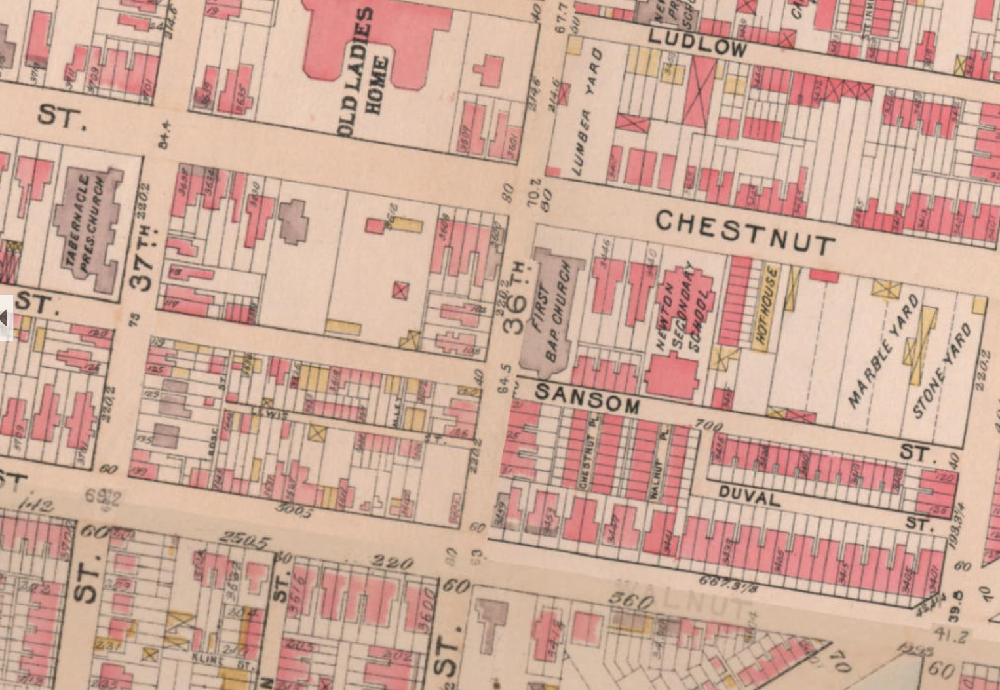
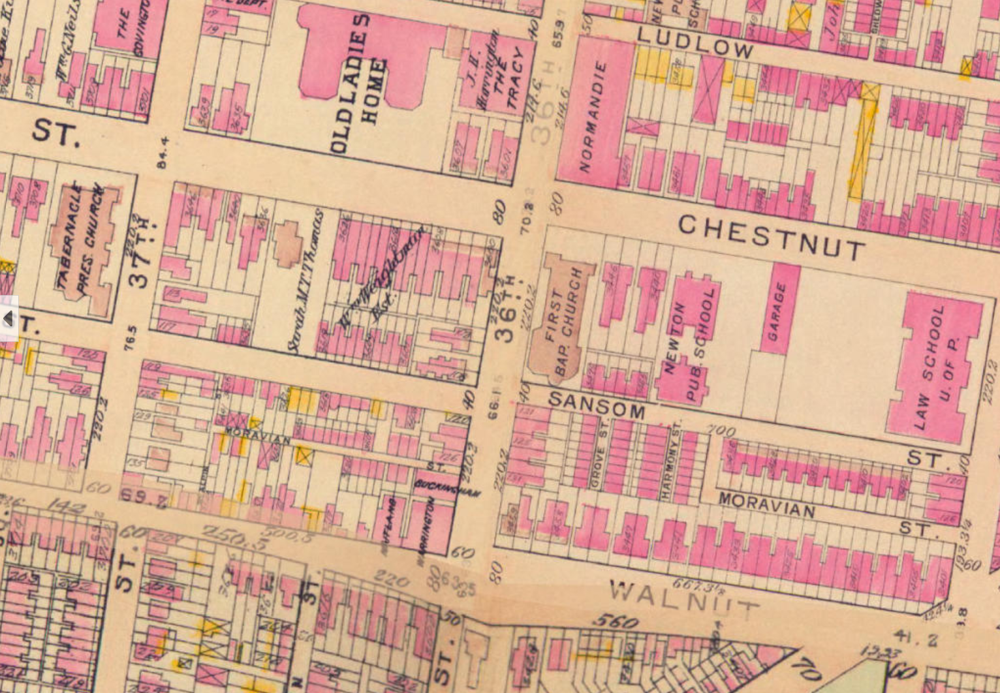
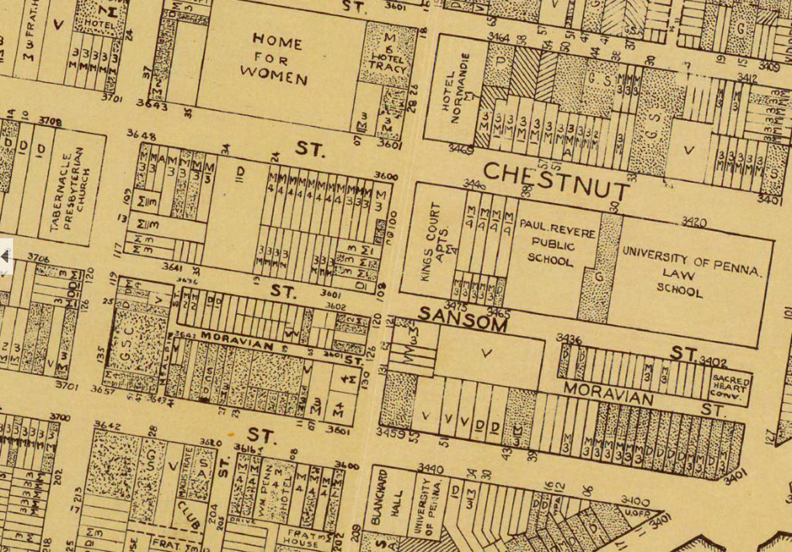
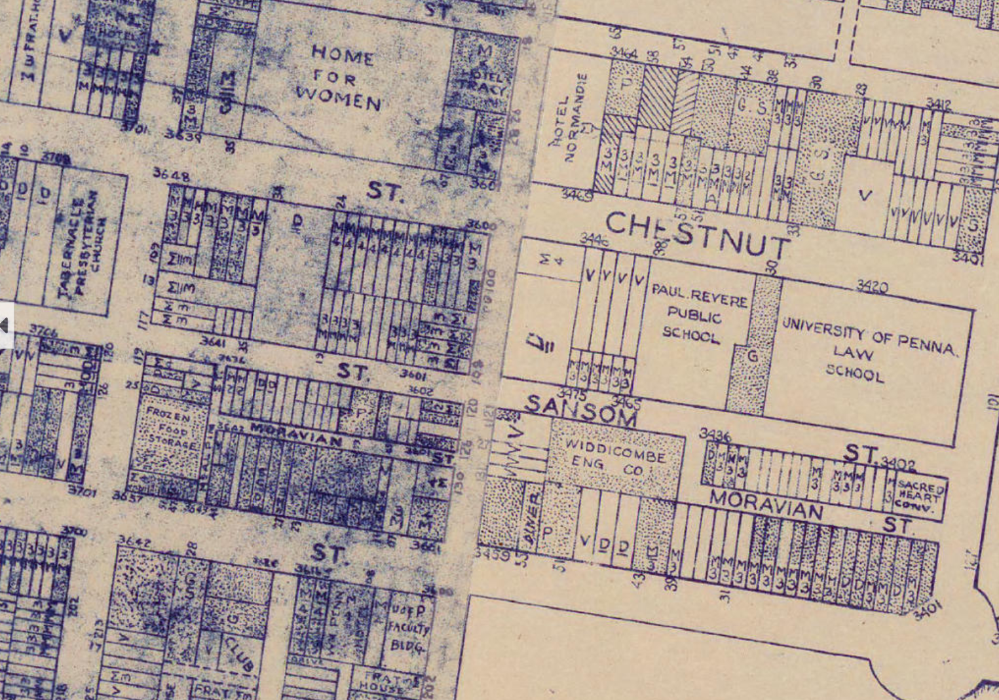
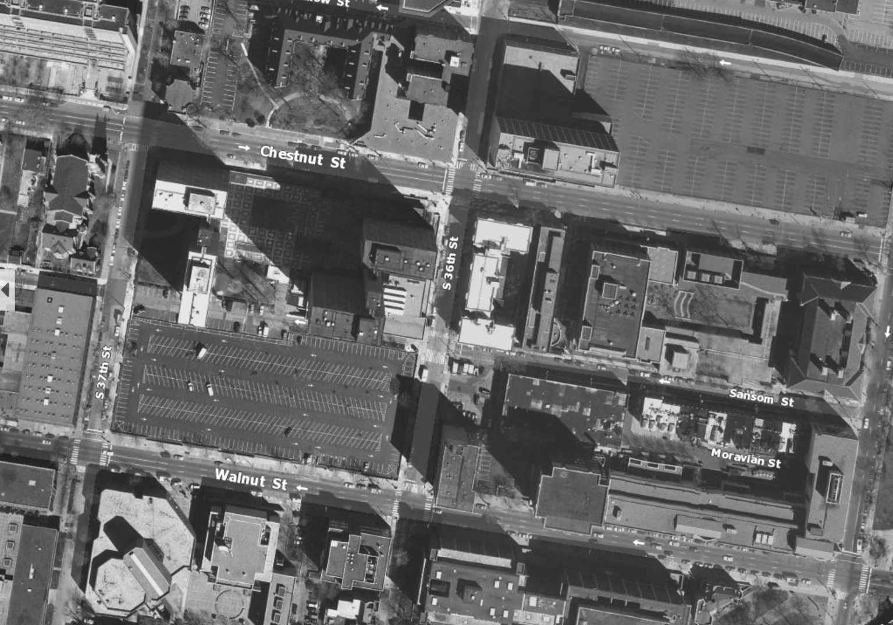
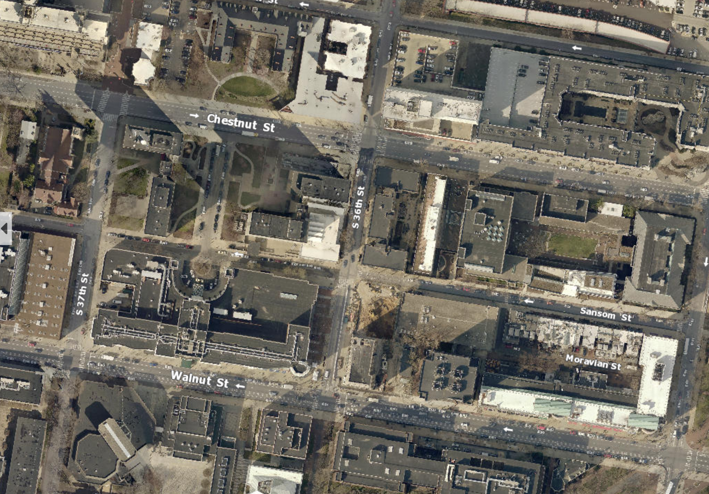

What would it feel like if my parents or grandparents' generations lived in the same building I live in 30 or 50 years ago? As a Korean student studying abroad, I am not used to that feeling because there are a lot of new cities and new buildings in Korea, but it is very common for the residents of Philadelphia.

"My father also graduated from the University of Pennsylvania, and he used the same dormitory building when he went to school."

"My grandmother also went to this cathedral."

```{r setup, warning = FALSE, message = FALSE}
knitr::opts_chunk$set(echo = TRUE)
if (!dir.exists("data")) {
  dir.create("data")
}

# Install and Load Libraries
# install.packages('mapview')
library(tidyverse)
library(tidycensus)
library(sf)
library(kableExtra)
library(mapview)
library(dplyr)
library(scales)
library(viridis)

# Disable Scientific Notation
options(scipen=999)
options(tigris_class = "sf")

# Set ACS API Key
census_api_key("b2835f54d89a4499ba29829c908967b86765b345", overwrite = TRUE)
```

The following photos of Chestnut Street and 36th Street show that Philadelphia has preserved its streetscape, buildings, and even type of businesses for over 100 years.

{width="500"}

{width="500"}

{width="500"}

{width="500"}

{width="500"}

{width="500"}

```{r getACS, warning = FALSE, message = FALSE, results = "hide"}
# Get ACS Data of Philadelphia County 2010, 2015 and 2020
tracts10 <-  
  get_acs(geography = "tract",
          variables = c("B25034_001E","B25034_002E","B25034_003E","B25034_004E","B25034_005E","B25034_006E","B25034_007E","B25034_008E","B25034_009E","B25034_010E"), 
          year=2010, state="PA",
          county="Philadelphia", geometry=TRUE) %>% 
  st_transform('EPSG:26986') # Use NAD 83 CRS

tracts15 <-  
  get_acs(geography = "tract",
          variables = c("B25034_001E","B25034_002E","B25034_003E","B25034_004E","B25034_005E","B25034_006E","B25034_007E","B25034_008E","B25034_009E","B25034_010E","B25034_011E"), 
          year=2015, state="PA",
          county="Philadelphia", geometry=TRUE) %>% 
  st_transform('EPSG:26986') # Use NAD 83 CRS

tracts20 <-  
  get_acs(geography = "tract",
          variables = c("B25034_001E","B25034_002E","B25034_003E","B25034_004E","B25034_005E","B25034_006E","B25034_007E","B25034_008E","B25034_009E","B25034_010E","B25034_011E"), 
          year=2020, state="PA",
          county="Philadelphia", geometry=TRUE) %>% 
  st_transform('EPSG:26986') # Use NAD 83 CRS

# Transforming Long Data to Wide Data Using Spread
tracts10 <- 
  tracts10 %>%
  dplyr::select( -NAME, -moe) %>%
  spread(key = variable, value = estimate) %>%
  rename(Total = B25034_001, 
         Y2005_to_Y2009 = B25034_002,
         Y2000_to_Y2004 = B25034_003, 
         Y1990_to_Y1999 = B25034_004,
         Y1980_to_Y1989 = B25034_005, 
         Y1970_to_Y1979 = B25034_006,
         Y1960_to_Y1969 = B25034_007,
         Y1950_to_Y1959 = B25034_008,
         Y1940_to_Y1949 = B25034_009,
         Y1939_or_earlier = B25034_010)

tracts20 <- 
  tracts20 %>%
  dplyr::select( -NAME, -moe) %>%
  spread(key = variable, value = estimate) %>%
  rename(Total = B25034_001, 
         Y2014_to_Y2019 = B25034_002,
         Y2010_to_Y2013 = B25034_003, 
         Y2000_to_Y2009 = B25034_004,
         Y1990_to_Y1999 = B25034_005, 
         Y1980_to_Y1989 = B25034_006,
         Y1970_to_Y1979 = B25034_007,
         Y1960_to_Y1969 = B25034_008,
         Y1950_to_Y1959 = B25034_009,
         Y1940_to_Y1949 = B25034_010,
         Y1939_or_earlier = B25034_011)

# Create Column that Calculates Proportion of 50 years above, 30 years above, and 10 years below
tracts10 <- 
  tracts10 %>%
  mutate(Y2010_to_Y2013=0,
         Y2014_to_Y2019=0,
         year="2010") %>%
  mutate(Y2000_to_Y2009=Y2000_to_Y2004+Y2005_to_Y2009) %>%
  mutate(pct50ab = ifelse(Total > 0, (Y1939_or_earlier+Y1940_to_Y1949+Y1950_to_Y1959) / Total, 0),
         pct30ab = ifelse(Total > 0, (Y1939_or_earlier+Y1940_to_Y1949+Y1950_to_Y1959+Y1960_to_Y1969+Y1970_to_Y1979) / Total, 0),
         pct10be = ifelse(Total > 0, (Y2005_to_Y2009+Y2000_to_Y2004) / Total, 0))

tracts20 <- 
  tracts20 %>%
  mutate(Y2000_to_Y2004=0,
         Y2005_to_Y2009=0,
         year="2020") %>%
  mutate(pct50ab = ifelse(Total > 0, (Y1939_or_earlier+Y1940_to_Y1949+Y1950_to_Y1959+Y1960_to_Y1969) / Total, 0),
         pct30ab = ifelse(Total > 0, (Y1939_or_earlier+Y1940_to_Y1949+Y1950_to_Y1959+Y1960_to_Y1969+Y1970_to_Y1979+Y1980_to_Y1989) / Total, 0),
         pct10be = ifelse(Total > 0, (Y2014_to_Y2019+Y2010_to_Y2013) / Total, 0))

# Row Bind of 2010 and 2020
allTracts <- rbind(tracts10,tracts20)
```

## Old Buildings in Philadelphia

This story is also confirmed by data. The following thematic map shows the proportion of buildings in Philadelphia that are more tha 30 years old by tract. The yellow area represents where 100% of buildings in the tract are more than 30 years old. You can see that the proportion in 2020 has decreased slightly in Center City and the Northeast compared to 2010.

```{r Plot_10-20_2, warning = FALSE, message = FALSE}
ggplot() +
  geom_sf(data=allTracts, aes(fill=pct30ab))+
  facet_wrap(~year)+
  scale_fill_viridis()+
  labs(
    title = "Proportion of Buildings older than 30 years by Tract, 2010-2020",
    subtitle = "Year Structure Built, Age of buildings based on the respective census year",
    caption = "Data: U.S. Census Bureau") +
  theme_void()
```

The following map shows the proportion of buildings in Philadelphia that are more than 50 years old by tract. The yellow area indicates that 100% of buildings in each tract are more than 50 years old. You can see that the proportion of buildings that are more than 50 years old in Center City and the North and Southwest increased slightly over the past decade.

```{r Plot_10-20_3, warning = FALSE, message = FALSE}
ggplot() +
  geom_sf(data=allTracts, aes(fill=pct50ab))+
  facet_wrap(~year)+
  scale_fill_viridis()+
  labs(
    title = "Proportion of Buildings older than 50 years by Tract, 2010-2020",
    subtitle = "Year Structure Built, Age of buildings based on the respective census year",
    caption = "Data: U.S. Census Bureau") +
  theme_void()
```
Meanwhile, the proportion of buildings built less than 10 years ago in each tract is as shown below. The Center City area was noticeably high in both 2010 and 2020, and the proportion increased particularly in 2020. It can be seen that construction has been active recently. In other tracts, there are hardly any buildings built in the past 10 years.

```{r Plot_10-20_4, warning = FALSE, message = FALSE}
ggplot() +
  geom_sf(data=allTracts, aes(fill=pct10be))+
  facet_wrap(~year)+
  scale_fill_viridis()+
  labs(
    title = "Proportion of Buildings less than 10 years old by Tract, 2010-2020",
    subtitle = "Year Structure Built, Age of buildings based on the respective census year",
    caption = "Data: U.S. Census Bureau") +
  theme_void()
```

## Historical Places in Philadelphia, and What Else?

Today, all properties of historical places in Philadelphia is managed by the City of Philadelphia, by undergoing a nomination process and being added to the register. The following map shows the locations of Philadelphia's historic sites. Yet many Philadelphians believe that many of Philadelphia's buildings, despite their preservation value, are not protected as much as they should be. Why is that?

```{r Plot_10-20_5, warning = FALSE, message = FALSE}
historicPlaces <- st_read('./data/T_Table_1__XYTableToPoint.shp')
historicPlaces_trans <- historicPlaces %>%
  st_as_sf(data=historicPlaces,coords=c("X_Location","Y_Location"),crs=4326) %>%
  st_transform('EPSG:26986') # Use NAD 83 CRS
```

```{r Plot_10-20_6, warning = FALSE, message = FALSE}

ggplot() + 
#  geom_sf(data=st_union(tracts20)) +
  geom_point(
    data=historicPlaces_trans, aes(color="red", geometry=geometry), stat = "sf_coordinates")+
  labs(
    title = "Historical Places in Philadelphia",
    subtitle = "June, 2024",
    caption = "Data: City of Philadelphia") +
  theme_void()
```


References:

Why so few of Philadelphia’s old buildings are historically protected <https://whyy.org/episodes/why-so-few-of-philadelphias-buildings-are-historically-protected/>

Upgrades Work in Philadelphia's Historic Buildings, Better Buildings Neighborhood Program, Department of Energy <https://www.energy.gov/eere/better-buildings-neighborhood-program/upgrades-work-philadelphias-historic-buildings>
